# Purchase Management

<cite>
**Referenced Files in This Document**   
- [purchase_order_form.js](file://src/components/purchase/PurchaseOrderForm.js)
- [grn_form.js](file://src/components/purchase/GRNForm.js)
- [bill_form.js](file://src/components/purchase/BillForm.js)
- [payment_made_form.js](file://src/components/purchase/PaymentMadeForm.js)
- [purchase_return_form.js](file://src/components/purchase/PurchaseReturnForm.js)
- [purchase_orders_api.js](file://src/pages/api/purchase/purchase-orders/index.js)
- [grn_api.js](file://src/pages/api/purchase/grn/index.js)
- [bills_api.js](file://src/pages/api/purchase/bills/index.js)
- [payments_made_api.js](file://src/pages/api/purchase/payments-made/index.js)
- [returns_api.js](file://src/pages/api/purchase/returns/index.js)
</cite>

## Table of Contents
1. [Introduction](#introduction)
2. [Procurement Workflow](#procurement-workflow)
3. [Key Entities](#key-entities)
4. [Document Creation](#document-creation)
5. [Data Model Relationships](#data-model-relationships)
6. [Common Issues](#common-issues)
7. [Performance Optimization](#performance-optimization)
8. [Conclusion](#conclusion)

## Introduction
The purchase management module in ezbillify-v1 provides a comprehensive solution for managing the entire procurement lifecycle. This document explains the complete workflow from purchase order creation to goods receipt, bill processing, payment, and returns. The system is designed to handle multi-branch operations with branch-specific document numbering and supports GST-compliant transactions. The module integrates seamlessly with inventory management, accounting, and vendor management systems to provide a unified procurement experience.

**Section sources**
- [purchase_order_form.js](file://src/components/purchase/PurchaseOrderForm.js)

## Procurement Workflow
The procurement workflow in ezbillify-v1 follows a structured process that ensures proper documentation and financial control. The workflow begins with purchase order creation and progresses through goods receipt, bill processing, payment, and handling of returns.

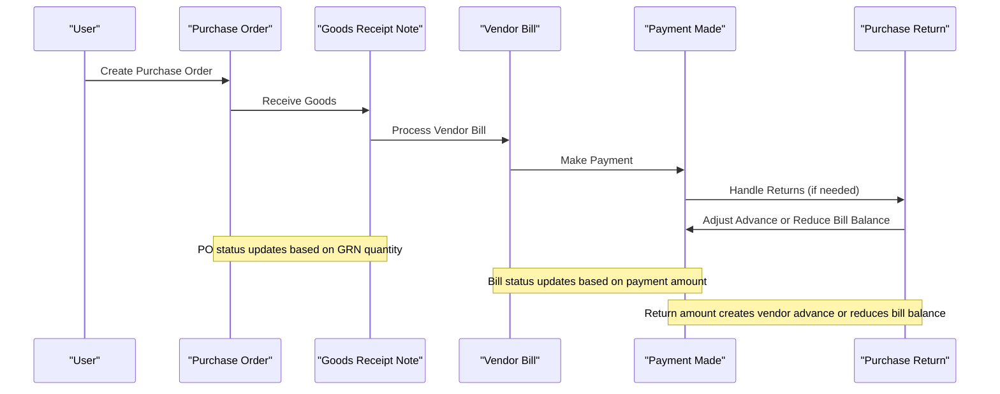

**Diagram sources**
- [purchase_orders_api.js](file://src/pages/api/purchase/purchase-orders/index.js)
- [grn_api.js](file://src/pages/api/purchase/grn/index.js)
- [bills_api.js](file://src/pages/api/purchase/bills/index.js)
- [payments_made_api.js](file://src/pages/api/purchase/payments-made/index.js)
- [returns_api.js](file://src/pages/api/purchase/returns/index.js)

**Section sources**
- [purchase_order_form.js](file://src/components/purchase/PurchaseOrderForm.js)
- [grn_form.js](file://src/components/purchase/GRNForm.js)
- [bill_form.js](file://src/components/purchase/BillForm.js)
- [payment_made_form.js](file://src/components/purchase/PaymentMadeForm.js)
- [purchase_return_form.js](file://src/components/purchase/PurchaseReturnForm.js)

## Key Entities
The purchase management module implements several key entities that represent different stages of the procurement process. Each entity has specific attributes and relationships that support the overall workflow.

### Purchase Orders
Purchase orders (PO) are the initial documents created to formalize the intent to purchase goods or services from vendors. They contain details about the items to be purchased, quantities, rates, and delivery terms.

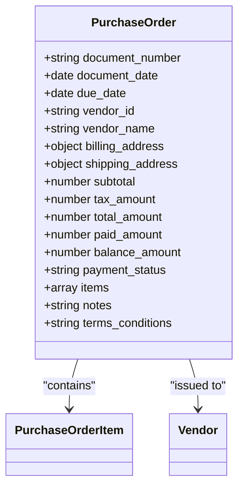

**Diagram sources**
- [purchase_orders_api.js](file://src/pages/api/purchase/purchase-orders/index.js)

**Section sources**
- [purchase_order_form.js](file://src/components/purchase/PurchaseOrderForm.js)

### Goods Receipt Notes
Goods Receipt Notes (GRN) document the physical receipt of goods from vendors. They are linked to purchase orders and validate that the received items match the ordered items in terms of quantity and quality.

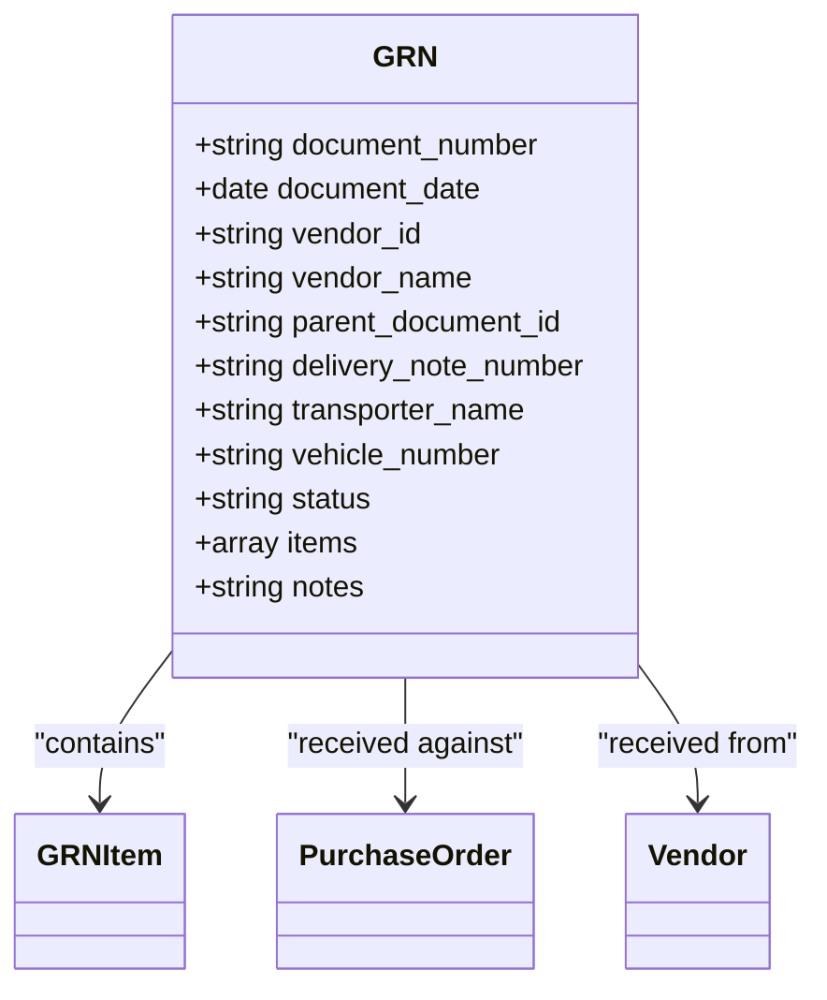

**Diagram sources**
- [grn_api.js](file://src/pages/api/purchase/grn/index.js)

**Section sources**
- [grn_form.js](file://src/components/purchase/GRNForm.js)

### Vendor Bills
Vendor bills represent the financial obligation to vendors for goods or services received. They are processed after goods receipt and include tax calculations based on GST rules.

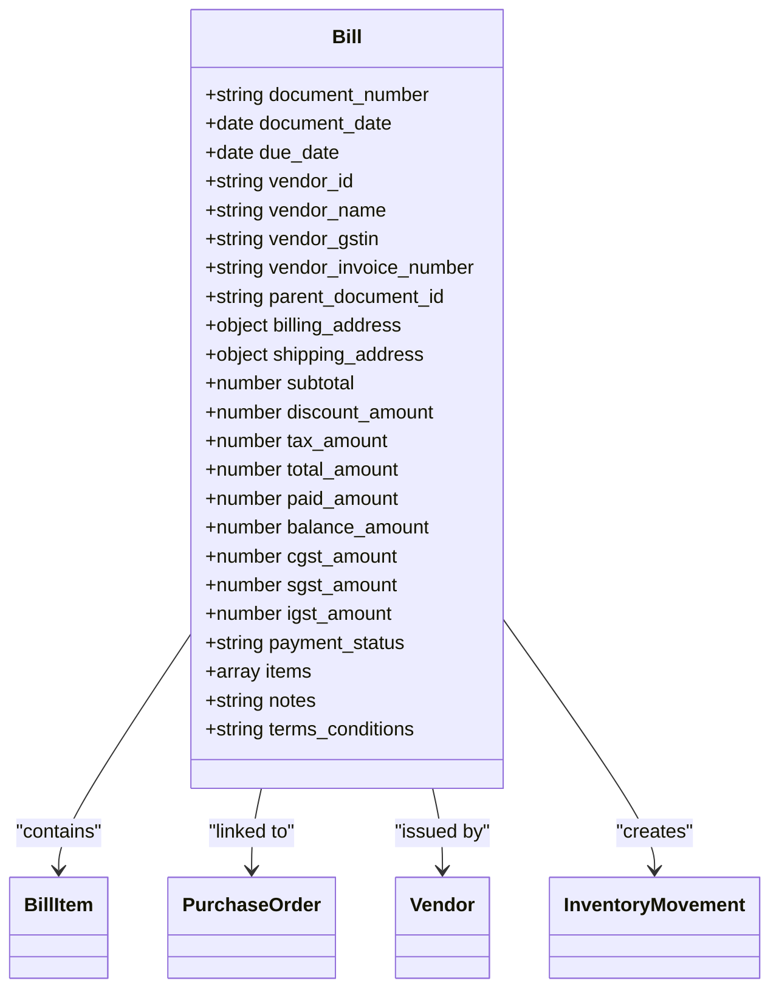

**Diagram sources**
- [bills_api.js](file://src/pages/api/purchase/bills/index.js)

**Section sources**
- [bill_form.js](file://src/components/purchase/BillForm.js)

### Payments Made
Payments made document the settlement of financial obligations to vendors. Payments can be made against specific bills or recorded as advance payments for future use.

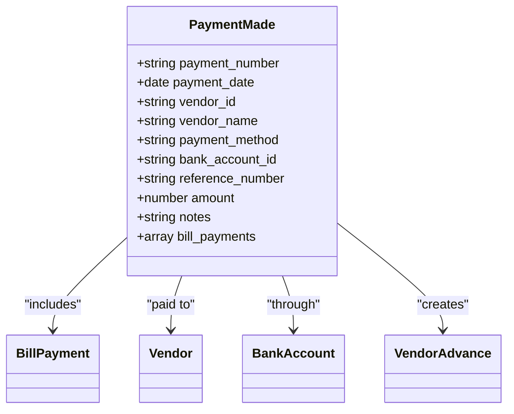

**Diagram sources**
- [payments_made_api.js](file://src/pages/api/purchase/payments-made/index.js)

**Section sources**
- [payment_made_form.js](file://src/components/purchase/PaymentMadeForm.js)

### Purchase Returns
Purchase returns, documented as debit notes, handle the return of goods to vendors due to various reasons such as damage, defects, or incorrect items. The system handles returns differently based on whether the corresponding bill has been paid.

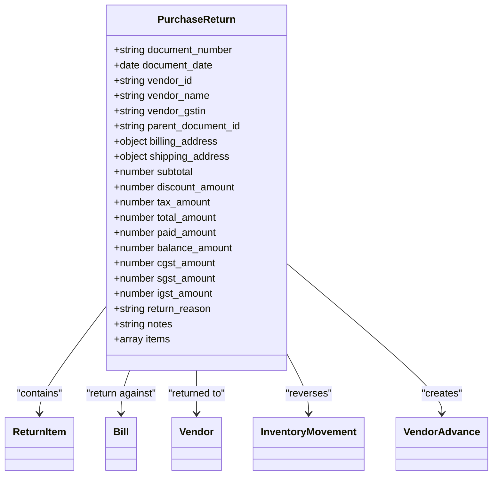

**Diagram sources**
- [returns_api.js](file://src/pages/api/purchase/returns/index.js)

**Section sources**
- [purchase_return_form.js](file://src/components/purchase/PurchaseReturnForm.js)

## Document Creation
Creating purchase documents in ezbillify-v1 follows a consistent pattern across different document types. The system provides user-friendly forms with validation and real-time calculations to ensure accuracy.

### Creating Purchase Orders
Purchase orders are created through a multi-step form that guides users through vendor selection, item selection, and finalization. The form supports branch-specific document numbering and provides real-time calculation of totals.

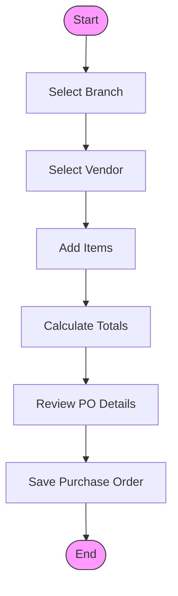

**Section sources**
- [purchase_order_form.js](file://src/components/purchase/PurchaseOrderForm.js)

### Matching GRN to PO
The system allows users to create Goods Receipt Notes directly from purchase orders, ensuring accurate matching of received goods to ordered items. This process validates quantities and updates the purchase order status accordingly.

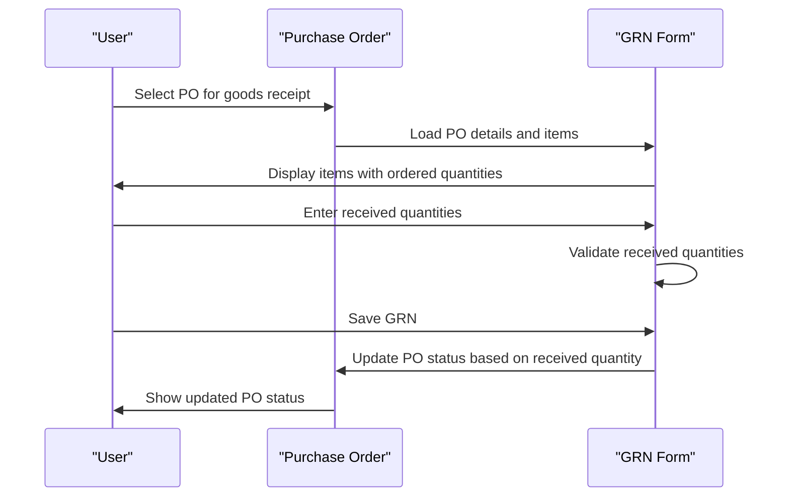

**Section sources**
- [grn_form.js](file://src/components/purchase/GRNForm.js)

### Processing Vendor Bills
Vendor bills are processed after goods receipt and can be created directly from purchase orders or independently. The system automatically calculates taxes based on vendor and company state information.

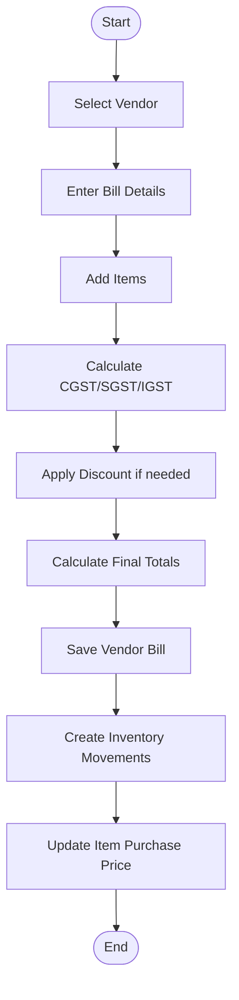

**Section sources**
- [bill_form.js](file://src/components/purchase/BillForm.js)

### Handling Returns
Purchase returns are processed through a dedicated form that allows users to select a vendor bill and specify items to return. The system handles the financial implications differently based on whether the bill has been paid.

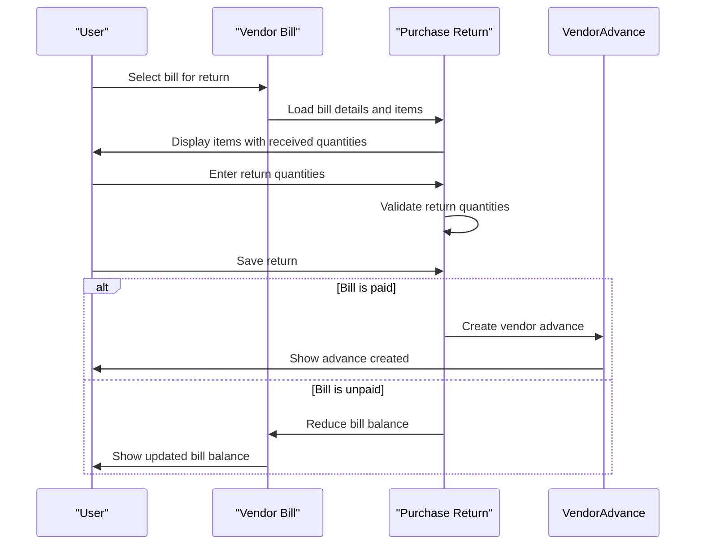

**Section sources**
- [purchase_return_form.js](file://src/components/purchase/PurchaseReturnForm.js)

## Data Model Relationships
The purchase management module implements a robust data model that establishes clear relationships between vendors, items, and purchase documents. This ensures data integrity and enables comprehensive reporting.

### Entity Relationship Diagram
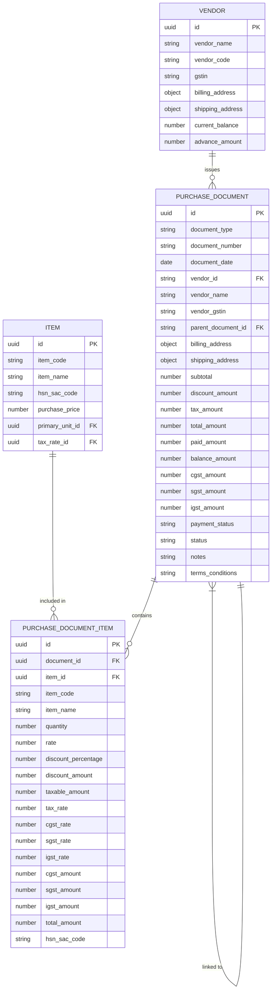

**Section sources**
- [purchase_orders_api.js](file://src/pages/api/purchase/purchase-orders/index.js)
- [grn_api.js](file://src/pages/api/purchase/grn/index.js)
- [bills_api.js](file://src/pages/api/purchase/bills/index.js)
- [returns_api.js](file://src/pages/api/purchase/returns/index.js)

## Common Issues
The purchase management module addresses several common issues that arise in procurement processes, providing mechanisms to prevent and resolve them.

### Three-Way Matching Problems
Three-way matching (PO, GRN, and bill) is a critical control in procurement to ensure that payments are made only for goods that were ordered and received. The system helps prevent mismatches by:

1. **Validating quantities**: When creating a GRN from a PO, the system validates that received quantities do not exceed ordered quantities.
2. **Linking documents**: Bills are linked to both POs and GRNs, enabling easy comparison of quantities and prices.
3. **Status tracking**: PO status is automatically updated based on GRN quantities (pending, partially received, received).

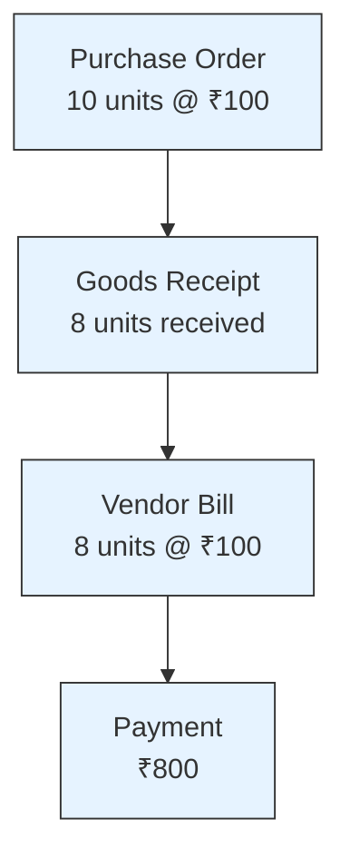

**Section sources**
- [grn_form.js](file://src/components/purchase/GRNForm.js)
- [bill_form.js](file://src/components/purchase/BillForm.js)

### Vendor Reconciliation Errors
Vendor reconciliation errors occur when the vendor's statement does not match the company's records. The system prevents these errors by:

1. **Maintaining accurate balances**: The vendor's current balance is automatically updated with each transaction.
2. **Tracking advances**: Advance payments are properly recorded and can be applied against future bills.
3. **Detailed ledger**: A comprehensive vendor ledger shows all transactions chronologically.

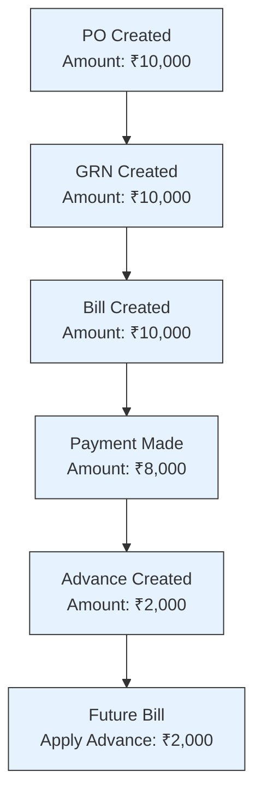

**Section sources**
- [payments_made_api.js](file://src/pages/api/purchase/payments-made/index.js)
- [returns_api.js](file://src/pages/api/purchase/returns/index.js)

### Inventory Valuation Discrepancies
Inventory valuation discrepancies can occur due to incorrect purchase price updates. The system ensures accurate inventory valuation by:

1. **Updating purchase price**: When a bill is processed, the item's purchase price is updated to the latest rate.
2. **Tracking inventory movements**: Each receipt and return is recorded as an inventory movement with the appropriate rate and value.
3. **Costing methods**: The system supports different costing methods (FIFO, weighted average) for inventory valuation.

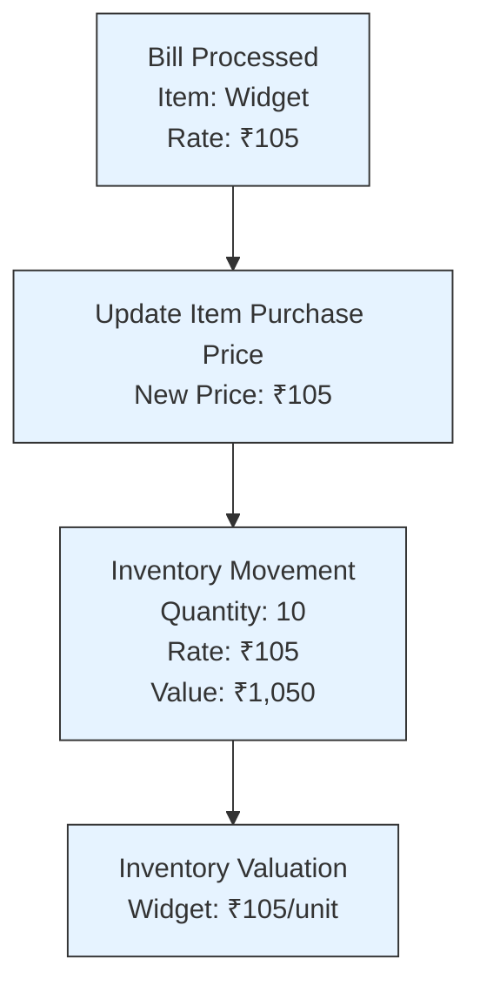

**Section sources**
- [bills_api.js](file://src/pages/api/purchase/bills/index.js)

## Performance Optimization
The purchase management module includes several performance optimization features to handle high-volume purchase operations efficiently.

### High-Volume Processing
For companies with high purchase volumes, the system provides features to streamline processing:

1. **Bulk operations**: Support for bulk creation and processing of purchase documents.
2. **Efficient queries**: Optimized database queries with proper indexing for fast retrieval of purchase data.
3. **Caching**: Implementation of caching for frequently accessed data like vendor and item information.

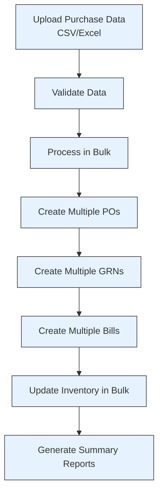

**Section sources**
- [purchase_orders_api.js](file://src/pages/api/purchase/purchase-orders/index.js)
- [grn_api.js](file://src/pages/api/purchase/grn/index.js)
- [bills_api.js](file://src/pages/api/purchase/bills/index.js)

### System Integration
The purchase management module integrates with other systems to enhance performance and data accuracy:

1. **Inventory integration**: Real-time updates to inventory levels and valuation.
2. **Accounting integration**: Automatic creation of journal entries for purchase transactions.
3. **Vendor portal**: Integration with vendor portals for electronic bill submission and tracking.

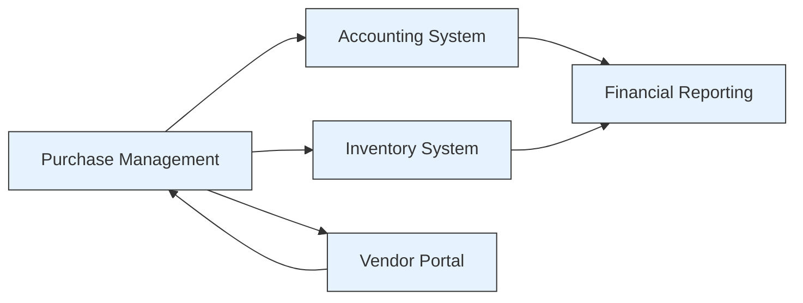

**Section sources**
- [bills_api.js](file://src/pages/api/purchase/bills/index.js)
- [payments_made_api.js](file://src/pages/api/purchase/payments-made/index.js)

## Conclusion
The purchase management module in ezbillify-v1 provides a comprehensive solution for managing the entire procurement lifecycle. From purchase order creation to goods receipt, bill processing, payment, and returns, the system ensures accurate documentation, financial control, and inventory management. The module's robust data model, integration with other systems, and performance optimization features make it suitable for businesses of all sizes. By addressing common procurement issues like three-way matching problems, vendor reconciliation errors, and inventory valuation discrepancies, the system helps organizations maintain financial accuracy and operational efficiency.