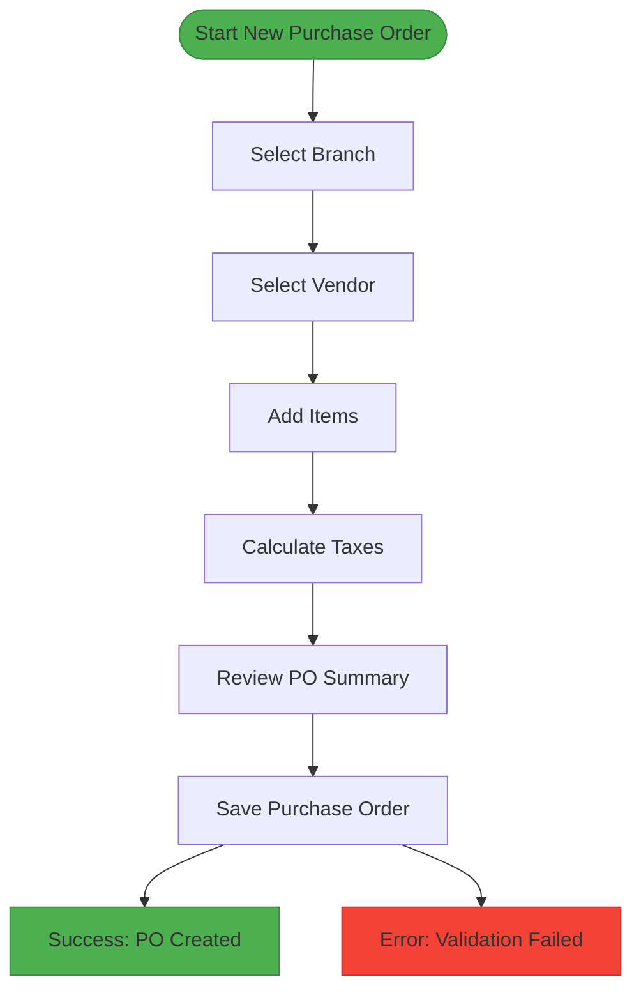
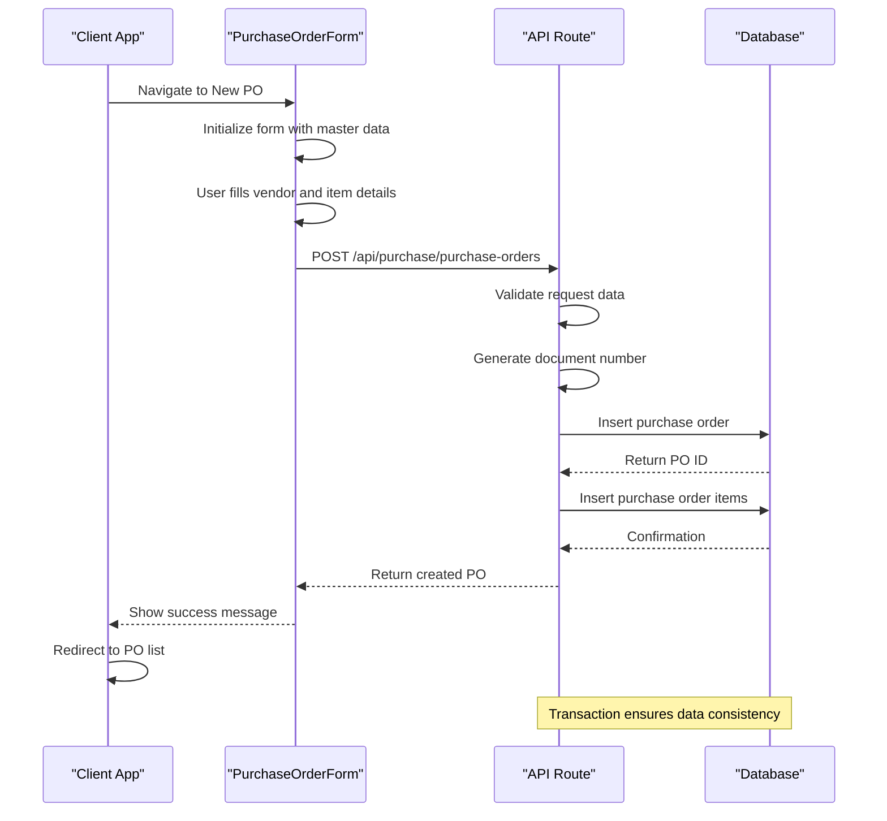
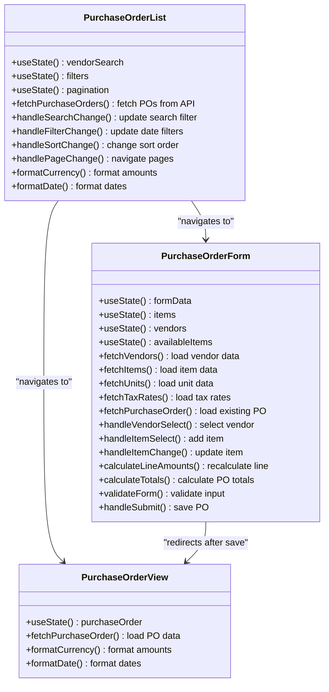
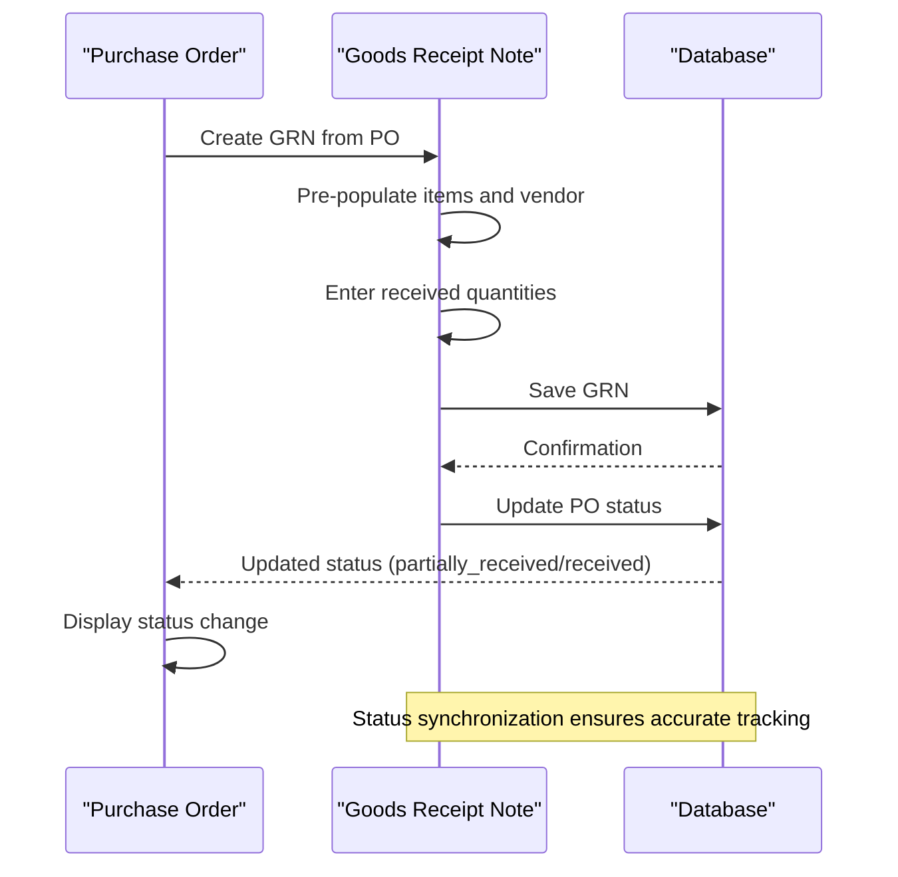

# Purchase Orders

<cite>
**Referenced Files in This Document**   
- [PurchaseOrderForm.js](file://src/components/purchase/PurchaseOrderForm.js)
- [PurchaseOrderList.js](file://src/components/purchase/PurchaseOrderList.js)
- [PurchaseOrderView.js](file://src/components/purchase/PurchaseOrderView.js)
- [index.js](file://src/pages/api/purchase/purchase-orders/index.js)
- [\[id\].js](file://src/pages/api/purchase/purchase-orders/[id].js)
- [new.js](file://src/pages/purchase/purchase-orders/new.js)
- [\[id\].js](file://src/pages/purchase/purchase-orders/[id].js)
- [edit.js](file://src/pages/purchase/purchase-orders/[id]/edit.js)
- [GRNForm.js](file://src/components/purchase/GRNForm.js)
- [GRNList.js](file://src/components/purchase/GRNList.js)
</cite>

## Table of Contents
1. [Introduction](#introduction)
2. [Data Model](#data-model)
3. [Creating Purchase Orders](#creating-purchase-orders)
4. [Viewing and Editing Purchase Orders](#viewing-and-editing-purchase-orders)
5. [Relationship with Other Entities](#relationship-with-other-entities)
6. [Common Issues and Troubleshooting](#common-issues-and-troubleshooting)
7. [Best Practices](#best-practices)

## Introduction
The Purchase Orders sub-feature in ezbillify-v1 enables businesses to manage their procurement process efficiently. This documentation provides a comprehensive overview of the implementation details for creating, viewing, editing, and tracking purchase orders within the system. The feature supports branch-specific procurement, integrates with Goods Receipt Notes (GRNs) for inventory tracking, and handles complex tax calculations for GST compliance. The system is designed to streamline the procurement workflow from order creation to goods receipt and payment processing.

## Data Model
The purchase order system in ezbillify-v1 is built around a robust data model that captures all essential procurement information. The core entity is the purchase order, which contains header information, line items, and financial calculations.

### Core Fields
The purchase order data model includes the following key fields:

**Header Fields**
- **document_number**: Unique identifier for the purchase order, generated based on company and branch settings
- **vendor_id**: Reference to the vendor from whom items are being purchased
- **document_date**: Date when the purchase order was created
- **due_date**: Expected delivery date or payment due date
- **branch_id**: Reference to the specific branch placing the order (enables branch-specific procurement)
- **company_id**: Reference to the company that owns the purchase order
- **notes**: Internal notes for the purchase order
- **terms_conditions**: Payment terms and conditions

**Financial Fields**
- **subtotal**: Sum of all taxable amounts from line items
- **cgst_amount**: Central Goods and Services Tax amount
- **sgst_amount**: State Goods and Services Tax amount
- **igst_amount**: Integrated Goods and Services Tax amount
- **total_amount**: Final amount including all taxes
- **payment_status**: Tracks whether the order has been paid (unpaid, partially_paid, paid)

### Item Details Structure
Each purchase order contains multiple line items with detailed specifications:

**Item Fields**
- **item_id**: Reference to the specific item being purchased
- **item_code**: Unique code for the item
- **item_name**: Name of the item
- **quantity**: Number of units ordered
- **unit_id**: Reference to the unit of measurement
- **unit_name**: Name of the unit (e.g., pieces, kilograms)
- **rate**: Price per unit
- **discount_percentage**: Discount percentage applied to the item
- **taxable_amount**: Amount subject to taxation after discounts
- **cgst_rate**: CGST rate applicable to the item
- **sgst_rate**: SGST rate applicable to the item
- **igst_rate**: IGST rate applicable to the item
- **total_amount**: Total amount for the line item including taxes
- **hsn_sac_code**: HSN (Harmonized System of Nomenclature) or SAC (Service Accounting Code) for GST purposes

### Status Tracking
The system implements a simplified status workflow for purchase orders:
- **pending**: Initial state when a purchase order is created
- **approved**: When the purchase order has been approved for processing
- **partially_received**: When some items from the purchase order have been received
- **received**: When all items from the purchase order have been received
- **closed**: When the purchase order is fully completed and closed

**Section sources**
- [PurchaseOrderForm.js](file://src/components/purchase/PurchaseOrderForm.js#L47-L54)
- [index.js](file://src/pages/api/purchase/purchase-orders/index.js#L113-L124)
- [\[id\].js](file://src/pages/api/purchase/purchase-orders/[id].js#L88-L98)

## Creating Purchase Orders
The process of creating purchase orders in ezbillify-v1 is designed to be intuitive and efficient, with features that enhance user productivity and data accuracy.

### Purchase Order Form Implementation
The PurchaseOrderForm component provides a comprehensive interface for creating new purchase orders. The form is implemented as a React component with several key sections:

**Form Structure**
- **Vendor Selection**: Users can search and select vendors from a dropdown list that displays vendor name, code, GSTIN, and billing address
- **PO Details**: Includes document date, due date, and branch selection (for multi-branch organizations)
- **Item Selection**: Users can search items by name or code and add them to the purchase order
- **PO Summary**: Real-time calculation of subtotal, taxes, and total amount

**Diagram sources**
- [PurchaseOrderForm.js](file://src/components/purchase/PurchaseOrderForm.js#L498-L748)

### API Route for Creation
The creation of purchase orders is handled by the API route at `/api/purchase/purchase-orders`. This endpoint implements a comprehensive workflow:

**Creation Process**
1. Validate required fields (company_id, branch_id, vendor_id, items)
2. Generate document number based on branch-specific settings
3. Fetch vendor details for billing information
4. Calculate financial totals (subtotal, taxes, total amount)
5. Insert purchase order record into the database
6. Insert purchase order items into the database
7. Return complete purchase order with all details

The document numbering system supports branch-specific prefixes and financial year-based resets, ensuring unique and meaningful purchase order numbers across different branches and financial periods.

**Diagram sources**
- [index.js](file://src/pages/api/purchase/purchase-orders/index.js#L112-L443)
- [PurchaseOrderForm.js](file://src/components/purchase/PurchaseOrderForm.js#L404-L438)

### Branch-Specific Procurement
The system supports branch-specific procurement through the branch_id field in purchase orders. When creating a purchase order, users must select a branch, which affects:

- Document numbering (branch-specific prefixes)
- Reporting and analytics (filtered by branch)
- Inventory management (items received to specific branch locations)
- Financial tracking (expenses attributed to specific branches)

This feature enables organizations with multiple locations to maintain separate procurement records while still having consolidated reporting at the company level.

**Section sources**
- [PurchaseOrderForm.js](file://src/components/purchase/PurchaseOrderForm.js#L137-L144)
- [index.js](file://src/pages/api/purchase/purchase-orders/index.js#L156-L158)

## Viewing and Editing Purchase Orders
The system provides comprehensive functionality for viewing and editing existing purchase orders, ensuring users can manage their procurement workflow effectively.

### Purchase Order List
The PurchaseOrderList component displays all purchase orders in a tabular format with filtering and sorting capabilities:

**List Features**
- Search functionality for PO number, vendor, or other fields
- Date range filtering for document_date
- Sorting by PO number, date, vendor, or amount
- Pagination for handling large datasets
- Action buttons for viewing, editing, and deleting purchase orders

The list displays key information including PO number, date, vendor name, and total amount, allowing users to quickly identify and access specific purchase orders.

**Diagram sources**
- [PurchaseOrderList.js](file://src/components/purchase/PurchaseOrderList.js#L16-L440)
- [PurchaseOrderForm.js](file://src/components/purchase/PurchaseOrderForm.js#L1-L950)
- [PurchaseOrderView.js](file://src/components/purchase/PurchaseOrderView.js#L1-L284)

### Purchase Order View
The PurchaseOrderView component provides a detailed read-only view of a purchase order:

**View Features**
- Header section with PO number, date, due date, and branch information
- Vendor details including name, code, email, phone, and GSTIN
- Billing address display
- Item table showing all line items with quantities, rates, discounts, taxes, and totals
- Financial summary with subtotal, individual tax amounts, and total amount
- Notes and terms & conditions sections
- Edit button to modify the purchase order

The view component ensures all relevant information is presented in a clear and organized manner, making it easy for users to review purchase order details.

**Section sources**
- [PurchaseOrderView.js](file://src/components/purchase/PurchaseOrderView.js#L84-L281)

### Editing Purchase Orders
Editing existing purchase orders follows a similar workflow to creation but with pre-filled data:

**Edit Process**
1. User navigates to an existing purchase order
2. The form loads all existing data from the database
3. User can modify vendor, dates, items, or other fields
4. Changes are saved, updating the existing record

When editing a purchase order, the system recalculates all financial totals based on the updated items and rates, ensuring accuracy in the final amounts.

**Section sources**
- [edit.js](file://src/pages/purchase/purchase-orders/[id]/edit.js#L1-L59)
- [\[id\].js](file://src/pages/api/purchase/purchase-orders/[id].js#L87-L294)

## Relationship with Other Entities
Purchase orders in ezbillify-v1 are integrated with several other entities to create a comprehensive procurement and inventory management system.

### Vendor Relationship
Purchase orders have a direct relationship with vendors:

**Vendor Integration**
- Each purchase order references a specific vendor through vendor_id
- Vendor details (name, code, GSTIN, addresses) are stored in the purchase order for historical accuracy
- The system validates that the vendor exists and is active before creating a purchase order
- Vendor-specific information like billing and shipping addresses are pre-populated from the vendor record

This relationship ensures that all procurement activities are properly attributed to the correct vendor and maintains consistency in vendor information across documents.

**Section sources**
- [index.js](file://src/pages/api/purchase/purchase-orders/index.js#L269-L282)
- [PurchaseOrderForm.js](file://src/components/purchase/PurchaseOrderForm.js#L249-L254)

### Item Relationship
Purchase orders contain detailed information about the items being purchased:

**Item Integration**
- Each line item references an item through item_id
- Item details (code, name, HSN/SAC code, primary unit) are stored in the purchase order for historical accuracy
- The system validates that items are marked as "for purchase" before allowing them to be added to a purchase order
- Tax rates are automatically applied based on the item's tax_rate_id

This relationship ensures that inventory records are accurate and that tax calculations are consistent with the items being purchased.

**Section sources**
- [PurchaseOrderForm.js](file://src/components/purchase/PurchaseOrderForm.js#L260-L322)
- [index.js](file://src/pages/api/purchase/purchase-orders/index.js#L293-L341)

### Goods Receipt Notes (GRN) Relationship
The most critical relationship for purchase orders is with Goods Receipt Notes (GRNs), which track the actual receipt of goods:

**GRN Integration**
- Purchase orders can be linked to one or more GRNs through the parent_document_id field
- When a GRN is created from a purchase order, it pre-populates items, quantities, and vendor information
- The system updates the purchase order status based on GRN creation:
  - When items are partially received, PO status changes to "partially_received"
  - When all items are received, PO status changes to "received"
- GRNs can be created directly from the purchase order view, streamlining the goods receipt process

This relationship creates a complete audit trail from purchase order creation to goods receipt, ensuring accurate inventory tracking and financial reporting.

**Diagram sources**
- [GRNForm.js](file://src/components/purchase/GRNForm.js#L240-L286)
- [index.js](file://src/pages/api/purchase/grn/index.js#L396-L433)

## Common Issues and Troubleshooting
While using the purchase order system, users may encounter certain issues. This section addresses common problems and their solutions.

### Validation Errors During Creation
Validation errors can occur when creating purchase orders:

**Common Validation Issues**
- **Missing vendor**: Ensure a vendor is selected before saving
- **No items**: Add at least one item to the purchase order
- **Invalid quantities or rates**: Ensure all item quantities are positive and rates are non-negative
- **Branch not selected**: For new organizations with multiple branches, ensure a branch is selected

The system provides clear error messages to help users identify and correct these issues before saving the purchase order.

**Section sources**
- [PurchaseOrderForm.js](file://src/components/purchase/PurchaseOrderForm.js#L384-L402)

### Status Synchronization Problems
Issues with status synchronization between purchase orders and GRNs:

**Synchronization Issues**
- **Status not updating**: Ensure GRNs are properly linked to the purchase order through parent_document_id
- **Incorrect received quantities**: Verify that the received quantities in GRNs match the actual goods received
- **Multiple GRNs for same PO**: The system supports multiple GRNs for a single purchase order, but ensure the total received quantities do not exceed ordered quantities

The system automatically calculates the total received quantities across all GRNs linked to a purchase order and updates the PO status accordingly.

**Section sources**
- [index.js](file://src/pages/api/purchase/grn/index.js#L396-L433)

### Branch-Specific Procurement Issues
Problems related to branch-specific procurement:

**Branch Issues**
- **Document numbering conflicts**: Ensure each branch has a unique document prefix configured
- **Items not available for branch**: Verify that items are available for purchase and assigned to the correct branch
- **Reporting inaccuracies**: When filtering reports, ensure the correct branch is selected to avoid mixing data from different locations

Proper configuration of branch settings and regular audits of branch-specific data can prevent these issues.

**Section sources**
- [index.js](file://src/pages/api/purchase/purchase-orders/index.js#L156-L158)
- [PurchaseOrderForm.js](file://src/components/purchase/PurchaseOrderForm.js#L137-L144)

## Best Practices
To maximize the effectiveness of the purchase order system, follow these best practices:

### Managing Large Purchase Orders
For purchase orders with many items:

**Large PO Management**
- Use the search functionality to quickly find and add items
- Leverage keyboard shortcuts (F1 for vendor search, F2 for item search) to speed up data entry
- Regularly save drafts to prevent data loss
- Use the real-time summary to monitor totals as items are added

### Optimizing Performance During High-Volume Operations
When processing multiple purchase orders:

**Performance Optimization**
- Ensure master data (vendors, items, units, tax rates) is pre-loaded to minimize API calls
- Use batch operations when possible to reduce the number of API requests
- Implement proper indexing on database fields used for filtering and sorting
- Monitor system performance during peak usage periods and scale resources as needed

### General Best Practices
Additional recommendations for effective purchase order management:

**General Recommendations**
- Regularly review and update vendor information to ensure accuracy
- Configure document numbering settings appropriately for your organization's needs
- Train users on the complete workflow from purchase order creation to goods receipt
- Implement approval workflows for high-value purchase orders
- Regularly audit purchase order data for accuracy and compliance

Following these best practices will help ensure smooth operation of the purchase order system and accurate financial and inventory records.

**Section sources**
- [PurchaseOrderForm.js](file://src/components/purchase/PurchaseOrderForm.js#L453-L474)
- [PurchaseOrderList.js](file://src/components/purchase/PurchaseOrderList.js#L337-L421)