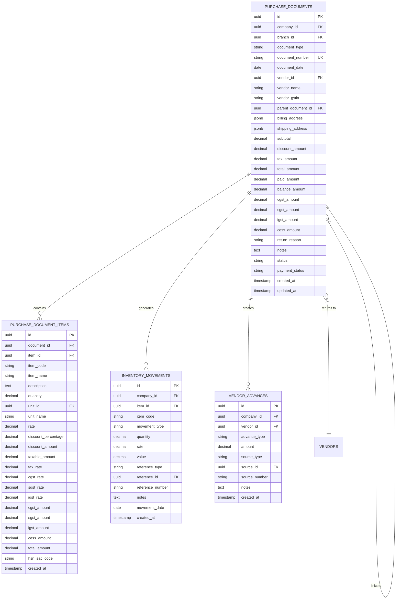
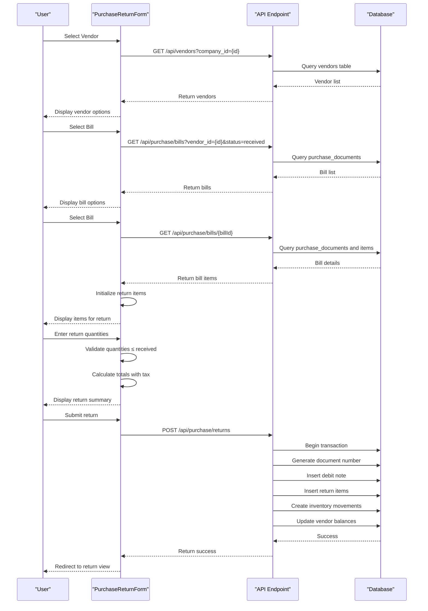
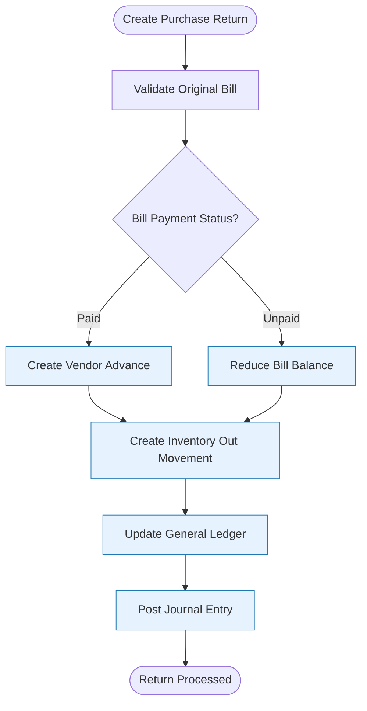
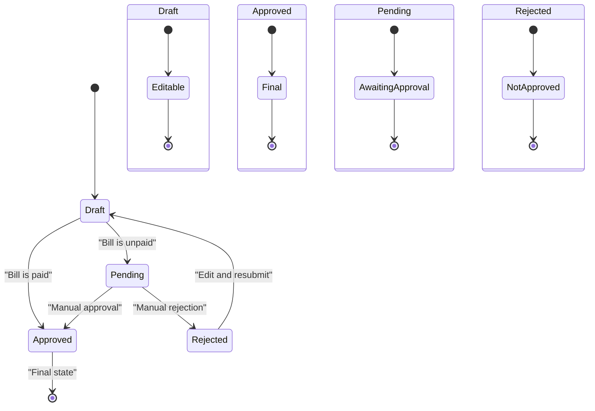

# Purchase Returns

<cite>
**Referenced Files in This Document**   
- [PurchaseReturnForm.js](file://src/components/purchase/PurchaseReturnForm.js)
- [PurchaseReturnList.js](file://src/components/purchase/PurchaseReturnList.js)
- [PurchaseReturnView.js](file://src/components/purchase/PurchaseReturnView.js)
- [index.js](file://src/pages/api/purchase/returns/index.js)
- [\[id\].js](file://src/pages/api/purchase/returns/[id].js)
- [summary.js](file://src/pages/api/purchase/returns/summary.js)
</cite>

## Table of Contents
1. [Introduction](#introduction)
2. [Data Model](#data-model)
3. [Return Creation Process](#return-creation-process)
4. [Inventory and Accounting Impact](#inventory-and-accounting-impact)
5. [Approval Workflows](#approval-workflows)
6. [Common Issues and Troubleshooting](#common-issues-and-troubleshooting)
7. [Performance Optimization](#performance-optimization)
8. [Conclusion](#conclusion)

## Introduction

The Purchase Returns sub-feature in ezbillify-v1 enables businesses to manage the return of goods to vendors through a structured process. This functionality creates debit notes that document returned items, adjust inventory levels, and update vendor payable balances. The system supports comprehensive return reasons, tax calculations, and financial reversals while maintaining audit trails and data integrity.

The implementation follows a document-based approach where each return is linked to the original purchase bill, ensuring traceability and accurate financial reporting. The feature includes a complete lifecycle management system with creation, viewing, editing, and deletion capabilities, along with analytics for monitoring return patterns and vendor performance.

**Section sources**
- [PurchaseReturnForm.js](file://src/components/purchase/PurchaseReturnForm.js#L1-L523)
- [PurchaseReturnList.js](file://src/components/purchase/PurchaseReturnList.js#L1-L784)

## Data Model

The purchase returns system uses a relational data model with primary entities stored in the `purchase_documents` table with `document_type = 'debit_note'`. Key fields include:

- **return_reason**: Enum field capturing the justification for return with values like 'damaged', 'defective', 'wrong_item', 'excess_quantity', 'quality_issue', 'expired', 'not_as_described', 'duplicate', and 'other'
- **document_number**: System-generated unique identifier following branch-specific numbering sequences with financial year suffixes
- **parent_document_id**: Foreign key linking to the original purchase bill
- **branch_id**: Reference to the organizational branch where the return was processed
- **status**: Workflow state indicator ('draft', 'approved', 'processed', 'rejected')

Return items are stored in the `purchase_document_items` table with detailed tax breakdowns including `cgst_rate`, `sgst_rate`, and `igst_rate` fields. The system maintains comprehensive financial data including `subtotal`, `discount_amount`, `tax_amount`, and `total_amount` at both document and item levels.

The data model also includes integration with inventory management through the `inventory_movements` table, which records stock adjustments, and vendor management through the `vendor_advances` table, which handles financial settlements.

**Diagram sources **
- [index.js](file://src/pages/api/purchase/returns/index.js#L115-L454)
- [PurchaseReturnForm.js](file://src/components/purchase/PurchaseReturnForm.js#L198-L214)

**Section sources**
- [index.js](file://src/pages/api/purchase/returns/index.js#L115-L454)
- [PurchaseReturnForm.js](file://src/components/purchase/PurchaseReturnForm.js#L24-L31)

## Return Creation Process

The return creation process begins with the `PurchaseReturnForm` component, which guides users through selecting a vendor and original purchase bill before specifying returned items. The form implements real-time validation to ensure data integrity and prevent common errors.

When a user selects a vendor, the system fetches all received bills for that vendor, filtering only those with `status = 'received'`. Upon selecting a bill, the form automatically populates the return items with the original purchase details, including quantities, rates, discounts, and tax rates. Users can then specify the return quantity for each item, with validation preventing returns exceeding the originally received quantity.

The form calculates financial totals using a precise tax computation algorithm that accounts for item-level discounts before applying GST components (CGST, SGST, IGST). The calculation sequence follows:
1. Line amount = quantity × rate
2. Discount amount = line amount × discount percentage ÷ 100
3. Taxable amount = line amount - discount amount
4. Tax components = taxable amount × respective tax rate ÷ 100
5. Total amount = taxable amount + sum of all tax components

**Diagram sources **
- [PurchaseReturnForm.js](file://src/components/purchase/PurchaseReturnForm.js#L56-L117)
- [index.js](file://src/pages/api/purchase/returns/index.js#L114-L454)

**Section sources**
- [PurchaseReturnForm.js](file://src/components/purchase/PurchaseReturnForm.js#L126-L151)
- [index.js](file://src/pages/api/purchase/returns/index.js#L303-L364)

## Inventory and Accounting Impact

When a purchase return is processed, the system triggers multiple financial and inventory adjustments to maintain data consistency across the accounting system. These adjustments follow different patterns based on the payment status of the original bill.

For **paid bills**, the system creates a vendor advance equal to the return amount, effectively creating a credit balance that can be applied to future purchases. This approach preserves the integrity of the original payment transaction while providing the vendor with credit for returned goods. The vendor's `advance_amount` is increased, and this credit appears in their payable ledger.

For **unpaid bills**, the system reduces the outstanding balance on the original purchase document. This direct reduction simplifies accounting by maintaining the original bill while accurately reflecting the adjusted payable amount. The `balance_amount` field on the purchase document is decreased by the return amount, with a minimum floor of zero.

Inventory adjustments are handled through the `inventory_movements` table, which records a movement of type 'out' for each returned item. This movement decreases the current stock level and is used for inventory valuation and stock tracking. The system maintains a complete audit trail of all stock movements, enabling accurate stock reconciliation and financial reporting.

The accounting entries created include:
- Debit to Vendor Payable (reduction in liability)
- Credit to Inventory (reduction in asset value)
- Credit to GST Input Tax Credit (reversal of previously claimed tax)
- Creation of Vendor Advance (for paid bills)

**Diagram sources **
- [index.js](file://src/pages/api/purchase/returns/index.js#L495-L566)
- [PurchaseReturnView.js](file://src/components/purchase/PurchaseReturnView.js#L236-L293)

**Section sources**
- [index.js](file://src/pages/api/purchase/returns/index.js#L495-L566)
- [PurchaseReturnView.js](file://src/components/purchase/PurchaseReturnView.js#L236-L293)

## Approval Workflows

The purchase returns system implements a streamlined approval workflow that adapts based on the payment status of the original bill. When a return is created against a paid bill, it automatically receives 'approved' status, as the financial impact is managed through vendor advances rather than direct bill adjustments. For returns against unpaid bills, the status is set to 'pending' to allow for additional review before balance adjustments take effect.

The workflow supports draft creation, allowing users to save incomplete return documents and complete them later. Draft returns can be edited freely but do not trigger inventory or financial adjustments until finalized. Once a return is processed, it can only be modified if it remains in 'draft' status, ensuring data integrity for completed transactions.

Deletion of returns is permitted for both draft and approved returns, with the system automatically reversing all associated inventory movements and financial adjustments. When a return is deleted, the system:
1. Creates reverse inventory movements to restore stock levels
2. Deletes the original inventory movement records
3. Reverses vendor advance adjustments (for paid bills)
4. Restores bill balances (for unpaid bills)
5. Removes the debit note and associated items

**Diagram sources **
- [index.js](file://src/pages/api/purchase/returns/index.js#L366-L397)
- [\[id\].js](file://src/pages/api/purchase/returns/[id].js#L231-L236)

**Section sources**
- [index.js](file://src/pages/api/purchase/returns/index.js#L366-L397)
- [\[id\].js](file://src/pages/api/purchase/returns/[id].js#L231-L236)

## Common Issues and Troubleshooting

Several common issues can arise when processing purchase returns, primarily related to data validation, inventory synchronization, and financial reconciliation. Understanding these issues and their solutions is critical for maintaining system integrity.

**Unauthorized returns** occur when users attempt to return items not present in the original purchase or exceed received quantities. The system prevents this through real-time validation in the `PurchaseReturnForm` component, which enforces that `return_quantity ≤ received_quantity` for each item. Error messages guide users to correct invalid entries before submission.

**Incorrect inventory adjustments** can happen if the inventory movement system fails to process the return. The system uses database transactions and error handling to ensure that inventory adjustments are atomic operations. If an inventory movement fails, the entire return transaction is rolled back, preventing partial updates that could lead to stock discrepancies.

**Tax reversal complications** may arise when returns involve partial quantities or when tax rates have changed since the original purchase. The system addresses this by using the original tax rates from the purchase bill rather than current rates, ensuring accurate tax credit reversals. The calculation preserves the original tax structure, maintaining compliance with GST regulations.

Other common issues include:
- **Document numbering conflicts**: Resolved through atomic sequence updates in the database
- **Vendor balance inconsistencies**: Prevented by using database triggers to maintain ledger accuracy
- **Stock valuation discrepancies**: Addressed by recording the original purchase rate with each return
- **Audit trail gaps**: Mitigated by logging all state changes and financial adjustments

Troubleshooting steps include verifying the original bill status, checking inventory movement logs, reviewing vendor advance records, and examining the complete audit trail available in the system.

**Section sources**
- [PurchaseReturnForm.js](file://src/components/purchase/PurchaseReturnForm.js#L130-L134)
- [index.js](file://src/pages/api/purchase/returns/index.js#L455-L492)
- [\[id\].js](file://src/pages/api/purchase/returns/[id].js#L242-L283)

## Performance Optimization

For processing return batches efficiently, several performance optimization strategies are recommended:

1. **Batch processing**: Group multiple returns into a single processing job to minimize database transaction overhead
2. **Index optimization**: Ensure proper indexing on key fields like `vendor_id`, `parent_document_id`, and `document_date` for faster queries
3. **Caching**: Implement caching for frequently accessed data such as vendor information and item details
4. **Asynchronous processing**: Handle non-critical operations like notifications and reporting asynchronously
5. **Connection pooling**: Use database connection pooling to reduce connection overhead

The system already implements several performance features, including pagination for return lists, selective field retrieval, and efficient database queries with proper filtering. For high-volume scenarios, consider implementing a queue-based processing system that handles returns in batches during off-peak hours.

Additional optimizations include:
- Pre-fetching related data to reduce round trips
- Using database views for complex analytics queries
- Implementing client-side caching for frequently accessed returns
- Optimizing the document numbering system for high-concurrency environments

**Section sources**
- [PurchaseReturnList.js](file://src/components/purchase/PurchaseReturnList.js#L61-L66)
- [index.js](file://src/pages/api/purchase/returns/index.js#L83-L86)

## Conclusion

The Purchase Returns sub-feature in ezbillify-v1 provides a comprehensive solution for managing vendor returns with robust financial controls and inventory integration. By linking returns to original purchase documents, the system ensures traceability and accurate accounting while providing flexibility in handling both paid and unpaid bills.

Key strengths of the implementation include automated financial adjustments, real-time validation, comprehensive audit trails, and adaptive approval workflows. The system effectively handles complex scenarios like tax reversals and vendor advances while maintaining data integrity through transactional processing.

For optimal use, organizations should establish clear return policies, train staff on proper documentation practices, and regularly reconcile vendor balances and inventory levels. The analytics capabilities provide valuable insights into return patterns, helping identify quality issues with specific vendors or products.

The modular design allows for future enhancements such as automated return authorizations, integration with quality control systems, and advanced reporting on return reasons and trends.

[No sources needed since this section summarizes without analyzing specific files]