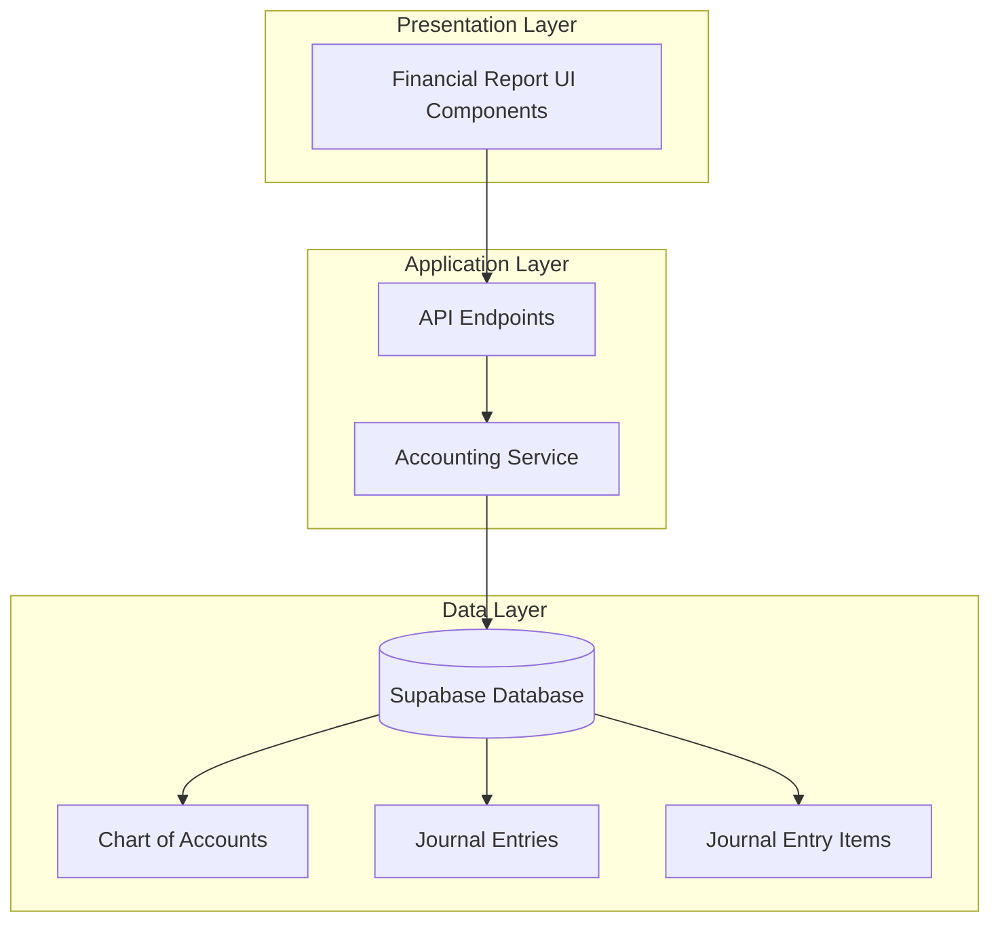
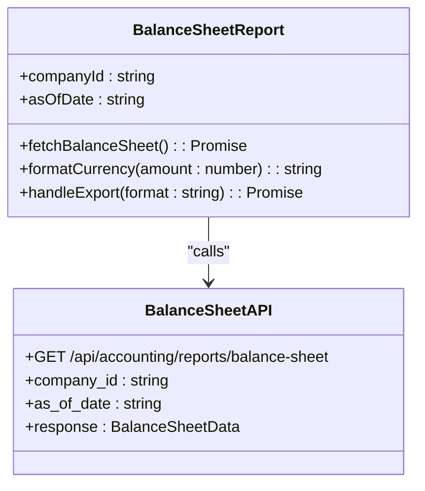
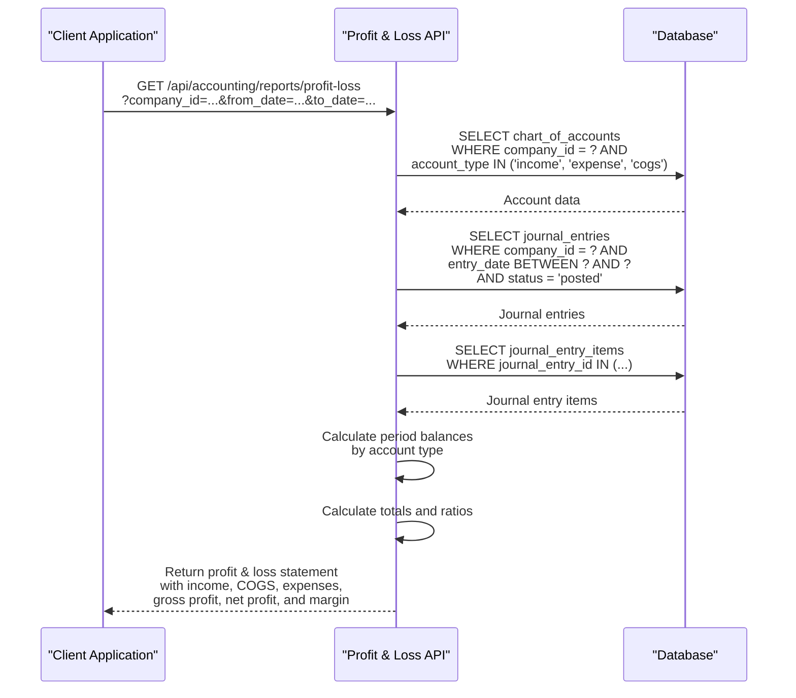
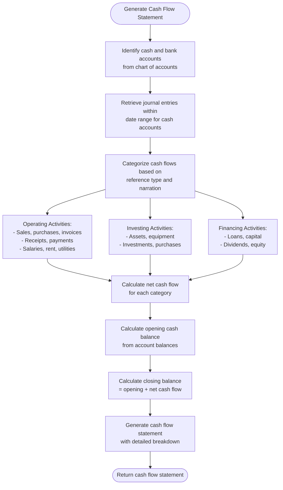
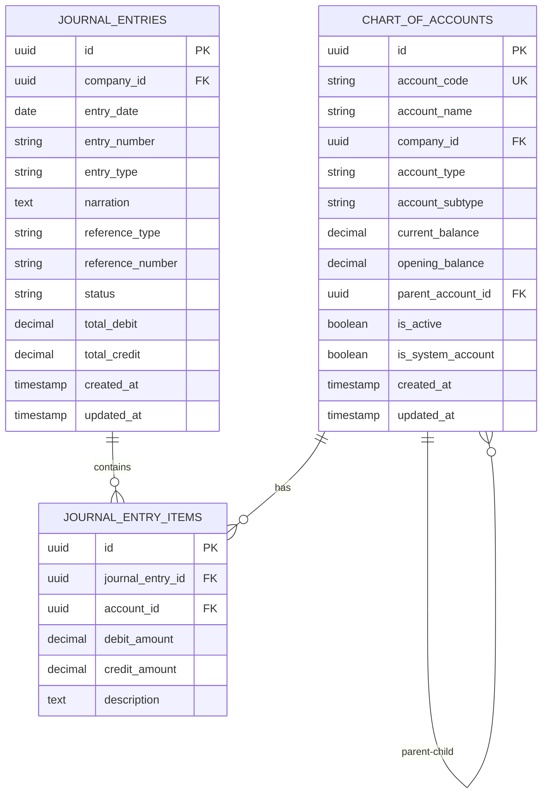
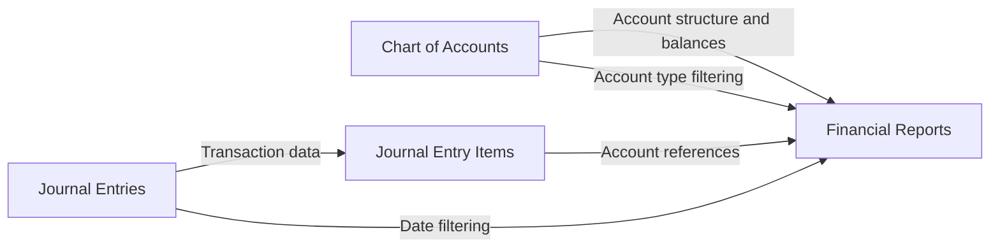
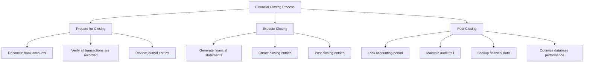

# Financial Reports

<cite>
**Referenced Files in This Document**   
- [balance-sheet.js](file://src/pages/api/accounting/reports/balance-sheet.js)
- [profit-loss.js](file://src/pages/api/accounting/reports/profit-loss.js)
- [cash-flow.js](file://src/pages/api/accounting/reports/cash-flow.js)
- [BalanceSheet.js](file://src/components/accounting/BalanceSheet.js)
- [ProfitLoss.js](file://src/components/accounting/ProfitLoss.js)
- [CashFlowStatement.js](file://src/components/accounting/CashFlowStatement.js)
- [accountingService.js](file://src/services/accountingService.js)
- [masterDataService.js](file://src/services/masterDataService.js)
- [db.js](file://src/lib/db.js)
</cite>

## Table of Contents
1. [Introduction](#introduction)
2. [Financial Reporting Architecture](#financial-reporting-architecture)
3. [Balance Sheet Implementation](#balance-sheet-implementation)
4. [Profit & Loss Statement Implementation](#profit--loss-statement-implementation)
5. [Cash Flow Statement Implementation](#cash-flow-statement-implementation)
6. [Chart of Accounts Integration](#chart-of-accounts-integration)
7. [Data Sources and Processing](#data-sources-and-processing)
8. [API Endpoints and Parameters](#api-endpoints-and-parameters)
9. [Financial Ratios and Analysis](#financial-ratios-and-analysis)
10. [Common Issues and Troubleshooting](#common-issues-and-troubleshooting)
11. [Financial Closing Optimization](#financial-closing-optimization)
12. [Conclusion](#conclusion)

## Introduction
The financial reporting module in ezbillify-v1 provides comprehensive financial statement generation capabilities for businesses, including balance sheet, profit & loss statement, and cash flow statement reports. These reports are essential for financial analysis, regulatory compliance, and business decision-making. The system leverages the general ledger and journal entries as primary data sources, ensuring accuracy and consistency across all financial statements.

The implementation follows standard accounting principles with a focus on real-time data processing and user-friendly interfaces. The reports are accessible through both API endpoints and interactive UI components, allowing for flexible integration and usage patterns. This documentation provides a detailed analysis of the implementation, covering the technical architecture, data flow, API specifications, and best practices for financial reporting in the ezbillify-v1 system.

## Financial Reporting Architecture
The financial reporting system in ezbillify-v1 follows a layered architecture with clear separation of concerns between data access, business logic, and presentation layers. The architecture is designed to ensure data consistency, performance, and extensibility.



**Diagram sources**
- [balance-sheet.js](file://src/pages/api/accounting/reports/balance-sheet.js)
- [accountingService.js](file://src/services/accountingService.js)
- [db.js](file://src/lib/db.js)

**Section sources**
- [balance-sheet.js](file://src/pages/api/accounting/reports/balance-sheet.js)
- [accountingService.js](file://src/services/accountingService.js)

## Balance Sheet Implementation
The balance sheet implementation in ezbillify-v1 follows the standard accounting equation: Assets = Liabilities + Equity. The system generates balance sheets as of a specific date, providing a snapshot of the company's financial position.

The balance sheet API endpoint `/api/accounting/reports/balance-sheet.js` accepts a company ID and as-of date parameter to generate the report. The implementation retrieves all accounts from the chart of accounts for the specified company and categorizes them into assets, liabilities, and equity based on their account type. Assets are further subdivided into current assets, fixed assets, and other assets, while liabilities are categorized into current liabilities, long-term liabilities, and other liabilities.



**Diagram sources**
- [BalanceSheet.js](file://src/components/accounting/BalanceSheet.js)
- [balance-sheet.js](file://src/pages/api/accounting/reports/balance-sheet.js)

**Section sources**
- [balance-sheet.js](file://src/pages/api/accounting/reports/balance-sheet.js)
- [BalanceSheet.js](file://src/components/accounting/BalanceSheet.js)

## Profit & Loss Statement Implementation
The profit & loss statement (also known as income statement) implementation in ezbillify-v1 calculates the company's financial performance over a specified period. The report follows the standard format: Revenue - Cost of Goods Sold = Gross Profit, and Gross Profit - Operating Expenses = Net Profit.

The profit & loss API endpoint `/api/accounting/reports/profit-loss.js` requires a company ID, start date, and end date to define the reporting period. Unlike the balance sheet which uses account balances as of a specific date, the profit & loss statement calculates period-based activity by analyzing journal entries within the specified date range. The implementation identifies income, expense, and cost of goods sold (COGS) accounts from the chart of accounts and calculates their period balances by summing the debit and credit amounts from journal entry items.

The system handles the fundamental accounting principle that income accounts increase with credits while expense accounts increase with debits. The profit & loss statement also includes financial ratios such as net profit margin, which is calculated as (Net Profit / Total Income) * 100.



**Diagram sources**
- [profit-loss.js](file://src/pages/api/accounting/reports/profit-loss.js)
- [ProfitLoss.js](file://src/components/accounting/ProfitLoss.js)

**Section sources**
- [profit-loss.js](file://src/pages/api/accounting/reports/profit-loss.js)
- [ProfitLoss.js](file://src/components/accounting/ProfitLoss.js)

## Cash Flow Statement Implementation
The cash flow statement implementation in ezbillify-v1 categorizes cash movements into three main activities: operating, investing, and financing. This statement provides insights into the company's liquidity and cash management.

The cash flow API endpoint `/api/accounting/reports/cash-flow.js` requires a company ID, start date, and end date to define the reporting period. The implementation first identifies all cash and bank accounts from the chart of accounts, as these are the accounts that directly affect the company's cash position. It then retrieves all journal entries that involve these cash accounts within the specified period.

The system categorizes cash flows based on the reference type or narration keywords in the journal entries. Operating activities include cash flows related to sales, purchases, invoices, receipts, payments, salaries, wages, rent, and utilities. Investing activities include transactions involving assets, equipment, and investments. Financing activities include transactions related to loans, capital, dividends, and equity.

The cash flow statement includes a summary section that shows the net cash flow from each activity category, the total net cash flow, and the opening and closing cash balances. The opening balance is calculated from the current balances of cash accounts, while the closing balance is derived by adding the net cash flow to the opening balance.



**Diagram sources**
- [cash-flow.js](file://src/pages/api/accounting/reports/cash-flow.js)
- [CashFlowStatement.js](file://src/components/accounting/CashFlowStatement.js)

**Section sources**
- [cash-flow.js](file://src/pages/api/accounting/reports/cash-flow.js)
- [CashFlowStatement.js](file://src/components/accounting/CashFlowStatement.js)

## Chart of Accounts Integration
The chart of accounts is the foundation of the financial reporting system in ezbillify-v1, serving as the central repository for all financial accounts and their classifications. The integration between financial reports and the chart of accounts structure is critical for accurate financial statement generation.

The chart of accounts table contains essential fields including account code, account name, account type (asset, liability, equity, income, expense, COGS), and account subtype (e.g., current_asset, fixed_asset, current_liability, long_term_liability). These classifications directly determine how accounts are grouped in financial statements. For example, accounts with type "asset" and subtype "current_asset" appear in the current assets section of the balance sheet.

The system enforces data integrity through validation rules and business logic. When creating or modifying accounts, the system prevents circular dependencies in the account hierarchy and ensures that accounts with transactions cannot be deleted. The chart of accounts also supports hierarchical relationships through the parent_account_id field, allowing for organized account grouping and reporting.



**Diagram sources**
- [masterDataService.js](file://src/services/masterDataService.js)
- [db.js](file://src/lib/db.js)

**Section sources**
- [masterDataService.js](file://src/services/masterDataService.js)
- [accountValidator.js](file://src/services/validators/accountValidator.js)

## Data Sources and Processing
The financial reports in ezbillify-v1 derive their data from two primary sources: the chart of accounts and journal entries. These data sources are interconnected through journal entry items, which link specific transactions to accounts.

The chart of accounts provides the structural framework for financial reporting, defining all available accounts and their classifications. Each account maintains a current_balance field that is updated with each transaction, enabling efficient balance sheet generation without requiring transaction-level calculations.

Journal entries serve as the transactional data source, recording all financial activities in the system. Each journal entry consists of one or more journal entry items that follow the double-entry accounting principle (debits equal credits). The journal entries table includes metadata such as entry date, narration, reference type, and status, which are crucial for proper financial reporting and audit trails.

The data processing flow for financial reports follows a consistent pattern:
1. Retrieve relevant accounts from the chart of accounts based on the report type and company
2. Filter journal entries by company, date range, and status (posted entries only)
3. Extract journal entry items related to the relevant accounts
4. Calculate account balances or period activity based on the report requirements
5. Organize and format the data according to financial statement standards



**Diagram sources**
- [accountingService.js](file://src/services/accountingService.js)
- [db.js](file://src/lib/db.js)

**Section sources**
- [accountingService.js](file://src/services/accountingService.js)
- [db.js](file://src/lib/db.js)

## API Endpoints and Parameters
The financial reporting module exposes three main API endpoints for generating financial statements, each with specific parameters and response structures.

### Balance Sheet Endpoint
**Endpoint**: `GET /api/accounting/reports/balance-sheet.js`
**Parameters**:
- `company_id` (required): The ID of the company for which to generate the report
- `as_of_date` (optional): The date for which to generate the balance sheet (defaults to current date)

**Response Structure**:
```json
{
  "success": true,
  "data": {
    "asOfDate": "2024-01-31",
    "assets": {
      "current": [...],
      "fixed": [...],
      "other": [...],
      "totals": {
        "current": 150000,
        "fixed": 250000,
        "other": 10000,
        "total": 410000
      }
    },
    "liabilities": {
      "current": [...],
      "longTerm": [...],
      "other": [...],
      "totals": {
        "current": 80000,
        "longTerm": 120000,
        "other": 5000,
        "total": 205000
      }
    },
    "equity": {
      "items": [...],
      "total": 205000
    },
    "totals": {
      "assets": 410000,
      "liabilities": 205000,
      "equity": 205000,
      "liabilitiesAndEquity": 410000
    },
    "isBalanced": true
  }
}
```

### Profit & Loss Statement Endpoint
**Endpoint**: `GET /api/accounting/reports/profit-loss.js`
**Parameters**:
- `company_id` (required): The ID of the company for which to generate the report
- `from_date` (required): The start date of the reporting period
- `to_date` (required): The end date of the reporting period

**Response Structure**:
```json
{
  "success": true,
  "data": {
    "period": {
      "from": "2024-01-01",
      "to": "2024-01-31"
    },
    "income": {
      "accounts": [...],
      "total": 200000
    },
    "cogs": {
      "accounts": [...],
      "total": 80000
    },
    "expenses": {
      "accounts": [...],
      "total": 70000
    },
    "grossProfit": 120000,
    "netProfit": 50000,
    "netProfitMargin": 25.00
  }
}
```

### Cash Flow Statement Endpoint
**Endpoint**: `GET /api/accounting/reports/cash-flow.js`
**Parameters**:
- `company_id` (required): The ID of the company for which to generate the report
- `from_date` (required): The start date of the reporting period
- `to_date` (required): The end date of the reporting period

**Response Structure**:
```json
{
  "success": true,
  "data": {
    "period": {
      "from": "2024-01-01",
      "to": "2024-01-31"
    },
    "operating": {
      "items": [...],
      "net": 45000
    },
    "investing": {
      "items": [...],
      "net": -20000
    },
    "financing": {
      "items": [...],
      "net": 10000
    },
    "summary": {
      "netOperating": 45000,
      "netInvesting": -20000,
      "netFinancing": 10000,
      "netCashFlow": 35000,
      "openingBalance": 25000,
      "closingBalance": 60000
    }
  }
}
```

**Section sources**
- [balance-sheet.js](file://src/pages/api/accounting/reports/balance-sheet.js)
- [profit-loss.js](file://src/pages/api/accounting/reports/profit-loss.js)
- [cash-flow.js](file://src/pages/api/accounting/reports/cash-flow.js)

## Financial Ratios and Analysis
The financial reporting system in ezbillify-v1 supports the calculation of key financial ratios that provide deeper insights into a company's financial health and performance. These ratios are derived from the data in the financial statements and are essential for financial analysis and decision-making.

The accounting service includes methods for calculating various financial ratios, including liquidity ratios (current ratio, working capital), profitability ratios (net profit margin, gross profit margin, return on assets), and leverage ratios (debt-to-equity, debt ratio). These ratios are calculated using data from both the balance sheet and profit & loss statement.

For example, the current ratio is calculated by dividing current assets by current liabilities, providing insight into the company's short-term liquidity position. The net profit margin is calculated by dividing net profit by total income, indicating the percentage of revenue that translates into profit. The debt-to-equity ratio is calculated by dividing total liabilities by total equity, showing the company's financial leverage.

The system also supports year-over-year comparisons and multi-period analysis by allowing users to generate financial statements for different periods and compare the results. This enables trend analysis and identification of financial patterns over time.

```mermaid
graph TD
A[Financial Ratios] --> B[Liquidity Ratios]
A --> C[Profitability Ratios]
A --> D[Leverage Ratios]
B --> B1[Current Ratio = Current Assets / Current Liabilities]
B --> B2[Working Capital = Current Assets - Current Liabilities]
C --> C1[Net Profit Margin = (Net Profit / Total Income) * 100]
C --> C2[Gross Profit Margin = (Gross Profit / Total Income) * 100]
C --> C3[Return on Assets = (Net Profit / Total Assets) * 100]
D --> D1[Debt-to-Equity = Total Liabilities / Total Equity]
D --> D2[Debt Ratio = Total Liabilities / Total Assets]
```

**Diagram sources**
- [accountingService.js](file://src/services/accountingService.js)

**Section sources**
- [accountingService.js](file://src/services/accountingService.js)

## Common Issues and Troubleshooting
The financial reporting system in ezbillify-v1 may encounter several common issues that affect the accuracy and reliability of financial statements. Understanding these issues and their solutions is crucial for maintaining data integrity.

### Incorrect Account Classifications
One common issue is incorrect account classifications in the chart of accounts. If an account is assigned to the wrong account type or subtype, it will appear in the wrong section of financial statements. For example, classifying a long-term loan as a current liability will distort the current ratio and working capital calculations. The solution is to implement proper validation and review processes when creating or modifying accounts, and to conduct regular audits of the chart of accounts structure.

### Timing Differences in Revenue Recognition
Timing differences in revenue recognition can occur when revenue is recorded in the wrong accounting period. This violates the matching principle and can lead to inaccurate profit & loss statements. The system addresses this by requiring users to specify the entry date for journal entries and by only including posted entries in financial reports. However, users must ensure that transactions are recorded in the correct period according to accounting standards.

### Errors in Cash Flow Categorization
The cash flow statement relies on automated categorization based on reference types and narration keywords, which may not always be accurate. For example, a payment for equipment might be categorized as an operating activity if the narration doesn't clearly indicate it's a capital expenditure. The solution is to implement standardized naming conventions for journal entry narrations and reference types, and to provide manual override capabilities for cash flow categorization.

### Unbalanced Journal Entries
Unbalanced journal entries (where total debits do not equal total credits) can cause errors in financial reporting. The system validates journal entries to ensure they are balanced before posting, preventing this issue. However, users should understand the double-entry accounting principle to create valid journal entries.

**Section sources**
- [accountValidator.js](file://src/services/validators/accountValidator.js)
- [accountingService.js](file://src/services/accountingService.js)
- [balance-sheet.js](file://src/pages/api/accounting/reports/balance-sheet.js)

## Financial Closing Optimization
The financial closing process in ezbillify-v1 can be optimized through several strategies to ensure accuracy, efficiency, and data integrity. These optimizations are particularly important for month-end and year-end closing procedures.

### Period Locking
Period locking prevents the creation or modification of journal entries for closed accounting periods. This ensures that financial statements for closed periods remain consistent and cannot be altered. The system can implement period locking by adding a status field to accounting periods and validating the period status before allowing journal entry creation or modification.

### Audit Trail Maintenance
Maintaining a comprehensive audit trail is essential for financial closing. The system tracks all changes to financial data through audit logs that record user actions, timestamps, and previous values. This provides transparency and accountability, making it easier to identify and correct errors. The audit trail should include all critical operations such as journal entry creation, modification, and deletion.

### Performance Optimization for Large Ledger Datasets
For companies with large volumes of financial transactions, performance optimization is crucial. The system can implement several strategies:
- Indexing key fields in the database (company_id, entry_date, account_id)
- Caching frequently accessed data such as account balances
- Using database views or materialized views for complex financial calculations
- Implementing pagination for large result sets
- Optimizing database queries to minimize data retrieval

The accounting service already includes methods for efficient data retrieval, such as the getTrialBalance method that uses a database RPC (Remote Procedure Call) for performance-critical operations.



**Diagram sources**
- [accountingService.js](file://src/services/accountingService.js)

**Section sources**
- [accountingService.js](file://src/services/accountingService.js)
- [db.js](file://src/lib/db.js)

## Conclusion
The financial reporting module in ezbillify-v1 provides a comprehensive solution for generating balance sheets, profit & loss statements, and cash flow statements. The system is built on a solid architectural foundation that integrates the chart of accounts, journal entries, and financial reporting logic to deliver accurate and reliable financial information.

Key strengths of the implementation include:
- Clear separation of concerns between data access, business logic, and presentation layers
- Standardized API endpoints with consistent parameter and response structures
- Comprehensive data validation and integrity checks
- Support for financial ratios and multi-period analysis
- User-friendly interfaces for report generation and export

To maximize the effectiveness of the financial reporting system, organizations should:
1. Maintain accurate and up-to-date chart of accounts classifications
2. Follow consistent naming conventions for journal entry narrations and reference types
3. Implement regular reconciliation processes
4. Utilize period locking to ensure data integrity
5. Monitor system performance and apply optimizations as needed

The financial reporting module serves as a critical tool for financial management, regulatory compliance, and strategic decision-making in ezbillify-v1, providing stakeholders with timely and accurate financial information.