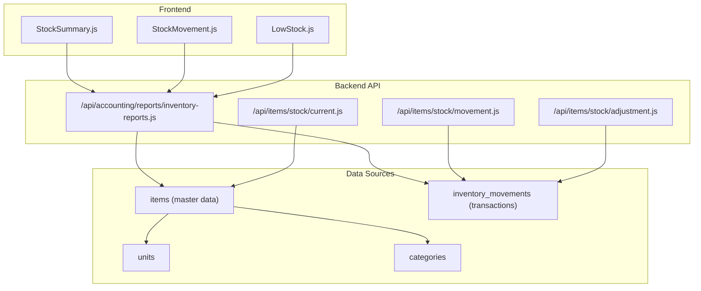
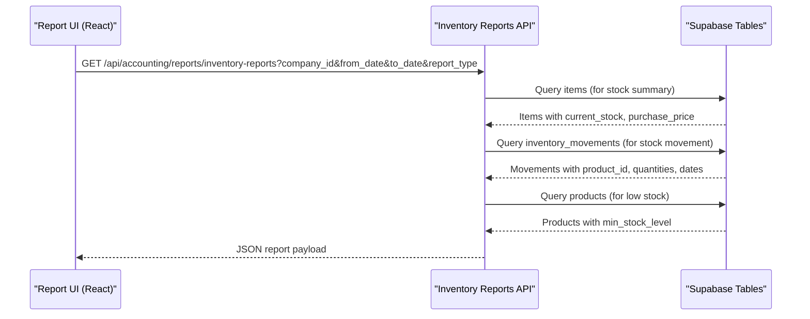
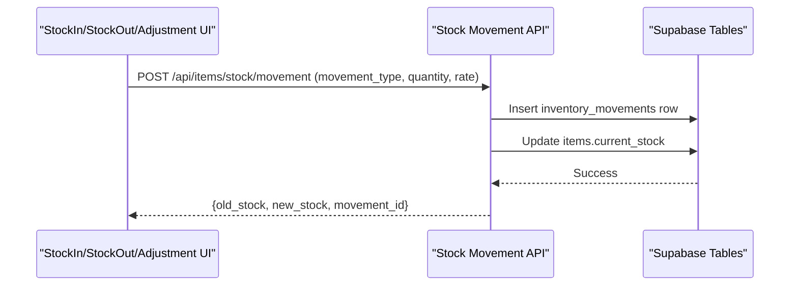
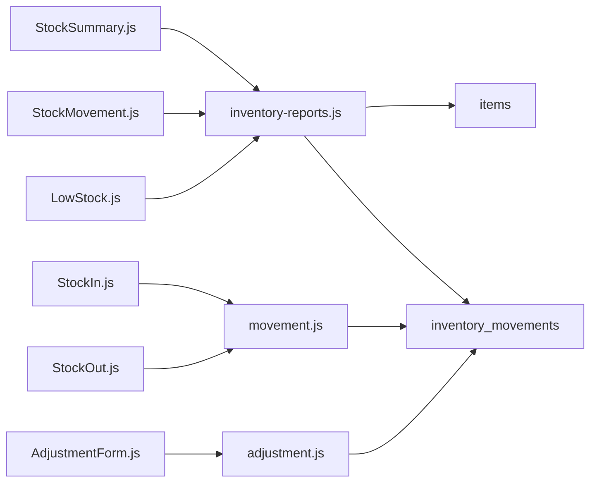

# Inventory Reports

<cite>
**Referenced Files in This Document**
- [inventory-reports.js](file://src/pages/api/accounting/reports/inventory-reports.js)
- [StockSummary.js](file://src/components/accounting/reports/inventory/StockSummary.js)
- [StockMovement.js](file://src/components/accounting/reports/inventory/StockMovement.js)
- [LowStock.js](file://src/components/accounting/reports/inventory/LowStock.js)
- [movement.js](file://src/pages/api/items/stock/movement.js)
- [adjustment.js](file://src/pages/api/items/stock/adjustment.js)
- [StockIn.js](file://src/components/items/StockIn.js)
- [StockOut.js](file://src/components/items/StockOut.js)
- [AdjustmentForm.js](file://src/components/items/AdjustmentForm.js)
- [ItemView.js](file://src/components/items/ItemView.js)
- [StockValuation.js](file://src/components/items/StockValuation.js)
- [ItemForm.js](file://src/components/items/ItemForm.js)
- [current.js](file://src/pages/api/items/stock/current.js)
</cite>

## Table of Contents
1. [Introduction](#introduction)
2. [Project Structure](#project-structure)
3. [Core Components](#core-components)
4. [Architecture Overview](#architecture-overview)
5. [Detailed Component Analysis](#detailed-component-analysis)
6. [Dependency Analysis](#dependency-analysis)
7. [Performance Considerations](#performance-considerations)
8. [Troubleshooting Guide](#troubleshooting-guide)
9. [Conclusion](#conclusion)

## Introduction
This document explains the inventory reporting module in ezbillify-v1, focusing on three key reports: stock summary, stock movement, and low stock alerts. It details how these reports are generated from inventory transactions and stock adjustments, documents the API endpoint for inventory reports, and clarifies how item master data integrates with reporting. It also covers practical examples for inventory turnover and stock aging, addresses common issues such as discrepancies and valuation problems, and provides optimization tips for report accuracy.

## Project Structure
The inventory reporting module spans frontend React components and backend API endpoints:
- Frontend report components render UI, collect date ranges, and call the inventory reports API.
- Backend API endpoints aggregate data from inventory transactions and stock adjustments.
- Item master data (items, units, categories) underpins valuation and thresholds used in reports.

**Diagram sources**
- [inventory-reports.js](file://src/pages/api/accounting/reports/inventory-reports.js#L1-L214)
- [StockSummary.js](file://src/components/accounting/reports/inventory/StockSummary.js#L1-L252)
- [StockMovement.js](file://src/components/accounting/reports/inventory/StockMovement.js#L1-L249)
- [LowStock.js](file://src/components/accounting/reports/inventory/LowStock.js#L1-L204)
- [movement.js](file://src/pages/api/items/stock/movement.js#L1-L309)
- [adjustment.js](file://src/pages/api/items/stock/adjustment.js#L1-L257)
- [current.js](file://src/pages/api/items/stock/current.js#L90-L154)

**Section sources**
- [inventory-reports.js](file://src/pages/api/accounting/reports/inventory-reports.js#L1-L214)
- [StockSummary.js](file://src/components/accounting/reports/inventory/StockSummary.js#L1-L252)
- [StockMovement.js](file://src/components/accounting/reports/inventory/StockMovement.js#L1-L249)
- [LowStock.js](file://src/components/accounting/reports/inventory/LowStock.js#L1-L204)
- [movement.js](file://src/pages/api/items/stock/movement.js#L1-L309)
- [adjustment.js](file://src/pages/api/items/stock/adjustment.js#L1-L257)
- [current.js](file://src/pages/api/items/stock/current.js#L90-L154)

## Core Components
- Stock Summary Report: Aggregates current stock and valuation by purchase price, sorted by stock value.
- Stock Movement Report: Groups movements by product within a date range, computes totals in/out and net movement.
- Low Stock Alert Report: Identifies items where current stock is below the configured minimum threshold.

Each report is driven by:
- Inventory transactions stored in inventory_movements.
- Item master data (current_stock, purchase_price, min_stock_level, unit, category).
- Optional branch filtering in transaction APIs.

**Section sources**
- [inventory-reports.js](file://src/pages/api/accounting/reports/inventory-reports.js#L47-L212)
- [StockSummary.js](file://src/components/accounting/reports/inventory/StockSummary.js#L1-L252)
- [StockMovement.js](file://src/components/accounting/reports/inventory/StockMovement.js#L1-L249)
- [LowStock.js](file://src/components/accounting/reports/inventory/LowStock.js#L1-L204)

## Architecture Overview
The reporting pipeline connects UI components to the inventory reports API, which queries Supabase tables for items and inventory movements.

**Diagram sources**
- [inventory-reports.js](file://src/pages/api/accounting/reports/inventory-reports.js#L14-L212)
- [StockSummary.js](file://src/components/accounting/reports/inventory/StockSummary.js#L28-L44)
- [StockMovement.js](file://src/components/accounting/reports/inventory/StockMovement.js#L28-L44)
- [LowStock.js](file://src/components/accounting/reports/inventory/LowStock.js#L23-L37)

## Detailed Component Analysis

### API Endpoint: /api/accounting/reports/inventory-reports.js
- Purpose: Single endpoint serving three report types: stock_summary, stock_movement, low_stock.
- Request parameters:
  - company_id: Required
  - from_date: Required for stock_summary and stock_movement
  - to_date: Required for stock_summary and stock_movement
  - report_type: Required; one of stock_summary, stock_movement, low_stock
- Behavior:
  - Validates presence of required parameters.
  - Switches to appropriate handler based on report_type.
  - Returns structured JSON with data and summary fields.

Implementation highlights:
- Stock summary: selects items, computes stock_value as current_stock × purchase_price, sorts by value, and returns totals.
- Stock movement: selects inventory_movements within date range, groups by product, aggregates totals in/out/net, and returns summary counts.
- Low stock: selects items where current_stock < min_stock_level and returns counts.

**Section sources**
- [inventory-reports.js](file://src/pages/api/accounting/reports/inventory-reports.js#L14-L46)
- [inventory-reports.js](file://src/pages/api/accounting/reports/inventory-reports.js#L47-L95)
- [inventory-reports.js](file://src/pages/api/accounting/reports/inventory-reports.js#L97-L177)
- [inventory-reports.js](file://src/pages/api/accounting/reports/inventory-reports.js#L179-L212)

### Stock Summary Report (UI)
- Collects a date range and calls the inventory reports API with report_type=stock_summary.
- Displays totals for total_products, total_stock, and total_value.
- Renders a table of products with current_stock, unit, purchase_price, and computed stock_value.

Practical example from codebase:
- Stock value calculation uses current_stock × purchase_price per product.

**Section sources**
- [StockSummary.js](file://src/components/accounting/reports/inventory/StockSummary.js#L1-L252)
- [inventory-reports.js](file://src/pages/api/accounting/reports/inventory-reports.js#L47-L95)

### Stock Movement Report (UI)
- Collects a date range and calls the inventory reports API with report_type=stock_movement.
- Groups movements by product, computes total_in, total_out, and net_movement.
- Displays summary counts and a product-level table.

Practical example from codebase:
- Net movement computed as total_in minus total_out per product.

**Section sources**
- [StockMovement.js](file://src/components/accounting/reports/inventory/StockMovement.js#L1-L249)
- [inventory-reports.js](file://src/pages/api/accounting/reports/inventory-reports.js#L97-L177)

### Low Stock Alert Report (UI)
- Calls the inventory reports API with report_type=low_stock.
- Filters items where current_stock < min_stock_level and displays counts.

Practical example from codebase:
- Threshold comparison against min_stock_level.

**Section sources**
- [LowStock.js](file://src/components/accounting/reports/inventory/LowStock.js#L1-L204)
- [inventory-reports.js](file://src/pages/api/accounting/reports/inventory-reports.js#L179-L212)

### Data Sources and Integration with Item Master Data
- Items table fields used:
  - current_stock, purchase_price, min_stock_level, unit, category.
- Inventory movements table fields used:
  - item_id, movement_type, quantity, reference_type, reference_id, created_at, movement_date.
- Integration points:
  - Stock summary joins items with inventory_movements to compute valuation.
  - Stock movement groups by product_id and aggregates quantities.
  - Low stock report compares current_stock to min_stock_level.

Evidence from codebase:
- Stock summary uses current_stock and purchase_price to compute stock_value.
- Stock movement aggregates quantities grouped by product_id.
- Low stock report filters products where current_stock < min_stock_level.

**Section sources**
- [inventory-reports.js](file://src/pages/api/accounting/reports/inventory-reports.js#L47-L212)
- [ItemView.js](file://src/components/items/ItemView.js#L350-L424)

### Practical Examples: Turnover, Aging, Reorder Point
- Inventory turnover: The system does not compute turnover ratio in the reported code. To implement, you would typically use cost of goods sold (COGS) and average inventory over a period. COGS can be derived from sales documents and inventory movements; average inventory can be computed from opening and closing stock. This is a conceptual extension not present in the current codebase.
- Stock aging: The system does not compute aging buckets (e.g., 0–30 days, 31–60 days) in the reported code. To implement, you would group inventory_movements by item and compute age based on movement_date relative to the report period. This is a conceptual extension not present in the current codebase.
- Reorder point: The system exposes reorder_level in item master data and uses it for low stock alerts. There is no explicit reorder point calculation logic in the reported code; it relies on the configured threshold.

**Section sources**
- [ItemForm.js](file://src/components/items/ItemForm.js#L550-L600)
- [StockOut.js](file://src/components/items/StockOut.js#L342-L366)
- [ItemView.js](file://src/components/items/ItemView.js#L350-L424)

### Transaction and Adjustment Integration
- StockIn and StockOut create inventory_movements with movement_type 'in' or 'out'.
- AdjustmentForm creates inventory_movements with movement_type 'adjustment'.
- These movements feed the stock_movement report and affect current_stock in items.

**Diagram sources**
- [StockIn.js](file://src/components/items/StockIn.js#L92-L114)
- [StockOut.js](file://src/components/items/StockOut.js#L131-L171)
- [AdjustmentForm.js](file://src/components/items/AdjustmentForm.js#L94-L123)
- [movement.js](file://src/pages/api/items/stock/movement.js#L147-L309)
- [adjustment.js](file://src/pages/api/items/stock/adjustment.js#L29-L165)

**Section sources**
- [StockIn.js](file://src/components/items/StockIn.js#L92-L114)
- [StockOut.js](file://src/components/items/StockOut.js#L131-L171)
- [AdjustmentForm.js](file://src/components/items/AdjustmentForm.js#L94-L123)
- [movement.js](file://src/pages/api/items/stock/movement.js#L147-L309)
- [adjustment.js](file://src/pages/api/items/stock/adjustment.js#L29-L165)

### Stock Valuation Integration
- StockValuation demonstrates valuation using different costing methods and computes percentages of total inventory value.
- The inventory reports module uses purchase_price for valuation in stock summary.

**Section sources**
- [StockValuation.js](file://src/components/items/StockValuation.js#L101-L127)
- [StockValuation.js](file://src/components/items/StockValuation.js#L261-L308)
- [inventory-reports.js](file://src/pages/api/accounting/reports/inventory-reports.js#L47-L95)

## Dependency Analysis
- Report UI components depend on the inventory reports API.
- The inventory reports API depends on items and inventory_movements tables.
- Transaction APIs (stock movement and adjustment) update inventory_movements and items, indirectly affecting report accuracy.

**Diagram sources**
- [StockSummary.js](file://src/components/accounting/reports/inventory/StockSummary.js#L1-L252)
- [StockMovement.js](file://src/components/accounting/reports/inventory/StockMovement.js#L1-L249)
- [LowStock.js](file://src/components/accounting/reports/inventory/LowStock.js#L1-L204)
- [inventory-reports.js](file://src/pages/api/accounting/reports/inventory-reports.js#L1-L214)
- [movement.js](file://src/pages/api/items/stock/movement.js#L1-L309)
- [adjustment.js](file://src/pages/api/items/stock/adjustment.js#L1-L257)

**Section sources**
- [StockSummary.js](file://src/components/accounting/reports/inventory/StockSummary.js#L1-L252)
- [StockMovement.js](file://src/components/accounting/reports/inventory/StockMovement.js#L1-L249)
- [LowStock.js](file://src/components/accounting/reports/inventory/LowStock.js#L1-L204)
- [inventory-reports.js](file://src/pages/api/accounting/reports/inventory-reports.js#L1-L214)
- [movement.js](file://src/pages/api/items/stock/movement.js#L1-L309)
- [adjustment.js](file://src/pages/api/items/stock/adjustment.js#L1-L257)

## Performance Considerations
- Indexing: Ensure indexes exist on inventory_movements for company_id, item_id, movement_date, and created_at to speed up report queries.
- Pagination: Use pagination parameters in movement and adjustment APIs to limit result sets.
- Filtering: Apply date filters and item filters early in queries to reduce dataset size.
- Sorting: Avoid expensive sorting on large datasets; precompute aggregates where possible.
- Caching: Consider caching frequently accessed item metadata (units, categories) to reduce repeated lookups.

[No sources needed since this section provides general guidance]

## Troubleshooting Guide
Common issues and resolutions:
- Stock quantity discrepancies:
  - Verify that all stock_in and stock_out entries are recorded consistently with correct movement_type and dates.
  - Confirm that stock adjustments are applied with correct adjustment_type and that items’ current_stock reflects the latest adjustment.
  - Check for missing or duplicate movements in inventory_movements.

- Inaccurate valuation due to wrong costing methods:
  - The stock summary uses purchase_price for valuation. If FIFO/LIFO is desired, implement a separate valuation report using inventory_movements timestamps and weighted averages.
  - Ensure rate/rate fields are populated during stock_in operations.

- Missing movement history:
  - Confirm that movement_date is set and not in the future.
  - Ensure movement_type is correctly set to 'in', 'out', or 'adjustment'.
  - Verify that item.track_inventory is enabled for items participating in stock movements.

- Low stock alerts not triggering:
  - Ensure min_stock_level is set on items.
  - Confirm that current_stock is updated after each transaction.

**Section sources**
- [movement.js](file://src/pages/api/items/stock/movement.js#L147-L309)
- [adjustment.js](file://src/pages/api/items/stock/adjustment.js#L29-L165)
- [StockIn.js](file://src/components/items/StockIn.js#L92-L114)
- [StockOut.js](file://src/components/items/StockOut.js#L131-L171)
- [AdjustmentForm.js](file://src/components/items/AdjustmentForm.js#L94-L123)
- [ItemForm.js](file://src/components/items/ItemForm.js#L550-L600)

## Conclusion
The inventory reporting module in ezbillify-v1 provides three essential reports—stock summary, stock movement, and low stock alerts—powered by inventory_movements and item master data. The inventory reports API consolidates data from items and inventory_movements, while transaction APIs (stock movement and adjustment) keep the underlying data consistent. While the current implementation focuses on purchase-price valuation and basic thresholds, extensions can add turnover, aging, and advanced costing methods to enhance reporting depth.