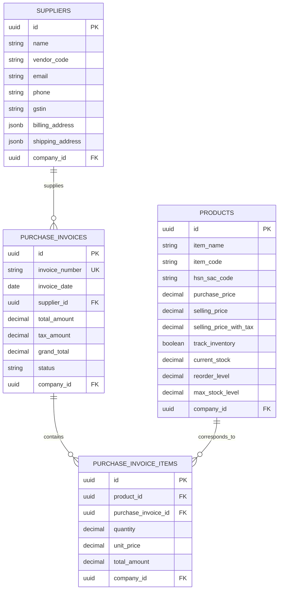
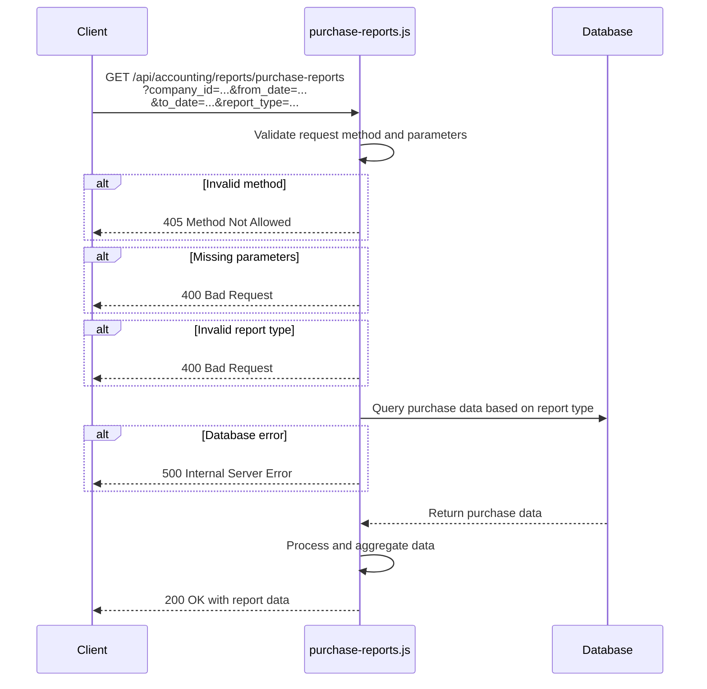
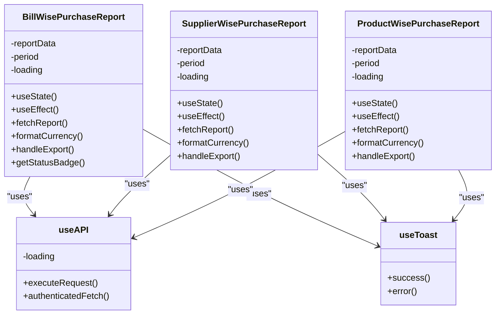
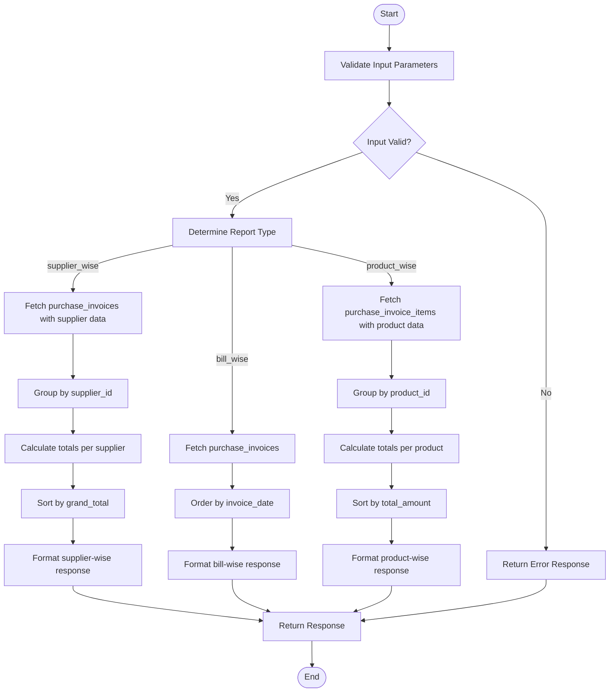
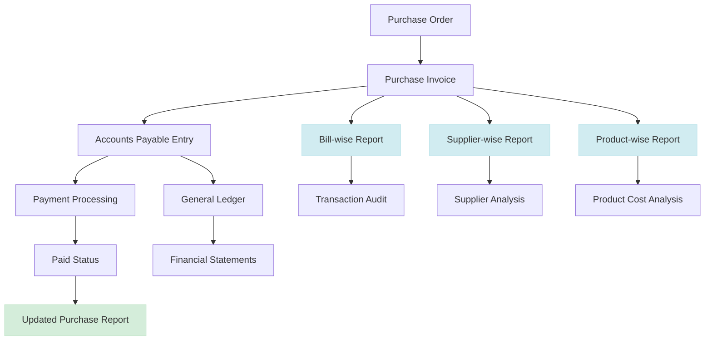
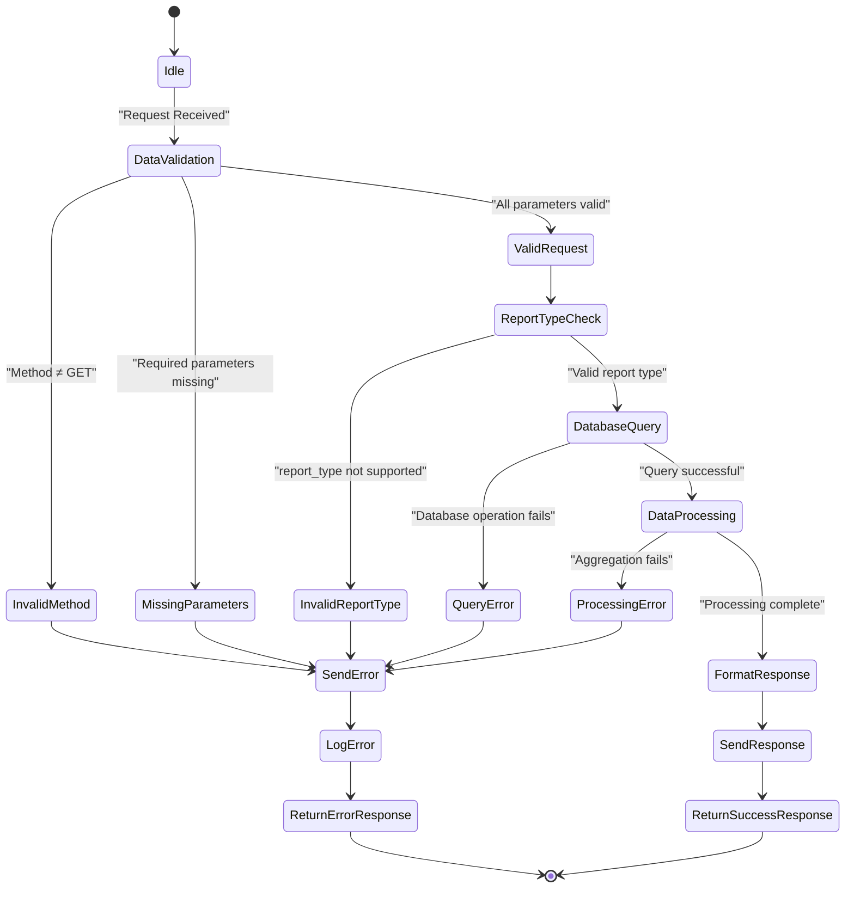
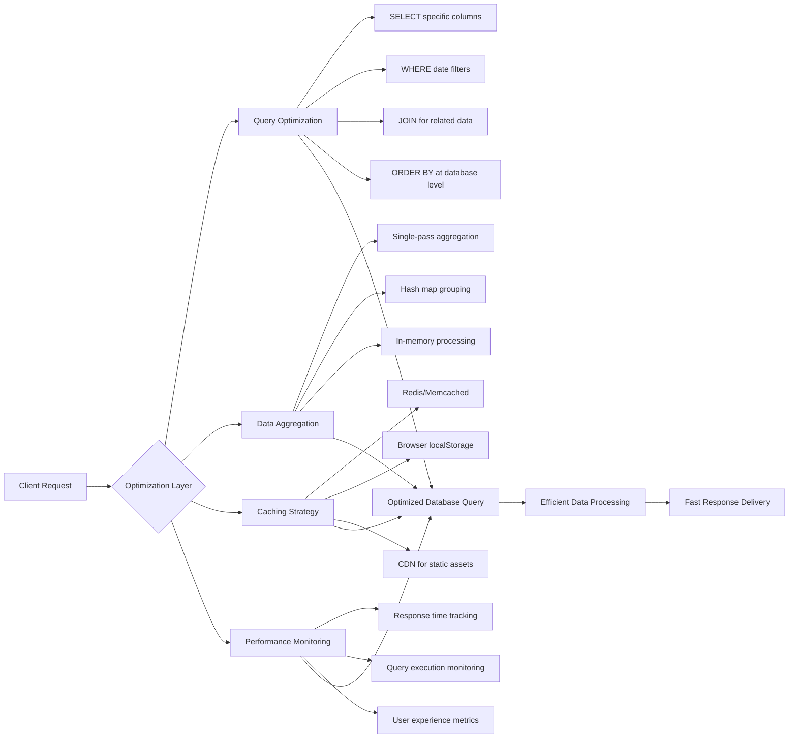

# Purchase Reports

<cite>
**Referenced Files in This Document**   
- [purchase-reports.js](file://src/pages/api/accounting/reports/purchase-reports.js)
- [BillWisePurchase.js](file://src/components/accounting/reports/purchase/BillWisePurchase.js)
- [SupplierWisePurchase.js](file://src/components/accounting/reports/purchase/SupplierWisePurchase.js)
- [ProductWisePurchase.js](file://src/components/accounting/reports/purchase/ProductWisePurchase.js)
- [bill-wise.js](file://src/pages/accounting/reports/purchase/bill-wise.js)
- [supplier-wise.js](file://src/pages/accounting/reports/purchase/supplier-wise.js)
- [product-wise.js](file://src/pages/accounting/reports/purchase/product-wise.js)
</cite>

## Table of Contents
1. [Introduction](#introduction)
2. [Report Types and Data Sources](#report-types-and-data-sources)
3. [API Endpoint Details](#api-endpoint-details)
4. [Frontend Implementation](#frontend-implementation)
5. [Data Aggregation and Processing](#data-aggregation-and-processing)
6. [Relationship with Accounts Payable](#relationship-with-accounts-payable)
7. [Common Issues and Error Handling](#common-issues-and-error-handling)
8. [Performance Optimization Strategies](#performance-optimization-strategies)
9. [Conclusion](#conclusion)

## Introduction
The purchase reporting module in ezbillify-v1 provides comprehensive analytics for procurement activities through three specialized report types: bill-wise, supplier-wise, and product-wise purchase reports. These reports enable businesses to analyze their purchasing patterns, evaluate supplier performance, and conduct detailed cost analysis. The system integrates with purchase documents and bills to extract relevant data, providing insights into procurement efficiency and financial obligations. This documentation details the implementation of these reports, their data sources, API specifications, and optimization strategies for handling large datasets.

**Section sources**
- [purchase-reports.js](file://src/pages/api/accounting/reports/purchase-reports.js#L1-L245)

## Report Types and Data Sources
The purchase reporting module offers three distinct report types, each serving different analytical purposes and drawing from specific data sources within the procurement system.

### Bill-wise Purchase Report
The bill-wise purchase report provides a detailed view of individual purchase transactions, displaying each purchase invoice with its associated metadata. This report sources data from the `purchase_invoices` table, including invoice number, date, supplier information, financial amounts (total, tax, and grand total), and status. It serves as a transaction-level audit trail for all purchases, enabling users to track individual bills and their payment status.

### Supplier-wise Purchase Report
The supplier-wise purchase report aggregates purchasing data by vendor, allowing businesses to analyze supplier relationships and performance. This report groups purchase invoices by supplier_id, calculating total purchase volume, tax amounts, and grand totals for each supplier. It helps identify key suppliers, evaluate spending patterns across vendors, and assess supplier concentration risk. The data is sourced from the `purchase_invoices` table with a join to the `suppliers` table for supplier name information.

### Product-wise Purchase Report
The product-wise purchase report analyzes purchasing patterns at the item level, aggregating data from purchase invoice items. This report sources data from the `purchase_invoice_items` table with relationships to `products` and `purchase_invoices`, enabling analysis of product-specific procurement trends. It calculates total quantities purchased, total amounts spent, and average purchase prices for each product, helping identify high-volume items, price fluctuations, and inventory procurement patterns.



**Diagram sources **
- [purchase-reports.js](file://src/pages/api/accounting/reports/purchase-reports.js#L48-L243)
- [add_barcodes_array_fixed.sql](file://migrations/add_barcodes_array_fixed.sql#L1-L111)

**Section sources**
- [purchase-reports.js](file://src/pages/api/accounting/reports/purchase-reports.js#L48-L243)
- [add_barcodes_array_fixed.sql](file://migrations/add_barcodes_array_fixed.sql#L1-L111)

## API Endpoint Details
The purchase reports API endpoint at `/api/accounting/reports/purchase-reports.js` serves as the backend interface for generating all purchase-related reports. This RESTful endpoint accepts GET requests with specific query parameters to determine the report type and filtering criteria.

### Query Parameters
The API requires four mandatory query parameters:
- `company_id`: UUID identifying the company for which the report is generated
- `from_date`: Start date for the reporting period (inclusive)
- `to_date`: End date for the reporting period (inclusive)
- `report_type`: Type of report to generate (supplier_wise, bill_wise, or product_wise)

### Response Structure
The API returns a standardized JSON response structure with the following components:

```json
{
  "success": true,
  "data": {
    "period": {
      "from": "YYYY-MM-DD",
      "to": "YYYY-MM-DD"
    },
    "report_type": "report_type_value",
    "summary": {
      "total_invoices": 0,
      "total_amount": 0.00,
      "total_tax": 0.00,
      "total_grand": 0.00
    },
    "report_specific_data": []
  }
}
```

For bill-wise reports, the `report_specific_data` is an array of invoices. For supplier-wise reports, it's an array of supplier objects with their aggregated purchase data. For product-wise reports, it's an array of product objects with aggregated purchase metrics.

### Error Conditions
The API handles several error conditions with appropriate HTTP status codes:
- 405 Method Not Allowed: When a method other than GET is used
- 400 Bad Request: When required parameters are missing or report type is invalid
- 500 Internal Server Error: When database operations fail

The error responses include a success flag, error message, and optional details in development mode.



**Diagram sources **
- [purchase-reports.js](file://src/pages/api/accounting/reports/purchase-reports.js#L1-L245)

**Section sources**
- [purchase-reports.js](file://src/pages/api/accounting/reports/purchase-reports.js#L1-L245)

## Frontend Implementation
The frontend implementation of the purchase reporting module consists of three React components that provide user interfaces for each report type, along with corresponding page routes.

### Component Architecture
The three main components—`BillWisePurchase.js`, `SupplierWisePurchase.js`, and `ProductWisePurchase.js`—follow a consistent architecture pattern. Each component uses React hooks for state management and side effects, with shared functionality for data fetching, loading states, and export capabilities.

Key features of the component architecture include:
- State management for date range selection and report data
- Integration with authentication and API hooks
- Export functionality to Excel, PDF, and JSON formats
- Responsive table displays with summary statistics
- Loading indicators and empty state handling

### User Interface Elements
Each report component provides a consistent user interface with the following elements:
- Date range selectors for filtering the reporting period
- Refresh button to regenerate the report with current parameters
- Export dropdown for downloading the report in multiple formats
- Summary cards displaying key metrics (total invoices, amounts, etc.)
- Data tables with appropriate columns for each report type
- Status badges for visualizing invoice payment status

The components are designed to be reusable and are instantiated with a companyId prop, making them adaptable to different company contexts within the application.



**Diagram sources **
- [BillWisePurchase.js](file://src/components/accounting/reports/purchase/BillWisePurchase.js#L1-L278)
- [SupplierWisePurchase.js](file://src/components/accounting/reports/purchase/SupplierWisePurchase.js#L1-L251)
- [ProductWisePurchase.js](file://src/components/accounting/reports/purchase/ProductWisePurchase.js#L1-L246)

**Section sources**
- [BillWisePurchase.js](file://src/components/accounting/reports/purchase/BillWisePurchase.js#L1-L278)
- [SupplierWisePurchase.js](file://src/components/accounting/reports/purchase/SupplierWisePurchase.js#L1-L251)
- [ProductWisePurchase.js](file://src/components/accounting/reports/purchase/ProductWisePurchase.js#L1-L246)

## Data Aggregation and Processing
The purchase reporting module employs efficient data aggregation techniques to transform raw purchase data into meaningful analytical insights. Each report type follows a specific processing pattern to group and summarize data according to its analytical purpose.

### Supplier-wise Data Processing
The supplier-wise report processing begins with retrieving all purchase invoices within the specified date range. The data is then grouped by supplier_id using a JavaScript object as a hash map. For each invoice, the system accumulates totals for amount, tax, and grand total while maintaining a list of individual invoices for detailed viewing. The final step sorts suppliers by grand total in descending order to highlight the most significant suppliers.

### Bill-wise Data Processing
The bill-wise report requires minimal processing as it displays transaction-level data. The system retrieves purchase invoices within the date range and orders them by invoice date. No aggregation is performed at the API level, as the frontend handles sorting and filtering. The response includes all invoice details with supplier names resolved through a database join.

### Product-wise Data Processing
The product-wise report processing is more complex, requiring data from purchase invoice items. The system retrieves all items from purchase invoices within the date range, then groups them by product_id. For each product, it accumulates total quantity and total amount while maintaining a list of individual purchase transactions. The average price is calculated on the fly by dividing total amount by total quantity. The results are sorted by total amount to highlight the most expensive products.



**Diagram sources **
- [purchase-reports.js](file://src/pages/api/accounting/reports/purchase-reports.js#L48-L243)

**Section sources**
- [purchase-reports.js](file://src/pages/api/accounting/reports/purchase-reports.js#L48-L243)

## Relationship with Accounts Payable
The purchase reporting module has a direct relationship with accounts payable data, serving as both a source of information for AP processes and a consumer of AP status updates.

### Data Flow Integration
Purchase invoices generated through the procurement process become the primary source of accounts payable entries. When a purchase invoice is created or updated, it automatically creates or updates a corresponding payable entry in the accounting system. The purchase reports reflect the current status of these payables, including payment status (paid, pending, overdue) which is synchronized between the purchase and accounting modules.

### Financial Reconciliation
The purchase reports play a crucial role in accounts payable reconciliation by providing detailed transaction data that can be matched against supplier statements. The bill-wise report serves as a transaction register for all purchases, while the supplier-wise report helps identify outstanding balances by vendor. This enables efficient reconciliation processes and helps prevent duplicate payments or missed payments.

### Payment Status Synchronization
The status field in purchase invoices (used in the bill-wise report) is synchronized with the accounts payable ledger. When a payment is recorded against a purchase invoice, the status is updated from "pending" to "paid" (or "overdue" if past due). This status is reflected in all purchase reports, providing real-time visibility into payment obligations and cash flow requirements.



**Diagram sources **
- [purchase-reports.js](file://src/pages/api/accounting/reports/purchase-reports.js#L1-L245)
- [bill-wise.js](file://src/pages/accounting/reports/purchase/bill-wise.js#L1-L51)

**Section sources**
- [purchase-reports.js](file://src/pages/api/accounting/reports/purchase-reports.js#L1-L245)
- [bill-wise.js](file://src/pages/accounting/reports/purchase/bill-wise.js#L1-L51)

## Common Issues and Error Handling
The purchase reporting module addresses several common issues that can arise in procurement data management, with specific error handling mechanisms to ensure data integrity and reporting accuracy.

### Mismatched Purchase Amounts
Mismatched purchase amounts can occur when there are discrepancies between invoice totals and the sum of line items. The system validates these amounts at the point of invoice creation and updates, but the reporting module includes safeguards to handle any inconsistencies. When generating reports, the system uses the stored total_amount, tax_amount, and grand_total fields from the purchase_invoices table, which are calculated and validated during invoice processing.

### Duplicate Bill Entries
Duplicate bill entries are prevented through database constraints and application-level validation. The migration scripts show that the system has implemented uniqueness constraints on critical fields. When duplicate entries do occur, the reporting module handles them by including all entries in the bill-wise report while aggregating them normally in supplier-wise and product-wise reports. This transparency allows users to identify and resolve duplication issues.

### Currency Conversion Errors
For multi-currency scenarios, the current implementation appears to use a single currency (INR) based on the currency formatting in the frontend components. However, the system architecture allows for future multi-currency support through the master data currency module. If multi-currency transactions were to be supported, currency conversion errors could be mitigated by:
- Storing exchange rates at the time of transaction
- Using consistent currency conversion logic across the application
- Displaying both original and converted amounts in reports
- Implementing validation rules for exchange rate entries

### Error Handling Implementation
The API implements comprehensive error handling with appropriate HTTP status codes and descriptive error messages. Client-side components handle API errors gracefully, displaying user-friendly messages through the toast notification system. Network errors, authentication failures, and data processing errors are all caught and presented to users in a consistent manner.



**Diagram sources **
- [purchase-reports.js](file://src/pages/api/accounting/reports/purchase-reports.js#L7-L43)
- [BillWisePurchase.js](file://src/components/accounting/reports/purchase/BillWisePurchase.js#L40-L44)

**Section sources**
- [purchase-reports.js](file://src/pages/api/accounting/reports/purchase-reports.js#L7-L43)
- [BillWisePurchase.js](file://src/components/accounting/reports/purchase/BillWisePurchase.js#L40-L44)

## Performance Optimization Strategies
The purchase reporting module incorporates several optimization strategies to handle large volumes of purchase data efficiently, ensuring responsive performance even with extensive procurement histories.

### Database Query Optimization
The API endpoints use targeted database queries with appropriate filtering and joins to minimize data transfer and processing overhead. Key optimization techniques include:
- Selecting only required fields rather than using SELECT *
- Applying date range filters at the database level
- Using database joins to resolve supplier and product names
- Ordering results at the database level when possible
- Leveraging database indexes on frequently queried columns

### Efficient Data Aggregation
The system performs data aggregation in memory using JavaScript objects as hash maps, which provides O(1) lookup and insertion times. This approach is more efficient than repeatedly querying the database for grouped data. The aggregation process is designed to make a single pass through the data, accumulating totals as it processes each record.

### Frontend Performance Considerations
The frontend components implement several performance optimizations:
- Using React's useEffect hook to fetch data only when necessary
- Implementing loading states to provide feedback during data retrieval
- Using efficient table rendering with proper key props
- Debouncing or throttling rapid user interactions
- Implementing virtual scrolling for large datasets (implied by the architecture)

### Scalability Recommendations
For handling very large datasets, additional optimization strategies could be implemented:
- Implementing server-side pagination for the bill-wise report
- Adding database indexes on date and company_id columns
- Implementing caching mechanisms for frequently accessed reports
- Using database materialized views for complex aggregations
- Implementing background report generation for large date ranges



**Diagram sources **
- [purchase-reports.js](file://src/pages/api/accounting/reports/purchase-reports.js#L51-L243)
- [BillWisePurchase.js](file://src/components/accounting/reports/purchase/BillWisePurchase.js#L28-L44)

**Section sources**
- [purchase-reports.js](file://src/pages/api/accounting/reports/purchase-reports.js#L51-L243)
- [BillWisePurchase.js](file://src/components/accounting/reports/purchase/BillWisePurchase.js#L28-L44)

## Conclusion
The purchase reporting module in ezbillify-v1 provides a comprehensive solution for analyzing procurement data through three specialized report types: bill-wise, supplier-wise, and product-wise. These reports draw data from purchase documents and bills, offering insights into transaction details, supplier relationships, and product procurement patterns. The API endpoint at `/api/accounting/reports/purchase-reports.js` serves as the backend interface with well-defined query parameters, response structures, and error handling. The frontend implementation provides user-friendly interfaces with export capabilities and responsive design. The system maintains a strong relationship with accounts payable data, ensuring financial reconciliation and payment tracking. Common issues like mismatched amounts and duplicate entries are addressed through validation and transparent reporting. Performance optimization strategies ensure efficient handling of large datasets through database query optimization, efficient data aggregation, and frontend performance considerations. This comprehensive reporting system enables businesses to make data-driven decisions about their procurement activities, supplier relationships, and inventory management.