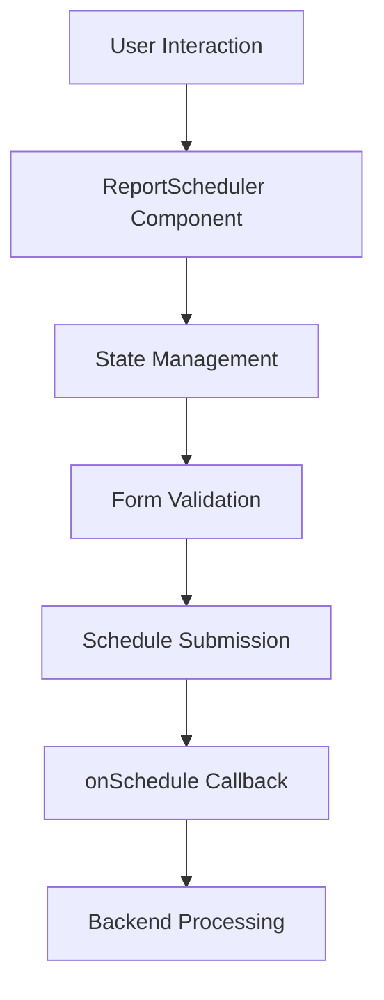
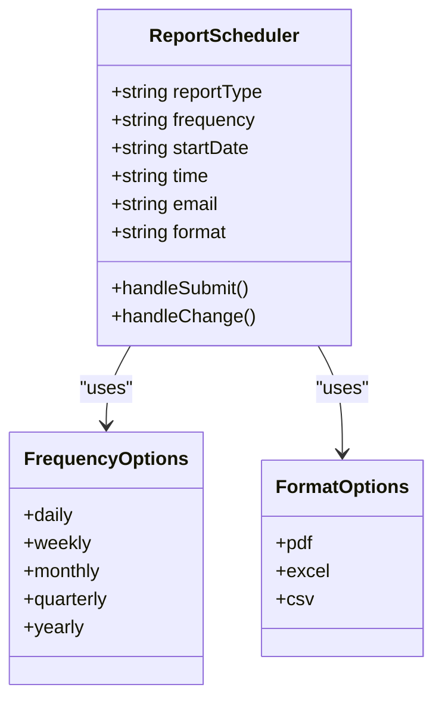
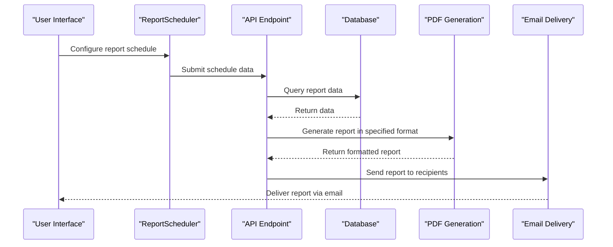
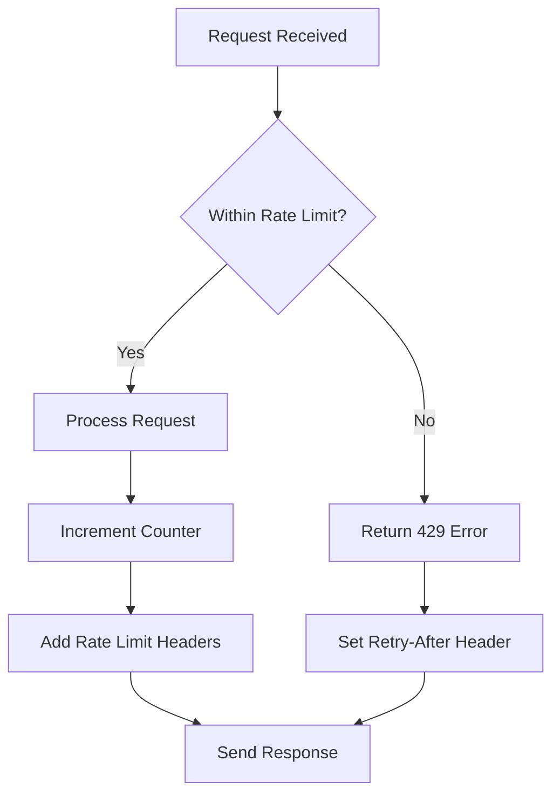

# Report Scheduling and Automation

<cite>
**Referenced Files in This Document**   
- [ReportScheduler.js](file://src/components/shared/calendar/ReportScheduler.js)
- [rateLimit.js](file://src/middleware/rateLimit.js)
- [pdfGenerationService.js](file://src/services/pdfGenerationService.js)
- [sales-reports.js](file://src/pages/api/accounting/reports/sales-reports.js)
- [purchase-reports.js](file://src/pages/api/accounting/reports/purchase-reports.js)
- [inventory-reports.js](file://src/pages/api/accounting/reports/inventory-reports.js)
- [constants.js](file://src/lib/constants.js)
</cite>

## Table of Contents
1. [Introduction](#introduction)
2. [ReportScheduler Component](#reportscheduler-component)
3. [Scheduling Configuration](#scheduling-configuration)
4. [Backend Integration](#backend-integration)
5. [Rate Limiting Mechanism](#rate-limiting-mechanism)
6. [Common Issues and Troubleshooting](#common-issues-and-troubleshooting)
7. [Best Practices](#best-practices)
8. [Conclusion](#conclusion)

## Introduction

The ezbillify-v1 platform provides robust report scheduling and automation features that enable users to configure and automate the generation and delivery of various business reports. This documentation details the implementation of the ReportScheduler component, its integration with backend systems, and the mechanisms in place for automated report generation, format conversion, and email delivery. The system supports multiple scheduling frequencies, output formats, and includes rate limiting to prevent system overload.

**Section sources**
- [ReportScheduler.js](file://src/components/shared/calendar/ReportScheduler.js)

## ReportScheduler Component

The ReportScheduler component provides a user-friendly interface for configuring automated report generation and delivery. Implemented as a React component, it allows users to specify report type, frequency, delivery time, and output format through an intuitive form interface.

The component maintains state for the scheduling configuration including:
- **reportType**: The type of report to generate
- **frequency**: How often the report should be generated (daily, weekly, monthly, quarterly, yearly)
- **startDate**: When the scheduling should begin
- **time**: The specific time of day for report generation
- **email**: Recipient email addresses for report delivery
- **format**: Output format (PDF, Excel, CSV)

**Diagram sources**
- [ReportScheduler.js](file://src/components/shared/calendar/ReportScheduler.js#L13-L20)

**Section sources**
- [ReportScheduler.js](file://src/components/shared/calendar/ReportScheduler.js#L1-L137)

## Scheduling Configuration

The ReportScheduler component provides comprehensive configuration options for automated report generation:

### Frequency Options
Users can select from five scheduling frequencies:
- **Daily**: Reports generated every day at the specified time
- **Weekly**: Reports generated once per week on the same day
- **Monthly**: Reports generated on the same date each month
- **Quarterly**: Reports generated every three months
- **Yearly**: Reports generated once per year

### Output Formats
The system supports three output formats:
- **PDF**: Portable Document Format for universal compatibility
- **Excel (XLSX)**: Spreadsheet format for data analysis
- **CSV**: Comma-separated values for data import/export

### Time and Date Configuration
The scheduler includes:
- **Start Date**: Calendar picker for selecting when scheduling begins
- **Delivery Time**: Time selector for specifying the exact generation time
- **Email Recipients**: Input field for one or more email addresses (comma-separated)

**Diagram sources**
- [ReportScheduler.js](file://src/components/shared/calendar/ReportScheduler.js#L22-L34)

**Section sources**
- [ReportScheduler.js](file://src/components/shared/calendar/ReportScheduler.js#L15-L34)

## Backend Integration

The report scheduling system integrates with backend services to generate reports and deliver them via email. When a user submits a scheduling request, the frontend passes the configuration to backend endpoints that handle report generation and delivery.

### Report Generation Endpoints
The system provides API endpoints for different report categories:
- **Sales Reports**: Customer-wise, bill-wise, and product-wise sales analysis
- **Purchase Reports**: Supplier-wise, bill-wise, and product-wise purchase analysis
- **Inventory Reports**: Stock summary, stock movement, and low stock alerts

### Format Conversion Process
The pdfGenerationService handles format conversion through a multi-step process:
1. Data retrieval from database based on report parameters
2. Template processing using Handlebars for dynamic content
3. HTML rendering with proper styling and formatting
4. Conversion to requested format (PDF, Excel, CSV)
5. Email attachment preparation

**Diagram sources**
- [sales-reports.js](file://src/pages/api/accounting/reports/sales-reports.js)
- [purchase-reports.js](file://src/pages/api/accounting/reports/purchase-reports.js)
- [inventory-reports.js](file://src/pages/api/accounting/reports/inventory-reports.js)
- [pdfGenerationService.js](file://src/services/pdfGenerationService.js)

**Section sources**
- [sales-reports.js](file://src/pages/api/accounting/reports/sales-reports.js)
- [purchase-reports.js](file://src/pages/api/accounting/reports/purchase-reports.js)
- [inventory-reports.js](file://src/pages/api/accounting/reports/inventory-reports.js)

## Rate Limiting Mechanism

The system implements a rate limiting mechanism to prevent abuse and ensure system stability. The rate limiting is configured in the middleware/rateLimit.js file and specifically restricts report generation to 5 reports per minute per user.

### Configuration Details
The rate limiting configuration includes:
- **Window**: 60 seconds (1 minute)
- **Maximum requests**: 5 reports
- **Message**: "Report generation rate limit exceeded."

### Implementation
The rate limiter uses an in-memory store (with Redis recommended for production) to track request counts. It includes:
- IP-based or user-based tracking
- Automatic cleanup of expired entries
- HTTP headers with rate limit information
- Retry-After header for client guidance

**Diagram sources**
- [rateLimit.js](file://src/middleware/rateLimit.js#L115-L120)

**Section sources**
- [rateLimit.js](file://src/middleware/rateLimit.js#L115-L120)

## Common Issues and Troubleshooting

### Failed Email Deliveries
Common causes and solutions:
- **Invalid email addresses**: Validate recipient emails before scheduling
- **Email server issues**: Check SMTP configuration and server status
- **Large attachments**: Consider format and size limitations
- **Spam filters**: Ensure proper email authentication (SPF, DKIM)

### Timezone Handling
The system uses the Asia/Kolkata timezone (IST) as default:
- Schedule times are interpreted in the user's configured timezone
- Server processing occurs in UTC with conversion to local time
- Daylight saving time is not applicable for IST

### Format Conversion Errors
Potential issues and resolutions:
- **Missing fonts**: Ensure all required fonts are available
- **Template errors**: Validate Handlebars syntax in templates
- **Data formatting**: Check for special characters in data fields
- **File size limits**: Monitor output file sizes for large reports

**Section sources**
- [pdfGenerationService.js](file://src/services/pdfGenerationService.js)
- [constants.js](file://src/lib/constants.js#L350-L356)

## Best Practices

### Optimal Scheduling Times
- Schedule reports during off-peak hours (e.g., early morning)
- Avoid business hours to minimize system impact
- Consider recipient time zones for delivery timing
- Stagger multiple scheduled reports to distribute load

### Recipient Management
- Use distribution lists instead of individual emails when appropriate
- Regularly update recipient lists to remove inactive addresses
- Implement email validation for all recipients
- Provide opt-out options for scheduled reports

### Monitoring Scheduled Reports
- Implement logging for successful and failed report generations
- Set up alerts for failed deliveries
- Regularly review scheduled reports for relevance
- Monitor system performance during report generation periods

### Configuration Recommendations
- Start with less frequent schedules and increase as needed
- Use CSV format for large data exports
- PDF format is recommended for formal reporting
- Test new schedules with a single recipient first

**Section sources**
- [ReportScheduler.js](file://src/components/shared/calendar/ReportScheduler.js)
- [pdfGenerationService.js](file://src/services/pdfGenerationService.js)

## Conclusion

The report scheduling and automation features in ezbillify-v1 provide a comprehensive solution for automated business reporting. The ReportScheduler component offers an intuitive interface for configuring report generation, while the backend system handles the complex tasks of data retrieval, format conversion, and email delivery. The rate limiting mechanism ensures system stability by restricting report generation to 5 per minute, preventing potential abuse or performance issues. By following the best practices outlined in this documentation, users can effectively leverage the scheduling features to streamline their reporting processes while maintaining system performance and reliability.