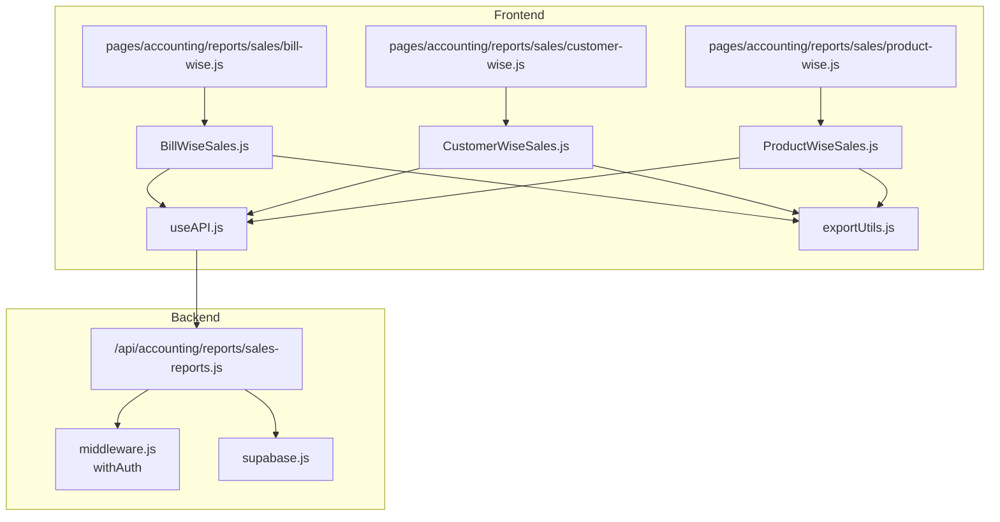
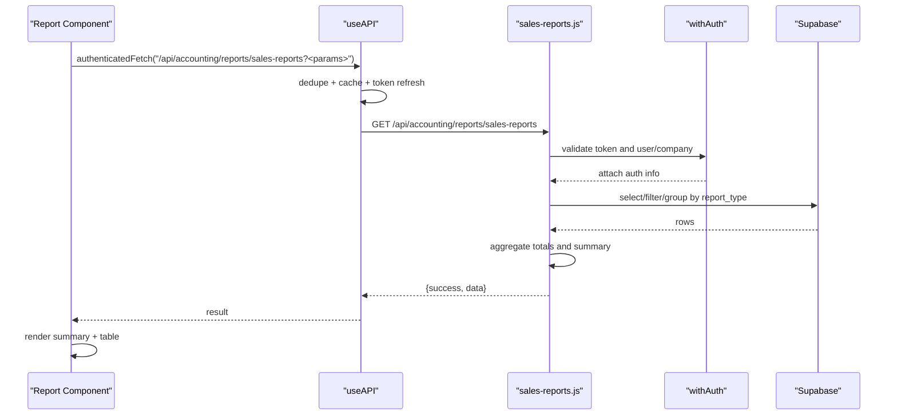
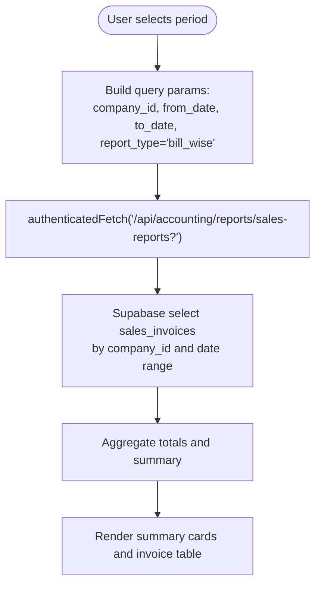
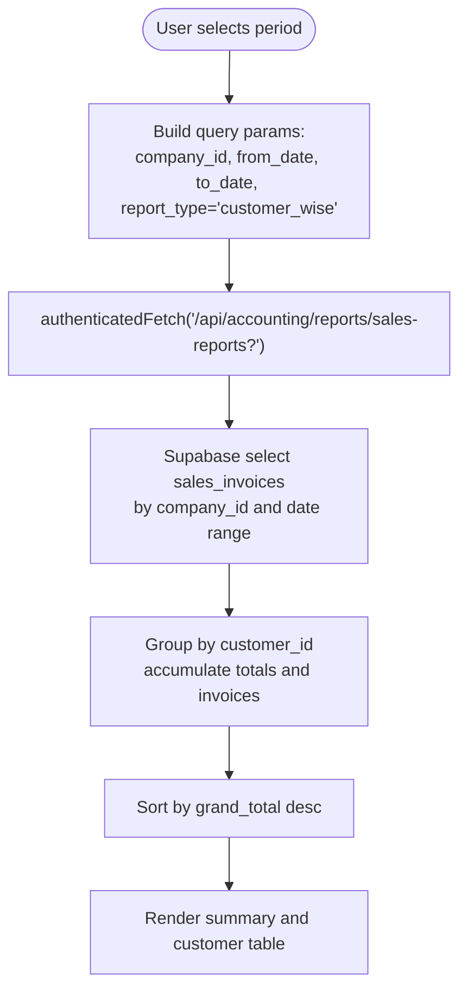
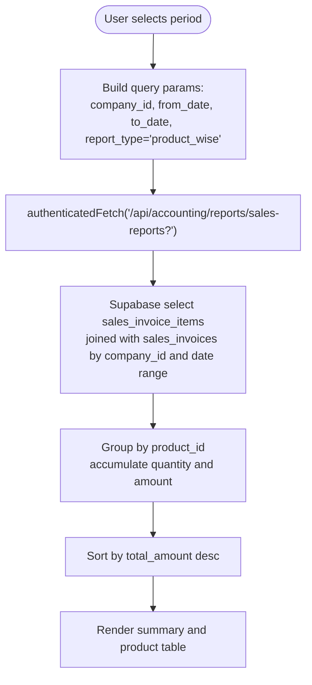
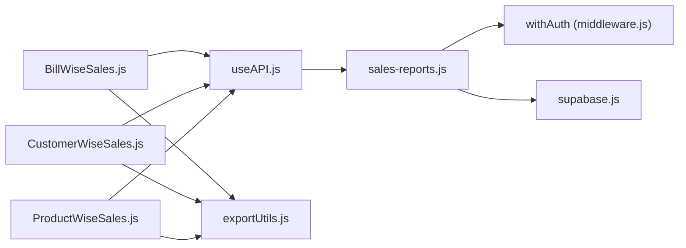

# Sales Reports

<cite>
**Referenced Files in This Document**
- [sales-reports.js](file://src/pages/api/accounting/reports/sales-reports.js)
- [useAPI.js](file://src/hooks/useAPI.js)
- [BillWiseSales.js](file://src/components/accounting/reports/sales/BillWiseSales.js)
- [CustomerWiseSales.js](file://src/components/accounting/reports/sales/CustomerWiseSales.js)
- [ProductWiseSales.js](file://src/components/accounting/reports/sales/ProductWiseSales.js)
- [bill-wise.js](file://src/pages/accounting/reports/sales/bill-wise.js)
- [customer-wise.js](file://src/pages/accounting/reports/sales/customer-wise.js)
- [product-wise.js](file://src/pages/accounting/reports/sales/product-wise.js)
- [middleware.js](file://src/lib/middleware.js)
- [supabase.js](file://src/services/utils/supabase.js)
- [exportUtils.js](file://src/components/shared/utils/exportUtils.js)
</cite>

## Table of Contents
1. [Introduction](#introduction)
2. [Project Structure](#project-structure)
3. [Core Components](#core-components)
4. [Architecture Overview](#architecture-overview)
5. [Detailed Component Analysis](#detailed-component-analysis)
6. [Dependency Analysis](#dependency-analysis)
7. [Performance Considerations](#performance-considerations)
8. [Troubleshooting Guide](#troubleshooting-guide)
9. [Conclusion](#conclusion)

## Introduction
This document explains the sales reporting module in ezbillify-v1, focusing on bill-wise, customer-wise, and product-wise sales reports. It covers the backend API endpoint, frontend integration, request/response schemas, authentication, filtering parameters, aggregation logic, and practical examples. It also provides guidance on performance optimization and common issues.

## Project Structure
The sales reporting feature spans frontend React components, Next.js pages, and a serverless API route. The API enforces authentication and delegates to Supabase for data retrieval and aggregation.

**Diagram sources**
- [bill-wise.js](file://src/pages/accounting/reports/sales/bill-wise.js#L1-L51)
- [customer-wise.js](file://src/pages/accounting/reports/sales/customer-wise.js#L1-L51)
- [product-wise.js](file://src/pages/accounting/reports/sales/product-wise.js#L1-L51)
- [BillWiseSales.js](file://src/components/accounting/reports/sales/BillWiseSales.js#L1-L278)
- [CustomerWiseSales.js](file://src/components/accounting/reports/sales/CustomerWiseSales.js#L1-L251)
- [ProductWiseSales.js](file://src/components/accounting/reports/sales/ProductWiseSales.js#L1-L246)
- [useAPI.js](file://src/hooks/useAPI.js#L1-L133)
- [sales-reports.js](file://src/pages/api/accounting/reports/sales-reports.js#L1-L245)
- [middleware.js](file://src/lib/middleware.js#L1-L114)
- [supabase.js](file://src/services/utils/supabase.js#L1-L105)
- [exportUtils.js](file://src/components/shared/utils/exportUtils.js#L1-L181)

**Section sources**
- [bill-wise.js](file://src/pages/accounting/reports/sales/bill-wise.js#L1-L51)
- [customer-wise.js](file://src/pages/accounting/reports/sales/customer-wise.js#L1-L51)
- [product-wise.js](file://src/pages/accounting/reports/sales/product-wise.js#L1-L51)
- [BillWiseSales.js](file://src/components/accounting/reports/sales/BillWiseSales.js#L1-L278)
- [CustomerWiseSales.js](file://src/components/accounting/reports/sales/CustomerWiseSales.js#L1-L251)
- [ProductWiseSales.js](file://src/components/accounting/reports/sales/ProductWiseSales.js#L1-L246)
- [useAPI.js](file://src/hooks/useAPI.js#L1-L133)
- [sales-reports.js](file://src/pages/api/accounting/reports/sales-reports.js#L1-L245)
- [middleware.js](file://src/lib/middleware.js#L1-L114)
- [supabase.js](file://src/services/utils/supabase.js#L1-L105)
- [exportUtils.js](file://src/components/shared/utils/exportUtils.js#L1-L181)

## Core Components
- Frontend report components:
  - BillWiseSales: renders invoice-level details and totals.
  - CustomerWiseSales: aggregates invoices by customer and computes totals.
  - ProductWiseSales: aggregates invoice items by product and computes quantities and amounts.
- Pages:
  - bill-wise.js, customer-wise.js, product-wise.js wrap the components with authentication guards and breadcrumbs.
- API:
  - sales-reports.js exposes a GET endpoint that accepts company_id, from_date, to_date, and report_type, returning aggregated data grouped by bill, customer, or product.
- Hooks:
  - useAPI.js provides authenticatedFetch with deduplication, caching, and error handling.
- Utilities:
  - exportUtils.js supports exporting reports to Excel, PDF, and JSON.

**Section sources**
- [BillWiseSales.js](file://src/components/accounting/reports/sales/BillWiseSales.js#L1-L278)
- [CustomerWiseSales.js](file://src/components/accounting/reports/sales/CustomerWiseSales.js#L1-L251)
- [ProductWiseSales.js](file://src/components/accounting/reports/sales/ProductWiseSales.js#L1-L246)
- [bill-wise.js](file://src/pages/accounting/reports/sales/bill-wise.js#L1-L51)
- [customer-wise.js](file://src/pages/accounting/reports/sales/customer-wise.js#L1-L51)
- [product-wise.js](file://src/pages/accounting/reports/sales/product-wise.js#L1-L51)
- [sales-reports.js](file://src/pages/api/accounting/reports/sales-reports.js#L1-L245)
- [useAPI.js](file://src/hooks/useAPI.js#L1-L133)
- [exportUtils.js](file://src/components/shared/utils/exportUtils.js#L1-L181)

## Architecture Overview
The frontend components call authenticatedFetch to request the sales-reports endpoint. The API validates inputs, enforces authentication, and performs database queries and aggregations. Results are returned with a standardized structure and summary metrics.

**Diagram sources**
- [BillWiseSales.js](file://src/components/accounting/reports/sales/BillWiseSales.js#L28-L44)
- [CustomerWiseSales.js](file://src/components/accounting/reports/sales/CustomerWiseSales.js#L28-L44)
- [ProductWiseSales.js](file://src/components/accounting/reports/sales/ProductWiseSales.js#L28-L44)
- [useAPI.js](file://src/hooks/useAPI.js#L44-L121)
- [sales-reports.js](file://src/pages/api/accounting/reports/sales-reports.js#L1-L45)
- [middleware.js](file://src/lib/middleware.js#L1-L114)
- [supabase.js](file://src/services/utils/supabase.js#L1-L105)

## Detailed Component Analysis

### Backend API: sales-reports.js
- Endpoint: GET /api/accounting/reports/sales-reports
- Required query parameters:
  - company_id: string
  - from_date: ISO date string
  - to_date: ISO date string
  - report_type: one of "bill_wise", "customer_wise", "product_wise"
- Behavior:
  - Validates presence of required parameters and method.
  - Switches on report_type to call the appropriate aggregation function.
  - Uses Supabase to query sales_invoices or sales_invoice_items with date filters and joins.
  - Aggregates data in memory and returns a structured payload with summary metrics.
- Response shape (common):
  - success: boolean
  - data: {
      period: { from, to },
      report_type: string,
      summary: object with computed totals
    }
  - For bill_wise: data.invoices[]
  - For customer_wise: data.customers[] with invoices[]
  - For product_wise: data.products[] with items[]
- Error handling:
  - Returns 400 for invalid parameters or unsupported report_type.
  - Returns 500 with error details in development.

Practical examples from codebase:
- Date range filtering is applied using gte/lte on invoice_date.
- Joins fetch customer/product names for display.
- Sorting:
  - Bill-wise sorts by invoice_date.
  - Customer-wise sorts by grand_total descending.
  - Product-wise sorts by total_amount descending.

**Section sources**
- [sales-reports.js](file://src/pages/api/accounting/reports/sales-reports.js#L1-L45)
- [sales-reports.js](file://src/pages/api/accounting/reports/sales-reports.js#L47-L123)
- [sales-reports.js](file://src/pages/api/accounting/reports/sales-reports.js#L125-L169)
- [sales-reports.js](file://src/pages/api/accounting/reports/sales-reports.js#L171-L243)

### Frontend Integration: useAPI.js
- Provides authenticatedFetch with:
  - Token resolution via getAccessToken or session refresh.
  - Request deduplication using ongoingRequests.
  - GET caching with TTL and automatic cleanup.
  - Error normalization and loading state.
- Used by all report components to call the sales-reports endpoint with query parameters.

**Section sources**
- [useAPI.js](file://src/hooks/useAPI.js#L1-L133)

### Frontend Components: Report Views
- BillWiseSales:
  - Period selection (from_date, to_date).
  - Calls authenticatedFetch with report_type=bill_wise.
  - Renders summary cards and an invoice table with status badges.
  - Supports export to Excel/PDF/JSON.
- CustomerWiseSales:
  - Period selection and fetch with report_type=customer_wise.
  - Renders customer-level totals and invoice counts.
  - Supports export to Excel/PDF/JSON.
- ProductWiseSales:
  - Period selection and fetch with report_type=product_wise.
  - Renders product-level totals and average price.
  - Supports export to Excel/PDF/JSON.

**Section sources**
- [BillWiseSales.js](file://src/components/accounting/reports/sales/BillWiseSales.js#L1-L278)
- [CustomerWiseSales.js](file://src/components/accounting/reports/sales/CustomerWiseSales.js#L1-L251)
- [ProductWiseSales.js](file://src/components/accounting/reports/sales/ProductWiseSales.js#L1-L246)
- [exportUtils.js](file://src/components/shared/utils/exportUtils.js#L1-L181)

### Authentication and Authorization
- API is wrapped with withAuth:
  - Extracts token from Authorization header, cookies, or x-auth-token.
  - Verifies token with Supabase and loads user profile and company.
  - Enforces user/company activity checks.
  - Attaches auth info to req for downstream handlers.
- Frontend uses authenticatedFetch which injects Authorization: Bearer <token>.

**Section sources**
- [middleware.js](file://src/lib/middleware.js#L1-L114)
- [useAPI.js](file://src/hooks/useAPI.js#L62-L85)
- [supabase.js](file://src/services/utils/supabase.js#L1-L105)

### Filtering Parameters and Aggregation Logic
- Filters:
  - company_id equality.
  - invoice_date range using gte/lte.
  - report_type switch drives which dataset and grouping to use.
- Aggregations:
  - Bill-wise: sums total_amount, tax_amount, grand_total across invoices.
  - Customer-wise: groups by customer_id, accumulates per-customer totals and invoice arrays; sorts by grand_total desc.
  - Product-wise: groups by product_id, accumulates total_quantity and total_amount; sorts by total_amount desc.

**Section sources**
- [sales-reports.js](file://src/pages/api/accounting/reports/sales-reports.js#L47-L123)
- [sales-reports.js](file://src/pages/api/accounting/reports/sales-reports.js#L125-L169)
- [sales-reports.js](file://src/pages/api/accounting/reports/sales-reports.js#L171-L243)

### Request/Response Schemas
- Request:
  - Method: GET
  - Path: /api/accounting/reports/sales-reports
  - Query parameters:
    - company_id: string
    - from_date: ISO date string
    - to_date: ISO date string
    - report_type: "bill_wise" | "customer_wise" | "product_wise"
  - Headers:
    - Authorization: Bearer <token>
- Response (success):
  - Body: { success: true, data: { period, report_type, summary, [invoices|customers|products] } }
  - Example shapes:
    - Bill-wise: data.invoices[] with invoice fields and summary totals.
    - Customer-wise: data.customers[] with invoices[], and summary totals.
    - Product-wise: data.products[] with items[], and summary totals.

**Section sources**
- [sales-reports.js](file://src/pages/api/accounting/reports/sales-reports.js#L1-L45)
- [sales-reports.js](file://src/pages/api/accounting/reports/sales-reports.js#L103-L119)
- [sales-reports.js](file://src/pages/api/accounting/reports/sales-reports.js#L149-L165)
- [sales-reports.js](file://src/pages/api/accounting/reports/sales-reports.js#L224-L239)

### Practical Examples from the Codebase
- Date ranges:
  - Components initialize period from start of current month to today and allow manual selection.
  - API applies gte('invoice_date', from_date) and lte('invoice_date', to_date).
- Customer segments:
  - Customer-wise report groups by customer_id and computes per-customer totals.
- Product categories:
  - Product-wise report groups by product_id and aggregates quantities and amounts.

**Section sources**
- [BillWiseSales.js](file://src/components/accounting/reports/sales/BillWiseSales.js#L16-L21)
- [CustomerWiseSales.js](file://src/components/accounting/reports/sales/CustomerWiseSales.js#L16-L21)
- [ProductWiseSales.js](file://src/components/accounting/reports/sales/ProductWiseSales.js#L16-L21)
- [sales-reports.js](file://src/pages/api/accounting/reports/sales-reports.js#L47-L123)
- [sales-reports.js](file://src/pages/api/accounting/reports/sales-reports.js#L171-L243)

### Data Flow Diagrams

#### Bill-wise Sales Flow

**Diagram sources**
- [BillWiseSales.js](file://src/components/accounting/reports/sales/BillWiseSales.js#L28-L44)
- [sales-reports.js](file://src/pages/api/accounting/reports/sales-reports.js#L125-L169)

#### Customer-wise Sales Flow

**Diagram sources**
- [CustomerWiseSales.js](file://src/components/accounting/reports/sales/CustomerWiseSales.js#L28-L44)
- [sales-reports.js](file://src/pages/api/accounting/reports/sales-reports.js#L47-L123)

#### Product-wise Sales Flow

**Diagram sources**
- [ProductWiseSales.js](file://src/components/accounting/reports/sales/ProductWiseSales.js#L28-L44)
- [sales-reports.js](file://src/pages/api/accounting/reports/sales-reports.js#L171-L243)

## Dependency Analysis
- Frontend-to-API:
  - Report components depend on useAPI for authenticatedFetch.
  - useAPI depends on Supabase client and auth tokens.
- API-to-DB:
  - sales-reports.js depends on Supabase client and withAuth middleware.
  - withAuth verifies tokens and loads user/company context.
- Export utilities:
  - Report components delegate export to exportUtils.js.

**Diagram sources**
- [BillWiseSales.js](file://src/components/accounting/reports/sales/BillWiseSales.js#L1-L278)
- [CustomerWiseSales.js](file://src/components/accounting/reports/sales/CustomerWiseSales.js#L1-L251)
- [ProductWiseSales.js](file://src/components/accounting/reports/sales/ProductWiseSales.js#L1-L246)
- [useAPI.js](file://src/hooks/useAPI.js#L1-L133)
- [sales-reports.js](file://src/pages/api/accounting/reports/sales-reports.js#L1-L245)
- [middleware.js](file://src/lib/middleware.js#L1-L114)
- [supabase.js](file://src/services/utils/supabase.js#L1-L105)
- [exportUtils.js](file://src/components/shared/utils/exportUtils.js#L1-L181)

**Section sources**
- [useAPI.js](file://src/hooks/useAPI.js#L1-L133)
- [sales-reports.js](file://src/pages/api/accounting/reports/sales-reports.js#L1-L245)
- [middleware.js](file://src/lib/middleware.js#L1-L114)
- [supabase.js](file://src/services/utils/supabase.js#L1-L105)
- [exportUtils.js](file://src/components/shared/utils/exportUtils.js#L1-L181)

## Performance Considerations
- Indexing strategies:
  - Ensure indexes on sales_invoices(company_id, invoice_date) and sales_invoice_items(sales_invoices.company_id, sales_invoices.invoice_date).
  - Consider composite indexes for frequent filters (e.g., customer_id, product_id).
- Caching:
  - useAPI.js caches GET responses with TTL; leverage clearCache when data changes.
- Pagination:
  - Current reports fetch all matching records. For large datasets, introduce pagination (page, limit) and server-side sorting to reduce payload sizes.
- Parallelization:
  - The API aggregates in-memory; consider offloading heavy aggregations to SQL where possible.
- Export size:
  - exportUtils.js truncates PDF rows; consider server-side export with chunking for very large datasets.

[No sources needed since this section provides general guidance]

## Troubleshooting Guide
- Authentication failures:
  - Ensure Authorization header is present and valid; withAuth returns 401/403 for missing/expired tokens or inactive user/company.
- Missing parameters:
  - API returns 400 if company_id, from_date, to_date, or report_type are missing.
- Network errors:
  - useAPI.js normalizes errors and surfaces messages; check browser console and network tab.
- Incomplete data retrieval:
  - Verify date range correctness and company_id association.
- Performance bottlenecks:
  - Large date ranges or missing indexes can slow queries; narrow the range or add indexes.
- Discrepancies in tax calculations:
  - Confirm invoice-level tax fields and ensure consistent tax rates across items.

**Section sources**
- [sales-reports.js](file://src/pages/api/accounting/reports/sales-reports.js#L1-L45)
- [middleware.js](file://src/lib/middleware.js#L1-L114)
- [useAPI.js](file://src/hooks/useAPI.js#L1-L133)

## Conclusion
The sales reporting module integrates cleanly between frontend and backend. The API supports three report types with robust filtering and aggregation, while the frontend components provide interactive controls and export capabilities. For production-scale usage, adopt pagination, proper indexing, and caching to ensure responsiveness and reliability.