# Invoices

<cite>
**Referenced Files in This Document**   
- [InvoiceForm.js](file://src/components/sales/InvoiceForm.js)
- [useInvoice.js](file://src/hooks/useInvoice.js)
- [index.js](file://src/pages/api/sales/invoices/index.js)
- [next-number.js](file://src/pages/api/sales/invoices/next-number.js)
- [gstService.js](file://src/services/gstService.js)
- [invoice-A4-classic.html](file://public/templates/invoice-A4-classic.html)
- [send.js](file://src/pages/api/sales/invoices/send.js)
- [EInvoiceList.js](file://src/components/gst/EInvoiceList.js)
</cite>

## Table of Contents
1. [Introduction](#introduction)
2. [Invoice Creation Workflow](#invoice-creation-workflow)
3. [Data Model](#data-model)
4. [Tax Calculations](#tax-calculations)
5. [Invoice Numbering](#invoice-numbering)
6. [E-Invoicing and IRN Submission](#e-invoicing-and-irn-submission)
7. [Validation and Error Handling](#validation-and-error-handling)
8. [Common Issues and Best Practices](#common-issues-and-best-practices)
9. [Integration with Accounting Systems](#integration-with-accounting-systems)
10. [Performance Optimization](#performance-optimization)

## Introduction
The Invoices feature in ezbillify-v1 provides a comprehensive solution for managing sales invoices with full compliance with Indian tax regulations. The system supports the complete invoice lifecycle from creation to finalization, including tax calculations, e-invoicing, and integration with accounting systems. This document details the implementation of key components including invoice creation, numbering, tax calculations (including GST), and e-invoicing capabilities.

**Section sources**
- [InvoiceForm.js](file://src/components/sales/InvoiceForm.js#L1-L1567)

## Invoice Creation Workflow
The invoice creation process in ezbillify-v1 follows a structured workflow that begins with selecting a customer and branch, followed by adding line items, applying discounts, and finalizing the invoice. The system automatically calculates taxes based on the customer's location relative to the company's state, determining whether the transaction is intrastate (CGST+SGST) or interstate (IGST).

The workflow starts with the InvoiceForm component, which initializes the form state and loads master data including customers, items, units, and tax rates. When a customer is selected, the system determines the GST type by comparing the company's state with the customer's billing address state. This information is used to calculate the appropriate tax rates for each line item.

**Diagram sources **
- [InvoiceForm.js](file://src/components/sales/InvoiceForm.js#L1-L1567)
- [index.js](file://src/pages/api/sales/invoices/index.js#L1-L625)

**Section sources**
- [InvoiceForm.js](file://src/components/sales/InvoiceForm.js#L1-L1567)
- [index.js](file://src/pages/api/sales/invoices/index.js#L1-L625)

## Data Model
The invoice data model in ezbillify-v1 is designed to capture all necessary information for tax compliance and accounting purposes. The core entity is the sales_documents table, which stores invoice headers with fields for document number, dates, customer information, and financial totals.

The data model includes comprehensive fields for tax components, with separate columns for CGST, SGST, and IGST amounts and rates. This allows for accurate reporting and compliance with GST regulations. Line items store both the rate including tax and the taxable amount (excluding tax), enabling precise calculations and audit trails.

**Diagram sources **
- [index.js](file://src/pages/api/sales/invoices/index.js#L1-L625)

**Section sources**
- [index.js](file://src/pages/api/sales/invoices/index.js#L1-L625)

## Tax Calculations
The tax calculation system in ezbillify-v1 follows Indian GST regulations, automatically determining whether a transaction is intrastate or interstate based on the company and customer states. For intrastate transactions, the system splits the tax rate equally between CGST and SGST. For interstate transactions, the full tax rate is applied as IGST.

The calculation process begins with determining the GST type using the getGSTType function from lib/constants.js. This function compares the company's state with the customer's billing address state, returning 'intrastate' if they match and 'interstate' otherwise. The tax rates are then applied to each line item based on this determination.

```mermaid
flowchart TD
Start([Start]) --> DetermineGSTType["Determine GST Type<br>(Intrastate/Interstate)"]
DetermineGSTType --> ApplyTaxRates["Apply Tax Rates"]
ApplyTaxRates --> CalculateTaxableAmount["Calculate Taxable Amount<br>(Rate / (1 + Tax Rate/100))"]
CalculateTaxableAmount --> CalculateTaxAmounts["Calculate Tax Amounts"]
CalculateTaxAmounts --> CalculateLineTotal["Calculate Line Total<br>(Quantity × Rate)"]
CalculateLineTotal --> ApplyDiscount["Apply Discount"]
ApplyDiscount --> CalculateSubtotal["Calculate Subtotal"]
CalculateSubtotal --> CalculateTotal["Calculate Final Total"]
CalculateTotal --> End([End])
style Start fill:#4CAF50,stroke:#388E3C
style End fill:#4CAF50,stroke:#388E3C
```

The system handles tax calculations at both the line item level and the document level. Each line item stores its taxable amount (excluding tax), tax rate, and individual tax amounts (CGST, SGST, IGST). The document-level totals are calculated by summing these components across all line items.

**Diagram sources **
- [InvoiceForm.js](file://src/components/sales/InvoiceForm.js#L1-L1567)
- [lib/constants.js](file://src/lib/constants.js#L1-L458)

**Section sources**
- [InvoiceForm.js](file://src/components/sales/InvoiceForm.js#L1-L1567)
- [lib/constants.js](file://src/lib/constants.js#L1-L458)

## Invoice Numbering
The invoice numbering system in ezbillify-v1 follows a structured format that includes the branch prefix, document prefix, sequential number, and financial year. The format is: BR-INV-0001/25-26, where "BR" is the branch prefix, "INV" is the document prefix, "0001" is the sequential number with zero padding, and "25-26" represents the financial year.

The numbering system is managed through the document_sequences table, which tracks the current number for each document type, branch, and financial year combination. When a new invoice is created, the system checks for an existing sequence record. If none exists, it creates a new one with a starting number of 1. For subsequent invoices, it increments the current number.

The system automatically resets the sequence number at the beginning of each financial year (April 1st). This ensures compliance with accounting practices and prevents number conflicts across financial periods.

**Diagram sources **
- [next-number.js](file://src/pages/api/sales/invoices/next-number.js#L1-L157)
- [index.js](file://src/pages/api/sales/invoices/index.js#L1-L625)

**Section sources**
- [next-number.js](file://src/pages/api/sales/invoices/next-number.js#L1-L157)
- [index.js](file://src/pages/api/sales/invoices/index.js#L1-L625)

## E-Invoicing and IRN Submission
The e-invoicing system in ezbillify-v1 integrates with the Whitebooks GSP (GST Suvidha Provider) to generate e-Invoices and IRN (Invoice Registration Number) as required by the Indian GST system. The integration is implemented through the gstService.js component, which handles authentication with the GSP and submission of invoice data.

The e-invoicing workflow begins when a user initiates the generation of an e-Invoice from the EInvoiceList component. The system first verifies that GST credentials are configured for the company. It then prepares the invoice data in the format required by the GSP and submits it to the Whitebooks API.

The system stores the e-Invoice details including the IRN, acknowledgment number, acknowledgment date, and QR code in the database. This information is then displayed on the invoice PDF and can be accessed through the e-Invoice list interface.

**Diagram sources **
- [gstService.js](file://src/services/gstService.js#L1-L174)
- [EInvoiceList.js](file://src/components/gst/EInvoiceList.js#L1-L157)

**Section sources**
- [gstService.js](file://src/services/gstService.js#L1-L174)
- [EInvoiceList.js](file://src/components/gst/EInvoiceList.js#L1-L157)

## Validation and Error Handling
The invoice system implements comprehensive validation at both the frontend and backend levels to ensure data integrity and compliance. The validation process includes customer selection, item details, tax calculations, and credit limit checks.

Frontend validation in InvoiceForm.js prevents submission of incomplete or invalid data. The validateForm function checks for required fields such as customer selection and at least one line item. It also validates that quantities and rates are positive numbers.

Backend validation in the API endpoints performs additional checks, including verifying that the customer and branch belong to the same company, and that the credit limit has not been exceeded. The system also validates GSTIN formats and ensures that financial calculations are consistent.

**Diagram sources **
- [InvoiceForm.js](file://src/components/sales/InvoiceForm.js#L1-L1567)
- [index.js](file://src/pages/api/sales/invoices/index.js#L1-L625)

**Section sources**
- [InvoiceForm.js](file://src/components/sales/InvoiceForm.js#L1-L1567)
- [index.js](file://src/pages/api/sales/invoices/index.js#L1-L625)

## Common Issues and Best Practices
Several common issues can arise when working with the invoice system, particularly related to tax calculations, duplicate invoice numbers, and reconciliation problems. Understanding these issues and following best practices can help ensure smooth operation.

**Tax Calculation Errors**: These typically occur when the customer's state is not properly set or when tax rates are incorrectly configured. To prevent this, ensure that customer addresses include the correct state information and that tax rates are properly maintained in the system.

**Duplicate Invoice Numbers**: This can happen if the document sequence is not properly managed. The system prevents this by using database transactions when updating the sequence number and by including the financial year in the invoice number format.

**Reconciliation Problems**: These often stem from timing issues between invoice creation and payment recording. To avoid reconciliation issues, ensure that payments are allocated to invoices promptly and that the system is updated when partial payments are received.

Best practices for invoice customization include:
- Using the template system to create customized invoice layouts for different customer segments
- Setting up default payment terms and tax rates for different customer types
- Configuring branch-specific document prefixes to maintain organizational structure
- Regularly reviewing and updating tax rates to ensure compliance with current regulations

**Section sources**
- [InvoiceForm.js](file://src/components/sales/InvoiceForm.js#L1-L1567)
- [index.js](file://src/pages/api/sales/invoices/index.js#L1-L625)

## Integration with Accounting Systems
The invoice system in ezbillify-v1 is designed to integrate seamlessly with accounting systems through automated ledger entries and financial reporting. When an invoice is created, the system automatically creates a corresponding ledger entry in the customer_ledger_entries table.

The integration process begins with the creation of the sales document, which triggers the creation of line items in the sales_document_items table. Simultaneously, a ledger entry is created with the invoice amount as a debit, increasing the customer's outstanding balance.

The system also integrates with external accounting systems through API endpoints that allow for data export and synchronization. The send.js endpoint enables invoices to be sent via email, WhatsApp, or SMS, with PDF attachments for record keeping.

**Diagram sources **
- [index.js](file://src/pages/api/sales/invoices/index.js#L1-L625)
- [send.js](file://src/pages/api/sales/invoices/send.js#L1-L337)

**Section sources**
- [index.js](file://src/pages/api/sales/invoices/index.js#L1-L625)
- [send.js](file://src/pages/api/sales/invoices/send.js#L1-L337)

## Performance Optimization
The invoice system implements several performance optimizations to ensure responsive user experience and efficient database operations. These include caching strategies, batch operations, and optimized database queries.

The system uses client-side caching through the useAPI hook to reduce redundant API calls. When a user navigates between invoice views, previously fetched data is served from cache rather than making new database queries.

Database queries are optimized through the use of appropriate indexes on frequently queried fields such as company_id, customer_id, and document_date. The API endpoints also implement pagination to prevent performance degradation when dealing with large datasets.

Additional optimizations include debounced search functionality in the invoice list, which reduces the number of API calls during user input, and lazy loading of related data to minimize initial page load time.

**Diagram sources **
- [useInvoice.js](file://src/hooks/useInvoice.js#L1-L198)
- [InvoiceList.js](file://src/components/sales/InvoiceList.js#L1-L733)

**Section sources**
- [useInvoice.js](file://src/hooks/useInvoice.js#L1-L198)
- [InvoiceList.js](file://src/components/sales/InvoiceList.js#L1-L733)