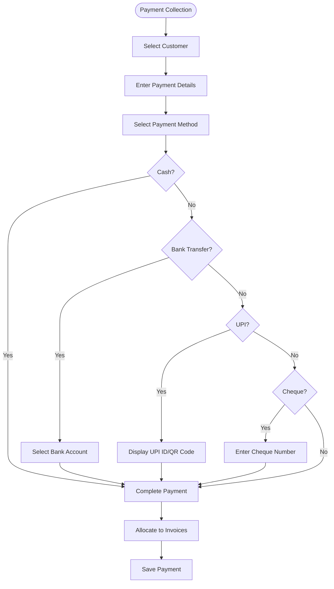
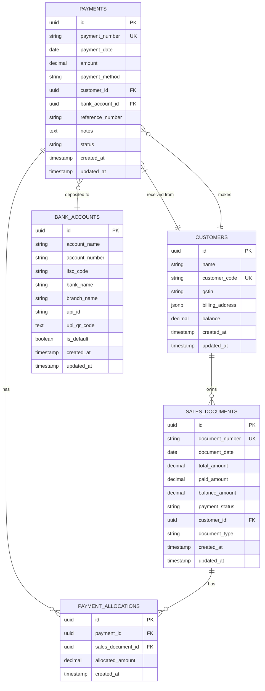
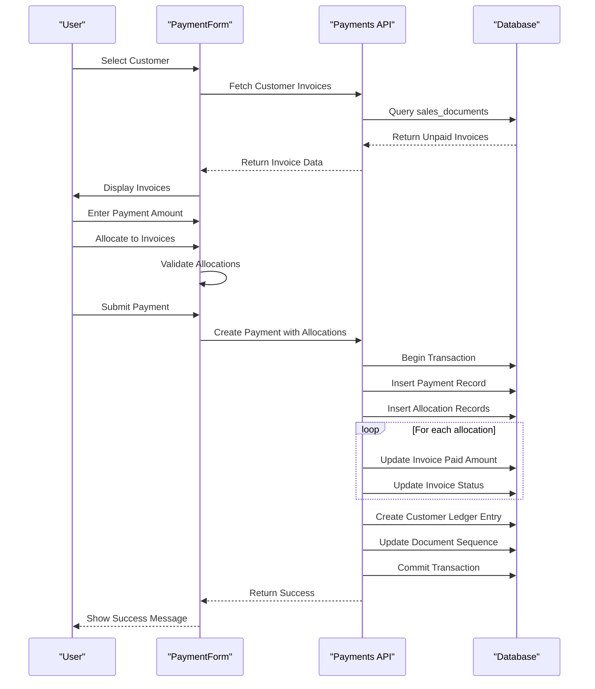
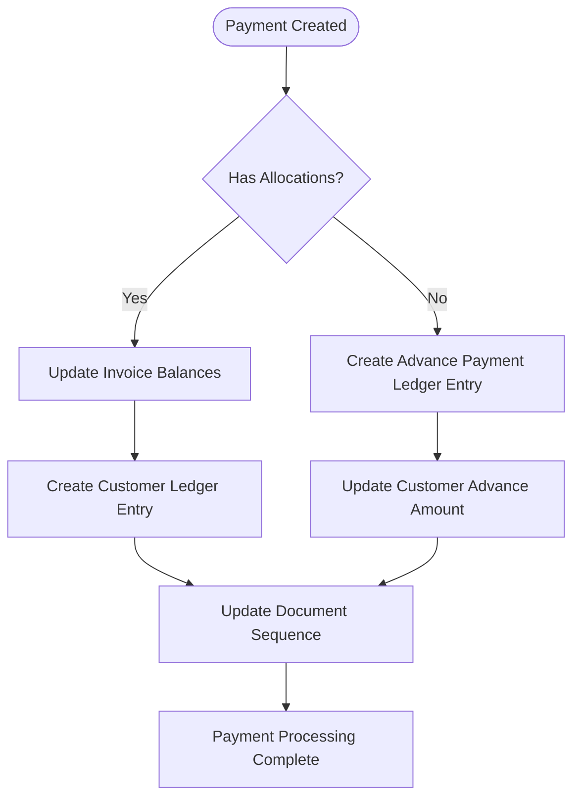

# Payments

<cite>
**Referenced Files in This Document**   
- [PaymentForm.js](file://src/components/sales/PaymentForm.js)
- [index.js](file://src/pages/api/sales/payments/index.js)
- [new.js](file://src/pages/sales/payments/new.js)
- [add_upi_fields_to_bank_accounts.sql](file://database/migrations/20241105_add_upi_fields_to_bank_accounts.sql)
- [BankAccountForm.js](file://src/components/master-data/BankAccountForm.js)
- [upi-qr.js](file://src/pages/api/master-data/bank-accounts/upi-qr.js)
- [customer_ledger_entries](file://src/pages/api/sales/payments/index.js#L368-L450)
- [sales_documents](file://src/pages/api/sales/payments/index.js#L338-L367)
</cite>

## Table of Contents
1. [Introduction](#introduction)
2. [Payment Collection Implementation](#payment-collection-implementation)
3. [Domain Model and Data Relationships](#domain-model-and-data-relationships)
4. [Payment Allocation Process](#payment-allocation-process)
5. [Accounting Integration](#accounting-integration)
6. [Common Issues and Troubleshooting](#common-issues-and-troubleshooting)
7. [Security and Performance Considerations](#security-and-performance-considerations)

## Introduction
The Payments feature in ezbillify-v1 enables businesses to collect customer payments through multiple methods including cash, bank transfer, and UPI. The system supports partial payments, advance payments, and allocation of payments to specific invoices. This documentation details the implementation of the payment collection process, domain model relationships, accounting integration, and best practices for secure payment handling.

**Section sources**
- [PaymentForm.js](file://src/components/sales/PaymentForm.js#L31-L1412)
- [index.js](file://src/pages/api/sales/payments/index.js#L1-L500)

## Payment Collection Implementation

### Multiple Payment Methods
The system supports multiple payment methods through the PaymentForm interface, allowing users to select from cash, bank transfer, cheque, UPI, credit card, and debit card. The implementation is centered around the PaymentForm component which provides a unified interface for all payment types.

For UPI payments, the system integrates with bank accounts that have UPI IDs configured. When a user selects UPI as the payment method and chooses a bank account, the form displays the UPI ID and provides a button to show the UPI QR code for scanning. This functionality is implemented in the PaymentForm component, which retrieves the UPI ID from the selected bank account and displays it as a read-only field.

**Diagram sources**
- [PaymentForm.js](file://src/components/sales/PaymentForm.js#L1038-L1123)

### Partial Payments and Advance Payments
The system supports both partial payments and advance payments. When a payment amount exceeds the total of allocated invoices, the remaining amount is treated as an advance payment and reduces the customer's overall balance. Conversely, when a payment is less than an invoice amount, it creates a partial payment status for that invoice.

The PaymentForm component includes functionality to auto-allocate payments to the oldest outstanding invoices first, helping users efficiently apply payments to their oldest receivables. This is particularly useful for businesses managing multiple outstanding invoices per customer.

**Section sources**
- [PaymentForm.js](file://src/components/sales/PaymentForm.js#L594-L646)
- [index.js](file://src/pages/api/sales/payments/index.js#L320-L367)

## Domain Model and Data Relationships

### Core Entities and Relationships
The payment system is built around several core entities: payments, invoices, customers, and bank accounts. These entities are interconnected through a well-defined domain model that ensures data consistency and proper financial tracking.

The payments table stores all customer payment records with essential fields including payment amount, date, method, and reference information. Each payment is linked to a customer and may be associated with one or more invoices through the payment_allocations table, which acts as a junction table between payments and sales_documents (invoices).

**Diagram sources**
- [index.js](file://src/pages/api/sales/payments/index.js#L54-L64)
- [add_upi_fields_to_bank_accounts.sql](file://database/migrations/20241105_add_upi_fields_to_bank_accounts.sql#L6-L11)

### UPI Payment Implementation
The UPI payment functionality is implemented through database schema changes and API endpoints that support UPI-specific features. The migration file `add_upi_fields_to_bank_accounts.sql` adds two critical fields to the bank_accounts table: `upi_id` and `upi_qr_code`. These fields store the UPI identifier for the bank account and a generated QR code image, respectively.

The system includes an API endpoint at `/api/master-data/bank-accounts/upi-qr` that generates UPI QR codes dynamically. When a user requests a QR code, the endpoint creates a UPI URL in the format `upi://pay?pa=UPI_ID&pn=PayeeName&am=Amount&cu=INR&tn=Note` and converts it to a QR code image using the qrcode library. This allows customers to scan the QR code with their UPI app to initiate payments.

**Section sources**
- [add_upi_fields_to_bank_accounts.sql](file://database/migrations/20241105_add_upi_fields_to_bank_accounts.sql#L1-L28)
- [upi-qr.js](file://src/pages/api/master-data/bank-accounts/upi-qr.js#L1-L52)
- [BankAccountForm.js](file://src/components/master-data/BankAccountForm.js#L332-L365)

## Payment Allocation Process

### Invoice Allocation Workflow
The payment allocation process allows users to distribute a single payment across multiple invoices. This is particularly useful when customers make lump sum payments against several outstanding invoices. The PaymentForm component provides an intuitive interface for allocating payments, with a table displaying all unpaid and partially paid invoices for the selected customer.

Users can allocate amounts to specific invoices either by entering values directly in the allocation table or by using the "Auto Allocate" feature, which automatically distributes the payment to the oldest invoices first. The system validates that allocated amounts do not exceed invoice balances and that the total allocated amount does not exceed the payment amount.

**Diagram sources**
- [PaymentForm.js](file://src/components/sales/PaymentForm.js#L540-L587)
- [index.js](file://src/pages/api/sales/payments/index.js#L320-L367)

### Payment Status Management
The system automatically manages payment statuses for both payments and invoices. When a payment is created, invoices that receive allocations have their payment_status updated based on the allocation amount:

- If the allocated amount equals or exceeds the invoice total, the status becomes "paid"
- If the allocated amount is positive but less than the total, the status becomes "partial"
- If no allocation is made, the invoice remains "unpaid"

For advance payments (payments not allocated to specific invoices), the system creates a customer ledger entry that reduces the customer's overall balance. This advance amount can be applied to future invoices automatically or manually by the user.

**Section sources**
- [index.js](file://src/pages/api/sales/payments/index.js#L349-L354)

## Accounting Integration

### Ledger Updates and Bank Reconciliation
The payment system integrates with the accounting module through automatic ledger updates. When a payment is recorded, the system creates a customer ledger entry that reflects the transaction. For payments allocated to invoices, a single ledger entry is created for the full payment amount. For advance payments, a ledger entry is created with the advance amount.

The ledger entry system follows double-entry principles where customer payments are recorded as credit transactions that reduce the customer's balance (amount receivable). The system retrieves the latest customer ledger balance before creating a new entry to ensure accurate balance tracking.

**Diagram sources**
- [index.js](file://src/pages/api/sales/payments/index.js#L368-L450)

### Bank Reconciliation Support
The payment system supports bank reconciliation by maintaining detailed records of payment methods and reference numbers. For bank transfers and UPI payments, users can enter reference numbers that correspond to bank statement entries, making it easier to match transactions during reconciliation.

The system also tracks which bank account received each payment, allowing users to filter payments by bank account when performing reconciliation. This information is stored in the payments table and displayed in payment reports, providing a complete audit trail for all transactions.

**Section sources**
- [index.js](file://src/pages/api/sales/payments/index.js#L58-L59)
- [PaymentForm.js](file://src/components/sales/PaymentForm.js#L1122-L1137)

## Common Issues and Troubleshooting

### Incorrect Payment Allocation
Incorrect payment allocation can occur when users allocate amounts that exceed invoice balances or when the auto-allocation feature doesn't distribute payments as expected. The system prevents over-allocation through client-side validation in the PaymentForm component, which checks that allocated amounts do not exceed invoice balances.

If incorrect allocations are discovered after a payment is saved, users can edit the payment to correct the allocations. The system will automatically recalculate invoice balances and update payment statuses accordingly. It's important to note that editing a payment with allocations will delete existing allocation records and create new ones, so users should review all allocations when making changes.

**Section sources**
- [PaymentForm.js](file://src/components/sales/PaymentForm.js#L677-L691)
- [index.js](file://src/pages/api/sales/payments/index.js#L320-L367)

### Currency Conversion Errors
While the current implementation focuses on INR transactions, currency conversion errors could occur if the system is extended to support multiple currencies. The database schema includes fields that could support currency information, but the current implementation assumes all transactions are in INR.

To prevent currency-related issues, the system should validate that all amounts are entered in the correct currency and provide clear indications of the currency being used. If multi-currency support is added, exchange rate information should be captured at the time of payment to ensure accurate accounting.

### Reconciliation Discrepancies
Reconciliation discrepancies can arise from several sources:
- Missing reference numbers for bank transfers and UPI payments
- Timing differences between payment recording and bank processing
- Manual entry errors in payment amounts or dates

To minimize reconciliation discrepancies, users should:
1. Always enter reference numbers for non-cash payments
2. Record payments on the actual payment date, not the recording date
3. Regularly reconcile bank accounts using the system's reporting features
4. Verify that all payments are properly allocated to invoices

**Section sources**
- [PaymentForm.js](file://src/components/sales/PaymentForm.js#L1122-L1137)
- [index.js](file://src/pages/api/sales/payments/index.js#L58-L59)

## Security and Performance Considerations

### Secure Payment Handling
The payment system implements several security measures to protect financial data:
- All payment APIs are protected by authentication middleware
- Sensitive operations are performed server-side to prevent client manipulation
- Input validation is performed both client-side and server-side
- The system uses parameterized queries to prevent SQL injection

For UPI payments, the system does not store sensitive UPI credentials but relies on the bank account configuration. The UPI QR code generation endpoint validates UPI ID format before creating QR codes, preventing malicious data from being encoded.

**Section sources**
- [index.js](file://src/pages/api/sales/payments/index.js#L3)
- [upi-qr.js](file://src/pages/api/master-data/bank-accounts/upi-qr.js#L15-L25)

### Audit Trails
The system maintains comprehensive audit trails for all payment transactions. Each payment record includes timestamps for creation and updates, and the customer ledger provides a complete history of all financial transactions with a customer. The system also tracks document sequences to ensure no gaps in payment numbering, which is critical for audit purposes.

When payments are edited, the system maintains the original payment record and creates new allocation records, preserving the history of changes. This allows users to see how payment allocations have evolved over time.

### Performance for High-Frequency Processing
The payment system is designed to handle high-frequency payment processing through several optimizations:
- Client-side validation reduces server round-trips
- Database indexing on key fields like customer_id and payment_date
- Efficient querying with proper joins and filtering
- Caching of frequently accessed data like customer lists

For businesses with high transaction volumes, additional performance optimizations could include:
- Database partitioning by date or company
- Asynchronous processing of non-critical operations
- Read replicas for reporting queries
- Connection pooling to reduce database connection overhead

The system's API endpoints are designed to handle bulk operations efficiently, with proper error handling and transaction management to ensure data consistency even under heavy load.

**Section sources**
- [index.js](file://src/pages/api/sales/payments/index.js#L30-L96)
- [PaymentForm.js](file://src/components/sales/PaymentForm.js#L99-L105)