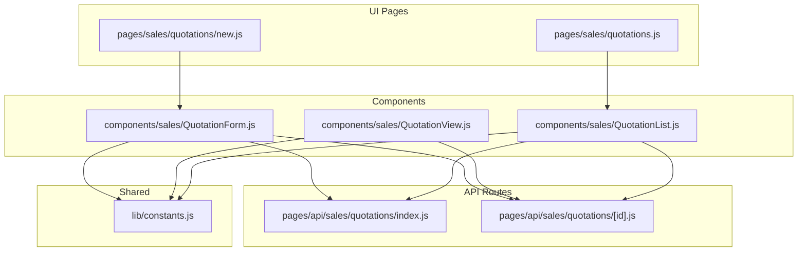
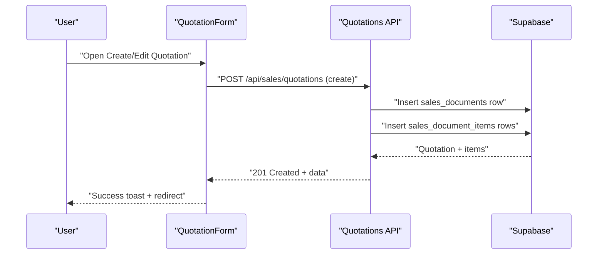
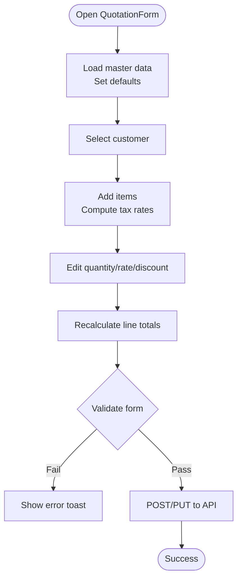
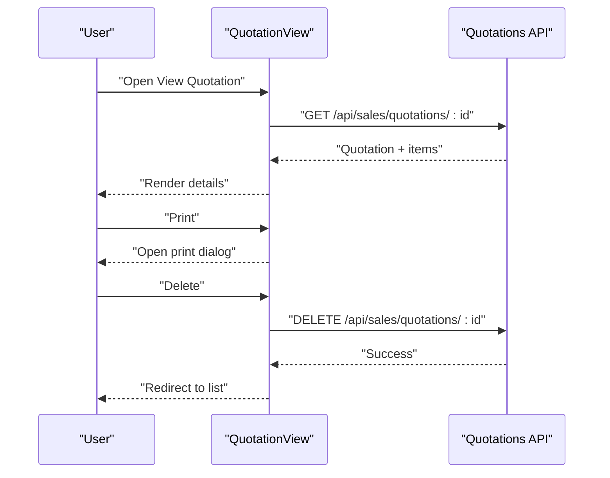
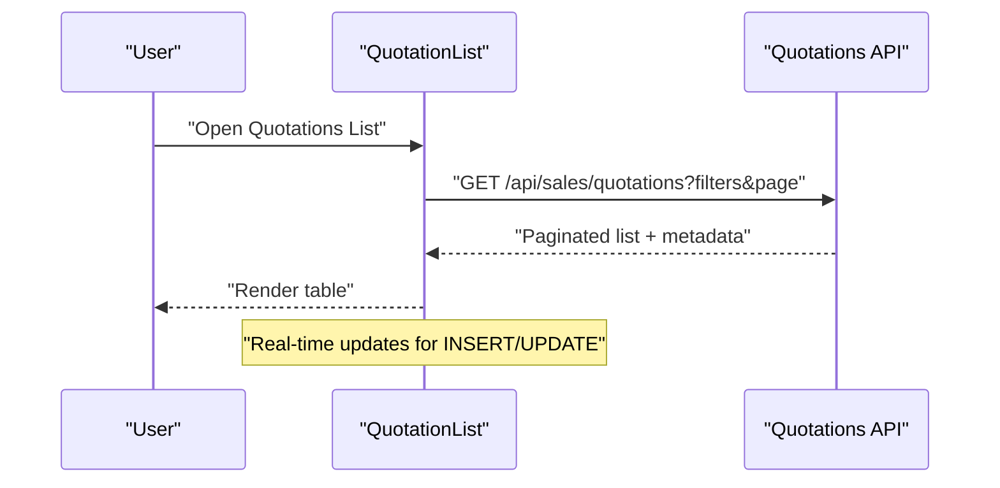
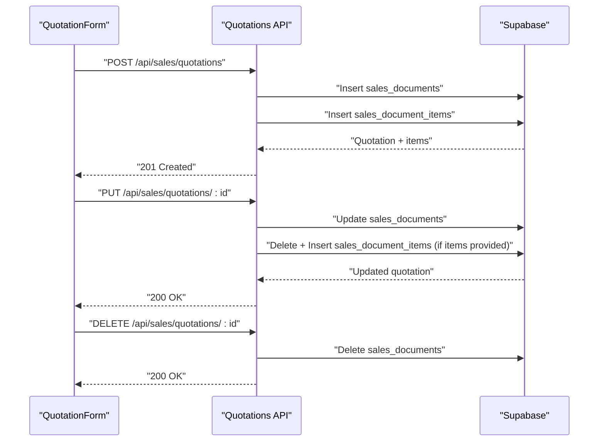
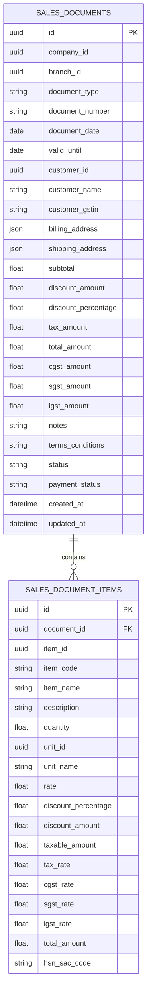
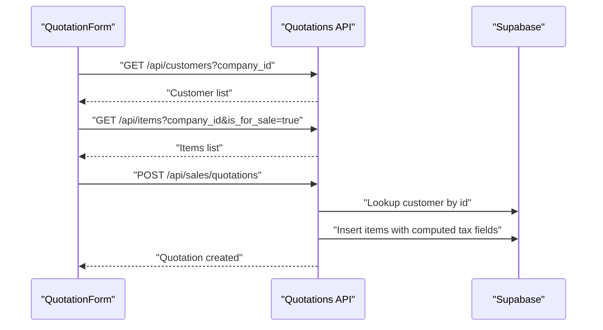
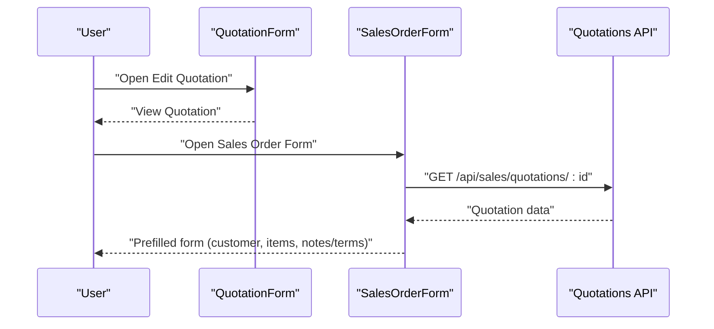
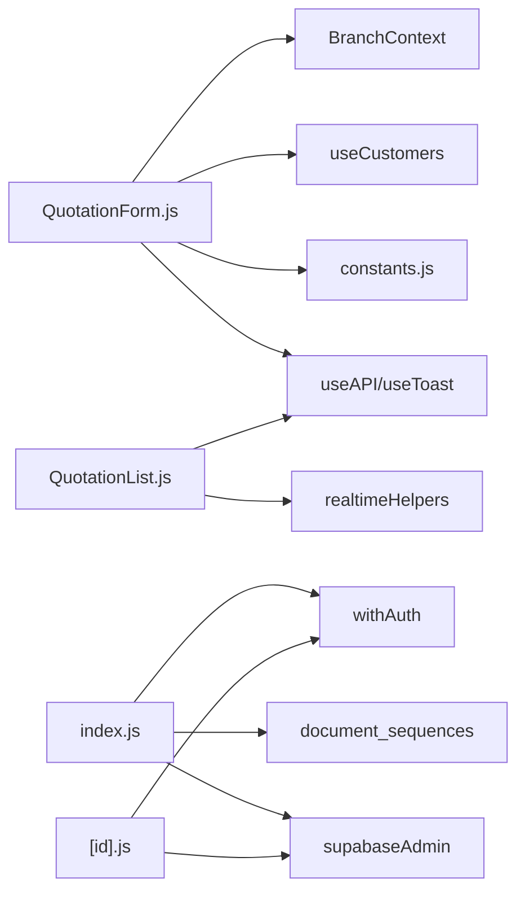

# Quotations

<cite>
**Referenced Files in This Document**
- [QuotationForm.js](file://src/components/sales/QuotationForm.js)
- [QuotationView.js](file://src/components/sales/QuotationView.js)
- [QuotationList.js](file://src/components/sales/QuotationList.js)
- [new.js](file://src/pages/sales/quotations/new.js)
- [quotations.js](file://src/pages/sales/quotations.js)
- [index.js](file://src/pages/api/sales/quotations/index.js)
- [id.js](file://src/pages/api/sales/quotations/[id].js)
- [constants.js](file://src/lib/constants.js)
- [SalesOrderForm.js](file://src/components/sales/SalesOrderForm.js)
</cite>

## Table of Contents
1. [Introduction](#introduction)
2. [Project Structure](#project-structure)
3. [Core Components](#core-components)
4. [Architecture Overview](#architecture-overview)
5. [Detailed Component Analysis](#detailed-component-analysis)
6. [Dependency Analysis](#dependency-analysis)
7. [Performance Considerations](#performance-considerations)
8. [Troubleshooting Guide](#troubleshooting-guide)
9. [Conclusion](#conclusion)

## Introduction
This document explains the Quotations feature in ezbillify-v1, covering how quotations are created, edited, viewed, printed, and deleted. It also documents the data model, including customer association, item details, pricing, taxes, validity periods, and notes/terms. Practical examples from the codebase illustrate form handling in QuotationForm.js and API interactions via the quotations API routes. Integration points with customer management and item pricing are described, along with common issues such as expired quotations, pricing mismatches, and tax configuration errors. Guidance on best practices and performance considerations for handling large quotation volumes is included.

## Project Structure
The Quotations feature spans UI components, Next.js pages, and backend API handlers:
- UI pages: new quotation page and list page
- Components: QuotationForm (create/edit), QuotationView (view/print/delete), QuotationList (browse/filter/paginate)
- API routes: GET/POST/PUT/DELETE for quotations
- Constants: GST helpers and document types/utilities

**Diagram sources**
- [new.js](file://src/pages/sales/quotations/new.js#L1-L52)
- [quotations.js](file://src/pages/sales/quotations.js#L1-L48)
- [QuotationForm.js](file://src/components/sales/QuotationForm.js#L1-L1375)
- [QuotationView.js](file://src/components/sales/QuotationView.js#L1-L413)
- [QuotationList.js](file://src/components/sales/QuotationList.js#L1-L549)
- [index.js](file://src/pages/api/sales/quotations/index.js#L1-L521)
- [id.js](file://src/pages/api/sales/quotations/[id].js#L1-L421)
- [constants.js](file://src/lib/constants.js#L1-L304)

**Section sources**
- [new.js](file://src/pages/sales/quotations/new.js#L1-L52)
- [quotations.js](file://src/pages/sales/quotations.js#L1-L48)
- [QuotationForm.js](file://src/components/sales/QuotationForm.js#L1-L1375)
- [QuotationView.js](file://src/components/sales/QuotationView.js#L1-L413)
- [QuotationList.js](file://src/components/sales/QuotationList.js#L1-L549)
- [index.js](file://src/pages/api/sales/quotations/index.js#L1-L521)
- [id.js](file://src/pages/api/sales/quotations/[id].js#L1-L421)
- [constants.js](file://src/lib/constants.js#L1-L304)

## Core Components
- QuotationForm: Handles creation/editing of quotations, including customer selection, item addition, pricing/tax calculations, and submission to the API.
- QuotationView: Displays a quotation’s details, prints it, and allows deletion.
- QuotationList: Lists quotations with filtering, sorting, pagination, and quick actions (view, edit, print, delete).
- API routes: Provide CRUD operations for quotations and integrate with Supabase.

Key responsibilities:
- Form validation and error messaging
- Tax computation (CGST/SGST/IGST) based on GST type
- Document numbering and sequences
- Real-time updates and printing integration

**Section sources**
- [QuotationForm.js](file://src/components/sales/QuotationForm.js#L1-L1375)
- [QuotationView.js](file://src/components/sales/QuotationView.js#L1-L413)
- [QuotationList.js](file://src/components/sales/QuotationList.js#L1-L549)
- [index.js](file://src/pages/api/sales/quotations/index.js#L1-L521)
- [id.js](file://src/pages/api/sales/quotations/[id].js#L1-L421)

## Architecture Overview
The Quotations feature follows a client-server architecture:
- Frontend components manage UI state, user interactions, and API requests.
- Backend API routes validate inputs, compute totals, and persist data to Supabase.
- Real-time subscriptions keep lists updated without manual refresh.

**Diagram sources**
- [QuotationForm.js](file://src/components/sales/QuotationForm.js#L623-L689)
- [index.js](file://src/pages/api/sales/quotations/index.js#L132-L521)

## Detailed Component Analysis

### QuotationForm: Creation and Editing
- Initializes master data (customers, items, units, tax rates) and sets defaults for dates and validity.
- Calculates taxes per item based on GST type and tax rates, and recomputes line totals and discount amounts.
- Submits to the API with company and branch context; on success, navigates to the quotations list.

**Diagram sources**
- [QuotationForm.js](file://src/components/sales/QuotationForm.js#L148-L250)
- [QuotationForm.js](file://src/components/sales/QuotationForm.js#L391-L467)
- [QuotationForm.js](file://src/components/sales/QuotationForm.js#L469-L560)
- [QuotationForm.js](file://src/components/sales/QuotationForm.js#L562-L621)
- [QuotationForm.js](file://src/components/sales/QuotationForm.js#L623-L689)

**Section sources**
- [QuotationForm.js](file://src/components/sales/QuotationForm.js#L1-L1375)

### QuotationView: Viewing, Printing, Deleting
- Loads a single quotation by ID and displays customer, dates, notes/terms, and items with tax breakdown.
- Provides print and delete actions; delete is disallowed for converted quotations.

**Diagram sources**
- [QuotationView.js](file://src/components/sales/QuotationView.js#L1-L205)
- [id.js](file://src/pages/api/sales/quotations/[id].js#L40-L86)
- [id.js](file://src/pages/api/sales/quotations/[id].js#L358-L421)

**Section sources**
- [QuotationView.js](file://src/components/sales/QuotationView.js#L1-L413)
- [id.js](file://src/pages/api/sales/quotations/[id].js#L1-L421)

### QuotationList: Browsing and Filtering
- Fetches quotations with search, date filters, pagination, and sorting.
- Supports real-time updates via Supabase subscriptions for new/updated quotations.
- Offers quick actions: view, edit, print, delete.

**Diagram sources**
- [QuotationList.js](file://src/components/sales/QuotationList.js#L1-L200)
- [index.js](file://src/pages/api/sales/quotations/index.js#L30-L130)

**Section sources**
- [QuotationList.js](file://src/components/sales/QuotationList.js#L1-L549)
- [index.js](file://src/pages/api/sales/quotations/index.js#L1-L130)

### API Interactions: Create, Update, Delete
- Create: Validates company/branch/customer/items; computes totals; generates document number using branch prefix and sequence; inserts sales_documents and sales_document_items.
- Update: Full recalculation when items are provided; otherwise simple updates for dates/status/discounts.
- Delete: Prevents deletion if the quotation is converted.

**Diagram sources**
- [index.js](file://src/pages/api/sales/quotations/index.js#L132-L521)
- [id.js](file://src/pages/api/sales/quotations/[id].js#L88-L356)

**Section sources**
- [index.js](file://src/pages/api/sales/quotations/index.js#L1-L521)
- [id.js](file://src/pages/api/sales/quotations/[id].js#L1-L421)

### Data Model and Pricing/Taxes
- Document-level fields: document_number, document_date, valid_until, customer_id, billing_address, shipping_address, subtotal, discount_amount, discount_percentage, tax_amount, total_amount, cgst_amount, sgst_amount, igst_amount, notes, terms_conditions, status, payment_status.
- Items-level fields: item_id, item_code, item_name, description, quantity, unit_id, unit_name, rate, discount_percentage, discount_amount, taxable_amount, tax_rate, cgst_rate, sgst_rate, igst_rate, total_amount, hsn_sac_code.
- Taxes computed using GST type (intrastate vs interstate) and tax rates; totals derived from line items and document-level discounts.

**Diagram sources**
- [index.js](file://src/pages/api/sales/quotations/index.js#L400-L442)
- [index.js](file://src/pages/api/sales/quotations/index.js#L444-L483)
- [id.js](file://src/pages/api/sales/quotations/[id].js#L242-L277)

**Section sources**
- [index.js](file://src/pages/api/sales/quotations/index.js#L400-L483)
- [id.js](file://src/pages/api/sales/quotations/[id].js#L242-L277)

### Integration Points: Customers and Item Pricing
- Customer association: Selected customer’s details (name, GSTIN, billing/shipping address) are stored on the quotation.
- Item pricing: Effective selling price is derived from item data; taxes are computed from configured tax rates or fallback values; quantities and rates drive line totals.

**Diagram sources**
- [QuotationForm.js](file://src/components/sales/QuotationForm.js#L272-L308)
- [index.js](file://src/pages/api/sales/quotations/index.js#L303-L317)
- [index.js](file://src/pages/api/sales/quotations/index.js#L318-L386)

**Section sources**
- [QuotationForm.js](file://src/components/sales/QuotationForm.js#L272-L308)
- [index.js](file://src/pages/api/sales/quotations/index.js#L303-L386)

### Conversion to Sales Orders or Invoices
- The Sales Order form can load a quotation and prefill customer, notes/terms, and items. This enables converting a quotation into a sales order.
- There is no built-in “convert” button in the UI; conversion is performed by opening the Sales Order form and selecting the quotation.

**Diagram sources**
- [SalesOrderForm.js](file://src/components/sales/SalesOrderForm.js#L365-L421)
- [id.js](file://src/pages/api/sales/quotations/[id].js#L40-L86)

**Section sources**
- [SalesOrderForm.js](file://src/components/sales/SalesOrderForm.js#L365-L421)
- [id.js](file://src/pages/api/sales/quotations/[id].js#L40-L86)

## Dependency Analysis
- QuotationForm depends on:
  - useAPI/useToast for network and notifications
  - useCustomers for customer list
  - constants for GST type and tax utilities
  - BranchContext for branch selection
- QuotationList depends on:
  - useAPI/useToast for network and notifications
  - realtimeHelpers for live updates
- API routes depend on:
  - Supabase admin client
  - Middleware for authentication
  - Document numbering and sequences

**Diagram sources**
- [QuotationForm.js](file://src/components/sales/QuotationForm.js#L1-L120)
- [QuotationList.js](file://src/components/sales/QuotationList.js#L1-L60)
- [index.js](file://src/pages/api/sales/quotations/index.js#L1-L28)
- [id.js](file://src/pages/api/sales/quotations/[id].js#L1-L38)
- [constants.js](file://src/lib/constants.js#L153-L304)

**Section sources**
- [QuotationForm.js](file://src/components/sales/QuotationForm.js#L1-L120)
- [QuotationList.js](file://src/components/sales/QuotationList.js#L1-L60)
- [index.js](file://src/pages/api/sales/quotations/index.js#L1-L28)
- [id.js](file://src/pages/api/sales/quotations/[id].js#L1-L38)
- [constants.js](file://src/lib/constants.js#L153-L304)

## Performance Considerations
- Master data loading: The form loads customers, items, units, and tax rates concurrently to reduce initialization latency.
- Real-time updates: QuotationList subscribes to sales document changes to keep the list fresh without polling.
- Pagination and filtering: API supports pagination and search to handle large datasets efficiently.
- Printing: QuotationList fetches the complete document before printing to ensure templates render correctly.

Best practices:
- Prefer batch operations where possible (e.g., concurrent initialization).
- Use debounced search and controlled filters to minimize unnecessary requests.
- Avoid heavy computations in render paths; compute totals in dedicated functions.
- Cache frequently accessed data (e.g., tax rates) in component state.

**Section sources**
- [QuotationForm.js](file://src/components/sales/QuotationForm.js#L166-L178)
- [QuotationList.js](file://src/components/sales/QuotationList.js#L138-L167)
- [index.js](file://src/pages/api/sales/quotations/index.js#L30-L130)

## Troubleshooting Guide
Common issues and resolutions:
- Expired quotations
  - Symptom: Quotation appears past valid_until date.
  - Resolution: Adjust valid_until date in the form; consider adding reminders or status badges in future enhancements.
  - Reference: [QuotationForm.js](file://src/components/sales/QuotationForm.js#L1030-L1057), [QuotationView.js](file://src/components/sales/QuotationView.js#L255-L282)

- Pricing mismatches
  - Symptom: Line totals differ from expectations.
  - Causes: Rate includes tax; frontend reverses to taxable amount; ensure item effective selling price aligns with tax rates.
  - Resolution: Verify item selling price and tax rate; recompute line totals after edits.
  - Reference: [QuotationForm.js](file://src/components/sales/QuotationForm.js#L427-L433), [QuotationForm.js](file://src/components/sales/QuotationForm.js#L488-L516)

- Tax configuration errors
  - Symptom: Incorrect CGST/SGST vs IGST allocation.
  - Causes: Mismatched GST type or missing tax rates.
  - Resolution: Ensure customer billing state is set; select appropriate tax rates; verify GST type helper.
  - Reference: [constants.js](file://src/lib/constants.js#L153-L218), [QuotationForm.js](file://src/components/sales/QuotationForm.js#L93-L146)

- Document numbering issues
  - Symptom: Duplicate or incorrect document numbers.
  - Causes: Sequence not found or financial year mismatch.
  - Resolution: Allow automatic sequence creation; ensure branch prefix and financial year alignment.
  - Reference: [index.js](file://src/pages/api/sales/quotations/index.js#L188-L301)

- Deletion blocked
  - Symptom: Cannot delete a quotation.
  - Cause: Converted quotations cannot be deleted.
  - Resolution: Convert back to draft or create a new document.
  - Reference: [id.js](file://src/pages/api/sales/quotations/[id].js#L391-L398)

- API errors
  - Symptom: 400/500 responses on create/update.
  - Causes: Missing company_id, branch_id, customer_id, or items.
  - Resolution: Validate required fields; check network connectivity and middleware.
  - Reference: [index.js](file://src/pages/api/sales/quotations/index.js#L149-L154), [id.js](file://src/pages/api/sales/quotations/[id].js#L88-L117)

**Section sources**
- [QuotationForm.js](file://src/components/sales/QuotationForm.js#L93-L146)
- [QuotationForm.js](file://src/components/sales/QuotationForm.js#L427-L516)
- [QuotationForm.js](file://src/components/sales/QuotationForm.js#L1030-L1057)
- [QuotationView.js](file://src/components/sales/QuotationView.js#L255-L282)
- [constants.js](file://src/lib/constants.js#L153-L218)
- [index.js](file://src/pages/api/sales/quotations/index.js#L149-L154)
- [index.js](file://src/pages/api/sales/quotations/index.js#L188-L301)
- [id.js](file://src/pages/api/sales/quotations/[id].js#L88-L117)
- [id.js](file://src/pages/api/sales/quotations/[id].js#L391-L398)

## Conclusion
The Quotations feature in ezbillify-v1 provides a robust foundation for creating, editing, viewing, printing, and deleting quotations. It integrates seamlessly with customer and item data, enforces tax correctness via GST type logic, and offers efficient API-driven workflows. For production readiness, consider adding explicit “Convert to Sales Order” actions, enhanced validation for pricing/taxes, and UI indicators for expired quotations. The provided architecture and components offer a solid base for extending functionality while maintaining performance and reliability.