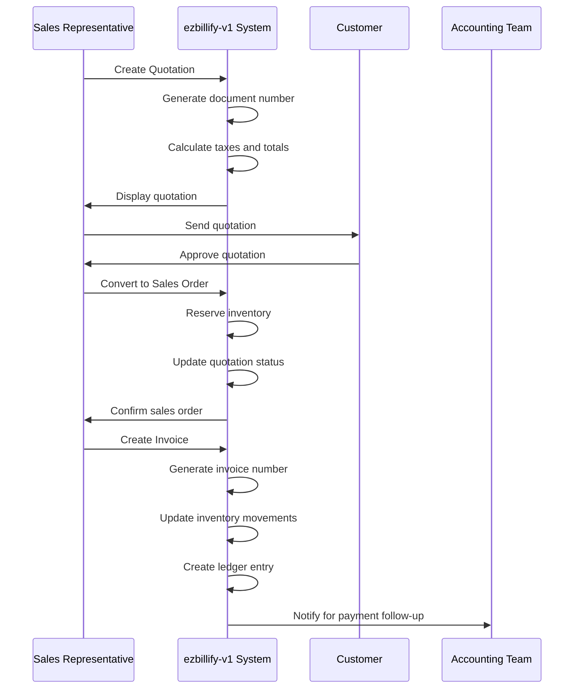
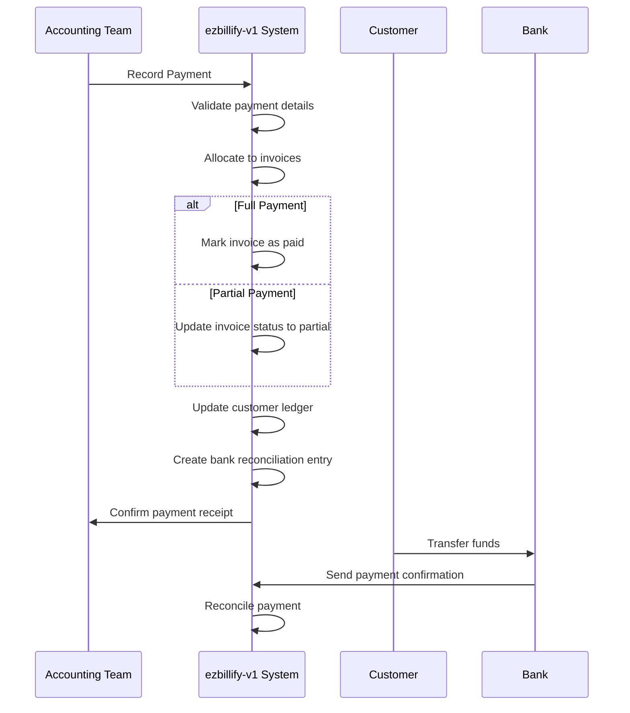
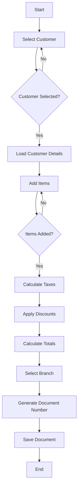
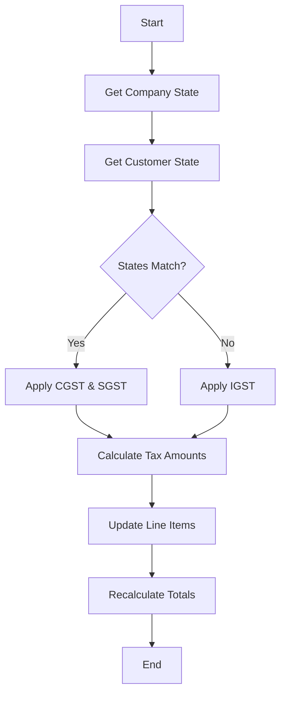
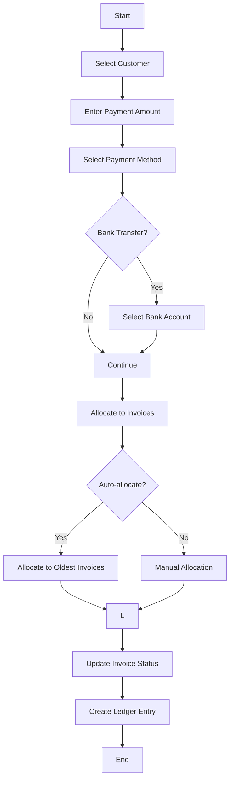
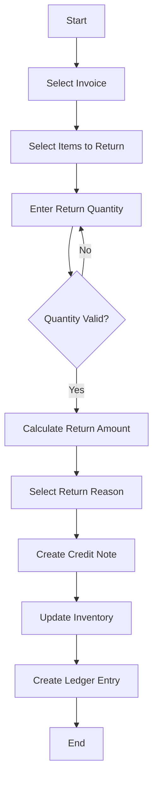
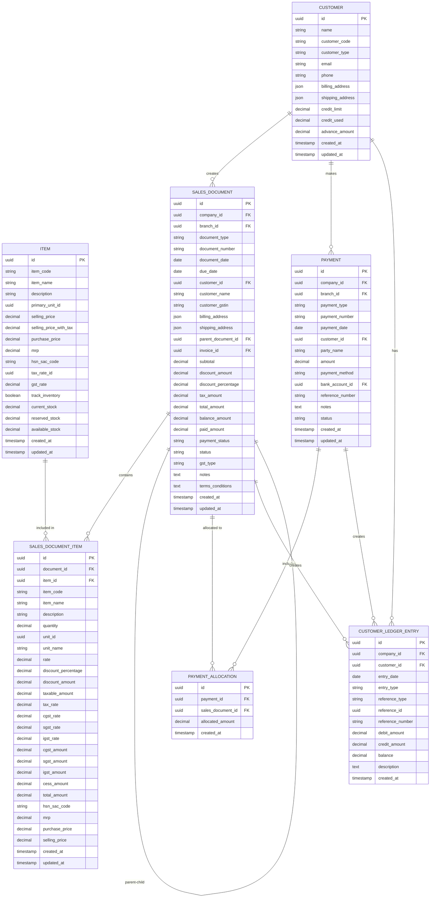
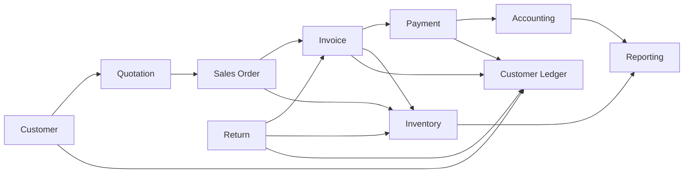

# Sales Management

<cite>
**Referenced Files in This Document**   
- [QuotationForm.js](file://src/components/sales/QuotationForm.js)
- [SalesOrderForm.js](file://src/components/sales/SalesOrderForm.js)
- [InvoiceForm.js](file://src/components/sales/InvoiceForm.js)
- [PaymentForm.js](file://src/components/sales/PaymentForm.js)
- [SalesReturnForm.js](file://src/components/sales/SalesReturnForm.js)
- [index.js](file://src/pages/api/sales/quotations/index.js)
- [index.js](file://src/pages/api/sales/sales-orders/index.js)
- [index.js](file://src/pages/api/sales/invoices/index.js)
- [index.js](file://src/pages/api/sales/payments/index.js)
- [index.js](file://src/pages/api/sales/returns/index.js)
- [useInvoice.js](file://src/hooks/useInvoice.js)
- [sales.js](file://src/pages/sales/index.js)
</cite>

## Table of Contents
1. [Introduction](#introduction)
2. [Complete Sales Workflow](#complete-sales-workflow)
3. [Key Entities Implementation](#key-entities-implementation)
4. [Practical Examples](#practical-examples)
5. [Data Model Relationships](#data-model-relationships)
6. [Common Issues and Solutions](#common-issues-and-solutions)
7. [Performance Optimization](#performance-optimization)
8. [Conclusion](#conclusion)

## Introduction

The sales management module in ezbillify-v1 provides a comprehensive solution for managing the complete sales cycle from quotation to payment collection. This document explains the complete workflow, implementation details of key entities, practical examples, data model relationships, common issues, and performance optimization strategies. The system is designed to handle high-volume sales operations with robust tax calculation, payment processing, and return handling capabilities.

**Section sources**
- [sales.js](file://src/pages/sales/index.js#L1-L137)

## Complete Sales Workflow

The sales workflow in ezbillify-v1 follows a structured progression from initial quotation to final payment collection, with optional return processing. Each step in the workflow builds upon the previous one, creating a seamless and traceable sales process.

### Quotation to Invoice Process

The sales process begins with creating a quotation, which can then be converted into a sales order and subsequently into an invoice. This workflow ensures that all sales activities are properly documented and tracked.

**Diagram sources**
- [QuotationForm.js](file://src/components/sales/QuotationForm.js#L1-L1375)
- [SalesOrderForm.js](file://src/components/sales/SalesOrderForm.js#L1-L1468)
- [InvoiceForm.js](file://src/components/sales/InvoiceForm.js#L1-L1567)

**Section sources**
- [QuotationForm.js](file://src/components/sales/QuotationForm.js#L1-L1375)
- [SalesOrderForm.js](file://src/components/sales/SalesOrderForm.js#L1-L1468)
- [InvoiceForm.js](file://src/components/sales/InvoiceForm.js#L1-L1567)

### Payment Collection Process

After an invoice is created, the payment collection process begins. Payments can be received against specific invoices or as advance payments, with proper allocation and ledger updates.

**Diagram sources**
- [PaymentForm.js](file://src/components/sales/PaymentForm.js#L1-L1412)
- [index.js](file://src/pages/api/sales/payments/index.js#L1-L500)

**Section sources**
- [PaymentForm.js](file://src/components/sales/PaymentForm.js#L1-L1412)
- [index.js](file://src/pages/api/sales/payments/index.js#L1-L500)

## Key Entities Implementation

The sales management module implements several key entities that represent different stages of the sales process. Each entity has specific fields and relationships that support the complete sales workflow.

### Quotations

Quotations are the initial sales documents that provide price estimates to customers. They include detailed item information, pricing, and tax calculations.

**Key Features:**
- Document numbering with branch-specific prefixes
- Tax calculation based on customer and company states
- Support for customer-specific discounts
- Validity period for quotations
- Conversion to sales orders

**Section sources**
- [QuotationForm.js](file://src/components/sales/QuotationForm.js#L1-L1375)
- [index.js](file://src/pages/api/sales/quotations/index.js#L1-L521)

### Sales Orders

Sales orders represent confirmed sales transactions after quotation approval. They trigger inventory reservation and serve as the basis for invoice creation.

**Key Features:**
- Linkage to parent quotations
- Inventory reservation upon creation
- Due date for delivery
- Status tracking (pending, confirmed, invoiced)
- Branch-specific document numbering

**Section sources**
- [SalesOrderForm.js](file://src/components/sales/SalesOrderForm.js#L1-L1468)
- [index.js](file://src/pages/api/sales/sales-orders/index.js#L1-L485)

### Invoices

Invoices are the final billing documents that request payment from customers. They include all necessary tax information and create entries in the accounting system.

**Key Features:**
- Automatic document numbering with financial year tracking
- GST type determination (intrastate or interstate)
- Credit limit validation before creation
- Customer-specific discount application
- Ledger entry creation for accounting
- Inventory movement tracking

**Section sources**
- [InvoiceForm.js](file://src/components/sales/InvoiceForm.js#L1-L1567)
- [index.js](file://src/pages/api/sales/invoices/index.js#L1-L625)

### Payments

Payments represent the receipt of funds from customers against invoices or as advance payments. They support multiple payment methods and proper allocation.

**Key Features:**
- Multiple payment methods (cash, bank transfer, UPI)
- Allocation to multiple invoices
- Advance payment handling
- Bank account integration
- Ledger entry creation for accounting
- Auto-allocation to oldest invoices

**Section sources**
- [PaymentForm.js](file://src/components/sales/PaymentForm.js#L1-L1412)
- [index.js](file://src/pages/api/sales/payments/index.js#L1-L500)

### Returns

Returns (credit notes) handle sales reversals due to various reasons such as damaged goods or customer dissatisfaction. They adjust inventory and accounting records accordingly.

**Key Features:**
- Linkage to original invoices
- Inventory restoration upon return
- Credit note creation for accounting
- Reason tracking for returns
- Impact on customer credit balance
- Branch-specific document numbering

**Section sources**
- [SalesReturnForm.js](file://src/components/sales/SalesReturnForm.js#L1-L1342)
- [index.js](file://src/pages/api/sales/returns/index.js#L1-L511)

## Practical Examples

This section provides practical examples of creating sales documents, applying tax calculations, processing payments, and handling returns in the ezbillify-v1 system.

### Creating a Sales Document

Creating a sales document involves several steps, from selecting a customer to calculating taxes and generating the document number.

**Section sources**
- [QuotationForm.js](file://src/components/sales/QuotationForm.js#L1-L1375)
- [SalesOrderForm.js](file://src/components/sales/SalesOrderForm.js#L1-L1468)
- [InvoiceForm.js](file://src/components/sales/InvoiceForm.js#L1-L1567)

### Applying Tax Calculations

Tax calculations in ezbillify-v1 are automated based on the customer's and company's states, determining whether the transaction is intrastate or interstate.

**Section sources**
- [QuotationForm.js](file://src/components/sales/QuotationForm.js#L1-L1375)
- [SalesOrderForm.js](file://src/components/sales/SalesOrderForm.js#L1-L1468)
- [InvoiceForm.js](file://src/components/sales/InvoiceForm.js#L1-L1567)

### Processing Payments

Payment processing involves recording the receipt of funds and allocating them to outstanding invoices.

**Section sources**
- [PaymentForm.js](file://src/components/sales/PaymentForm.js#L1-L1412)
- [index.js](file://src/pages/api/sales/payments/index.js#L1-L500)

### Handling Returns

Returns processing involves creating credit notes and adjusting inventory and accounting records.

**Section sources**
- [SalesReturnForm.js](file://src/components/sales/SalesReturnForm.js#L1-L1342)
- [index.js](file://src/pages/api/sales/returns/index.js#L1-L511)

## Data Model Relationships

The sales management module uses a relational data model to connect customers, items, and sales documents. Understanding these relationships is crucial for effective system usage and troubleshooting.

### Entity Relationship Diagram

**Diagram sources**
- [index.js](file://src/pages/api/sales/quotations/index.js#L1-L521)
- [index.js](file://src/pages/api/sales/sales-orders/index.js#L1-L485)
- [index.js](file://src/pages/api/sales/invoices/index.js#L1-L625)
- [index.js](file://src/pages/api/sales/payments/index.js#L1-L500)
- [index.js](file://src/pages/api/sales/returns/index.js#L1-L511)

**Section sources**
- [index.js](file://src/pages/api/sales/quotations/index.js#L1-L521)
- [index.js](file://src/pages/api/sales/sales-orders/index.js#L1-L485)
- [index.js](file://src/pages/api/sales/invoices/index.js#L1-L625)
- [index.js](file://src/pages/api/sales/payments/index.js#L1-L500)
- [index.js](file://src/pages/api/sales/returns/index.js#L1-L511)

### Data Flow Diagram

**Diagram sources**
- [QuotationForm.js](file://src/components/sales/QuotationForm.js#L1-L1375)
- [SalesOrderForm.js](file://src/components/sales/SalesOrderForm.js#L1-L1468)
- [InvoiceForm.js](file://src/components/sales/InvoiceForm.js#L1-L1567)
- [PaymentForm.js](file://src/components/sales/PaymentForm.js#L1-L1412)
- [SalesReturnForm.js](file://src/components/sales/SalesReturnForm.js#L1-L1342)

**Section sources**
- [QuotationForm.js](file://src/components/sales/QuotationForm.js#L1-L1375)
- [SalesOrderForm.js](file://src/components/sales/SalesOrderForm.js#L1-L1468)
- [InvoiceForm.js](file://src/components/sales/InvoiceForm.js#L1-L1567)
- [PaymentForm.js](file://src/components/sales/PaymentForm.js#L1-L1412)
- [SalesReturnForm.js](file://src/components/sales/SalesReturnForm.js#L1-L1342)

## Common Issues and Solutions

This section addresses common issues encountered in the sales management module and provides solutions for each.

### Pricing Errors

Pricing errors can occur due to incorrect item pricing or discount application.

**Common Causes:**
- Incorrect selling price in item master
- Wrong discount percentage applied
- Tax calculation errors
- Currency conversion issues

**Solutions:**
- Regularly audit item pricing
- Implement price change approval workflow
- Validate discounts against customer agreements
- Use standardized tax calculation methods

**Section sources**
- [QuotationForm.js](file://src/components/sales/QuotationForm.js#L1-L1375)
- [SalesOrderForm.js](file://src/components/sales/SalesOrderForm.js#L1-L1468)
- [InvoiceForm.js](file://src/components/sales/InvoiceForm.js#L1-L1567)

### Tax Calculation Problems

Tax calculation issues can lead to compliance problems and financial discrepancies.

**Common Causes:**
- Incorrect GST type determination
- Wrong tax rate applied
- Missing HSN/SAC codes
- State mismatch between company and customer

**Solutions:**
- Implement automated GST type detection
- Maintain up-to-date tax rate master
- Validate HSN/SAC codes during item creation
- Regularly verify customer state information

**Section sources**
- [QuotationForm.js](file://src/components/sales/QuotationForm.js#L1-L1375)
- [SalesOrderForm.js](file://src/components/sales/SalesOrderForm.js#L1-L1468)
- [InvoiceForm.js](file://src/components/sales/InvoiceForm.js#L1-L1567)

### Payment Reconciliation

Payment reconciliation issues can arise from mismatched records between the system and bank statements.

**Common Causes:**
- Duplicate payment entries
- Incorrect payment allocation
- Timing differences between system and bank
- Missing payment references

**Solutions:**
- Implement bank reconciliation module
- Use unique payment references
- Regular reconciliation schedules
- Automated matching algorithms

**Section sources**
- [PaymentForm.js](file://src/components/sales/PaymentForm.js#L1-L1412)
- [index.js](file://src/pages/api/sales/payments/index.js#L1-L500)

## Performance Optimization

For high-volume sales operations, performance optimization is crucial to maintain system responsiveness and data integrity.

### Database Indexing

Proper indexing of database tables improves query performance significantly.

**Recommended Indexes:**
- Sales documents: document_number, document_date, customer_id, payment_status
- Items: item_code, item_name, hsn_sac_code
- Customers: customer_code, name, email
- Payments: payment_number, payment_date, customer_id

**Section sources**
- [index.js](file://src/pages/api/sales/quotations/index.js#L1-L521)
- [index.js](file://src/pages/api/sales/sales-orders/index.js#L1-L485)
- [index.js](file://src/pages/api/sales/invoices/index.js#L1-L625)
- [index.js](file://src/pages/api/sales/payments/index.js#L1-L500)

### Caching Strategies

Implementing caching reduces database load and improves response times.

**Caching Approach:**
- Cache frequently accessed master data (items, customers, tax rates)
- Use short TTL for transactional data
- Implement cache invalidation on data updates
- Cache document numbering sequences

**Section sources**
- [useInvoice.js](file://src/hooks/useInvoice.js#L1-L198)
- [QuotationForm.js](file://src/components/sales/QuotationForm.js#L1-L1375)
- [SalesOrderForm.js](file://src/components/sales/SalesOrderForm.js#L1-L1468)
- [InvoiceForm.js](file://src/components/sales/InvoiceForm.js#L1-L1567)

### Batch Processing

For high-volume operations, batch processing improves efficiency.

**Batch Processing Use Cases:**
- Bulk invoice generation
- Mass payment processing
- End-of-day reconciliation
- Monthly reporting

**Section sources**
- [index.js](file://src/pages/api/sales/invoices/index.js#L1-L625)
- [index.js](file://src/pages/api/sales/payments/index.js#L1-L500)

## Conclusion

The sales management module in ezbillify-v1 provides a comprehensive and robust solution for managing the complete sales cycle. By understanding the workflow, data model, and implementation details, users can effectively leverage the system to streamline sales operations, ensure accurate financial reporting, and improve customer satisfaction. The module's design supports high-volume operations with performance optimization strategies and addresses common issues through systematic solutions. Regular maintenance and optimization will ensure the system continues to meet evolving business needs.