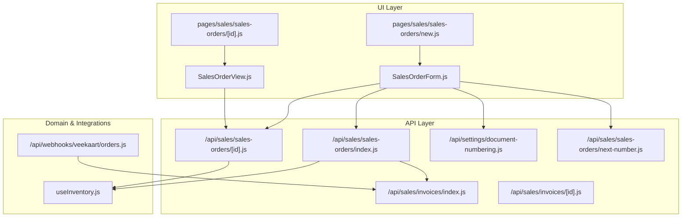
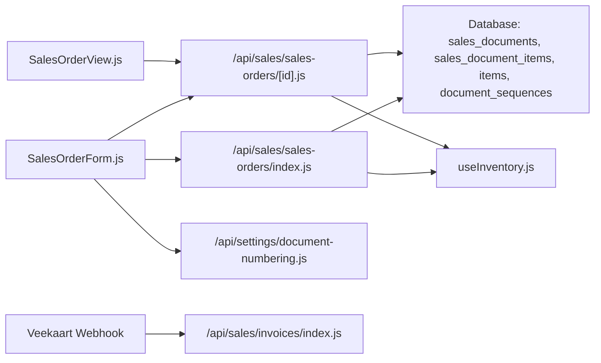

# Sales Orders

<cite>
**Referenced Files in This Document**
- [SalesOrderForm.js](file://src/components/sales/SalesOrderForm.js)
- [SalesOrderView.js](file://src/components/sales/SalesOrderView.js)
- [new.js (Sales Orders)](file://src/pages/sales/sales-orders/new.js)
- [new.js (Sales Orders View)](file://src/pages/sales/sales-orders/[id].js)
- [index.js (Sales Orders API)](file://src/pages/api/sales/sales-orders/index.js)
- [index.js (Sales Orders API by ID)](file://src/pages/api/sales/sales-orders/[id].js)
- [document-numbering.js](file://src/pages/api/settings/document-numbering.js)
- [next-number.js (Sales Orders)](file://src/pages/api/sales/sales-orders/next-number.js)
- [useInventory.js](file://src/hooks/useInventory.js)
- [orders.js (Veekaart Webhook)](file://src/pages/api/webhooks/veekaart/orders.js)
- [invoices/index.js](file://src/pages/api/sales/invoices/index.js)
- [invoices/[id].js](file://src/pages/api/sales/invoices/[id].js)
</cite>

## Table of Contents
1. [Introduction](#introduction)
2. [Project Structure](#project-structure)
3. [Core Components](#core-components)
4. [Architecture Overview](#architecture-overview)
5. [Detailed Component Analysis](#detailed-component-analysis)
6. [Dependency Analysis](#dependency-analysis)
7. [Performance Considerations](#performance-considerations)
8. [Troubleshooting Guide](#troubleshooting-guide)
9. [Conclusion](#conclusion)
10. [Appendices](#appendices)

## Introduction
This document explains the Sales Orders feature in ezbillify-v1. It covers the end-to-end lifecycle: creating sales orders, managing them, and tracking fulfillment through downstream documents like invoices and delivery notes. It also documents the domain model relationships among customers, items, inventory availability, and the integration with inventory reservations to prevent overselling. Practical examples reference SalesOrderForm.js and the associated API endpoints, along with usage patterns for common business scenarios and performance optimization tips.

## Project Structure
The Sales Orders feature spans the UI, API, and inventory domains:
- UI pages and components: SalesOrderForm, SalesOrderView, and Next.js pages for new/edit/view.
- API endpoints: CRUD for sales orders, document numbering, and conversions to invoices.
- Inventory integration: stock reservation on creation/update and reversal on deletion/update.
- Downstream documents: invoices and delivery notes (via invoice creation and inventory movements).



**Diagram sources**
- [SalesOrderForm.js](file://src/components/sales/SalesOrderForm.js#L1-L120)
- [SalesOrderView.js](file://src/components/sales/SalesOrderView.js#L1-L120)
- [new.js (Sales Orders)](file://src/pages/sales/sales-orders/new.js#L1-L56)
- [new.js (Sales Orders View)](file://src/pages/sales/sales-orders/[id].js#L1-L70)
- [index.js (Sales Orders API)](file://src/pages/api/sales/sales-orders/index.js#L1-L120)
- [index.js (Sales Orders API by ID)](file://src/pages/api/sales/sales-orders/[id].js#L1-L120)
- [document-numbering.js](file://src/pages/api/settings/document-numbering.js#L450-L532)
- [next-number.js (Sales Orders)](file://src/pages/api/sales/sales-orders/next-number.js#L48-L87)
- [useInventory.js](file://src/hooks/useInventory.js#L1-L114)
- [orders.js (Veekaart Webhook)](file://src/pages/api/webhooks/veekaart/orders.js#L113-L199)
- [invoices/index.js](file://src/pages/api/sales/invoices/index.js#L443-L607)

**Section sources**
- [SalesOrderForm.js](file://src/components/sales/SalesOrderForm.js#L1-L120)
- [index.js (Sales Orders API)](file://src/pages/api/sales/sales-orders/index.js#L1-L120)

## Core Components
- SalesOrderForm: Client-side form for creating and editing sales orders, including customer/item selection, tax calculation, GST type detection, and submission to the backend.
- SalesOrderView: Read-only view for sales orders, including actions to edit, delete, print, and convert to invoice.
- API handlers: Create, update, delete sales orders; reserve/unreserve inventory; manage document numbering; and integrate with invoice creation.
- Inventory hook: Provides item data and manages item lifecycle for inventory operations.
- Document numbering APIs: Generate and preview sales order numbers with branch prefixes and financial year resets.

Key responsibilities:
- Validate form data and enforce company/customer ownership.
- Compute totals and taxes using frontend-calculated fields passed from the form.
- Reserve inventory on creation/update and unreserve on deletion/update.
- Convert sales orders to invoices and update upstream/downstream statuses.

**Section sources**
- [SalesOrderForm.js](file://src/components/sales/SalesOrderForm.js#L1-L120)
- [SalesOrderView.js](file://src/components/sales/SalesOrderView.js#L1-L120)
- [index.js (Sales Orders API)](file://src/pages/api/sales/sales-orders/index.js#L117-L170)
- [index.js (Sales Orders API by ID)](file://src/pages/api/sales/sales-orders/[id].js#L88-L160)
- [document-numbering.js](file://src/pages/api/settings/document-numbering.js#L450-L532)

## Architecture Overview
The Sales Orders feature follows a layered architecture:
- UI layer: Next.js pages render SalesOrderForm and SalesOrderView, which call the API layer.
- API layer: Express-style handlers in src/pages/api handle requests, validate inputs, compute totals, and interact with the database.
- Domain layer: Sales documents and items are persisted in the database; inventory is managed via reserved_stock/current_stock.
- Integrations: Webhooks can create invoices from external orders; invoice creation updates inventory and ledger entries.

```mermaid
sequenceDiagram
participant Client as "Browser"
participant Page as "Sales Orders Page"
participant Form as "SalesOrderForm"
participant API as "Sales Orders API"
participant DB as "Database"
participant Inv as "Inventory Hook"
Client->>Page : Navigate to create/edit sales order
Page->>Form : Render form with company_id, salesOrderId/quotationId
Form->>API : GET /api/settings/document-numbering?company_id&branch_id&document_type=sales_order&action=preview
API-->>Form : { preview }
Form->>API : POST /api/sales/sales-orders (items with taxable_amount, tax amounts, total_amount)
API->>DB : Insert sales_documents
API->>DB : Insert sales_document_items
API->>Inv : Reserve stock (reserved_stock += qty; available_stock -= qty)
API-->>Form : 201 Created { data }
Form-->>Client : Success toast and redirect
```

**Diagram sources**
- [SalesOrderForm.js](file://src/components/sales/SalesOrderForm.js#L219-L244)
- [index.js (Sales Orders API)](file://src/pages/api/sales/sales-orders/index.js#L117-L170)
- [document-numbering.js](file://src/pages/api/settings/document-numbering.js#L450-L532)

## Detailed Component Analysis

### SalesOrderForm: Creation, Editing, and Validation
Responsibilities:
- Initialize form with company-scoped master data (customers, items, units, tax rates).
- Compute GST split (CGST/SGST/IGST) based on company vs customer state.
- Manage item lines: add, change quantity/rate/discount, recalculate amounts.
- Validate customer existence and company ownership.
- Submit to API with items carrying precomputed taxable_amount, tax amounts, and total_amount.

Important behaviors:
- Uses authenticatedFetch to call internal APIs.
- On edit, loads existing sales order and populates form.
- On quotation link, loads quotation data into the form.
- Validates UUID customer_id and cross-checks against fetched customer list.
- Prevents invalid item entries (non-positive quantities or negative rates).

Common validations and checks:
- Customer presence and UUID format.
- Items present and valid numeric fields.
- Customer belongs to the current company.

Submission payload:
- POST creates a new sales order; PUT updates an existing one.
- Items include: item_id, unit_id, quantity, rate, discount fields, and precomputed tax fields.

**Section sources**
- [SalesOrderForm.js](file://src/components/sales/SalesOrderForm.js#L1-L120)
- [SalesOrderForm.js](file://src/components/sales/SalesOrderForm.js#L219-L244)
- [SalesOrderForm.js](file://src/components/sales/SalesOrderForm.js#L301-L363)
- [SalesOrderForm.js](file://src/components/sales/SalesOrderForm.js#L365-L421)
- [SalesOrderForm.js](file://src/components/sales/SalesOrderForm.js#L440-L561)
- [SalesOrderForm.js](file://src/components/sales/SalesOrderForm.js#L563-L655)
- [SalesOrderForm.js](file://src/components/sales/SalesOrderForm.js#L657-L772)
- [SalesOrderForm.js](file://src/components/sales/SalesOrderForm.js#L774-L800)

### SalesOrderView: Viewing and Converting to Invoice
Responsibilities:
- Fetch and display sales order details, customer info, items, and totals.
- Provide actions: edit, delete, print, and create invoice from sales order.
- Deletion triggers unreservation of inventory.

Conversion to invoice:
- Navigates to invoice creation page with sales_order_id parameter.
- Downstream invoice creation updates inventory and ledger entries.

**Section sources**
- [SalesOrderView.js](file://src/components/sales/SalesOrderView.js#L1-L120)
- [SalesOrderView.js](file://src/components/sales/SalesOrderView.js#L120-L223)
- [SalesOrderView.js](file://src/components/sales/SalesOrderView.js#L224-L422)

### API Handlers: Create, Update, Delete Sales Orders
Endpoints:
- POST /api/sales/sales-orders: Create a sales order with document numbering and inventory reservation.
- PUT /api/sales/sales-orders/[id]: Update sales order with full recalculation or simple updates.
- DELETE /api/sales/sales-orders/[id]: Delete sales order with inventory unreservation and status checks.

Key logic:
- Document numbering: Uses branch prefix and document_sequences with yearly reset.
- GST determination: Inter/Intra-state based on company and customer GSTIN state codes.
- Totals: Sums taxable_amount, tax amounts, and applies document-level discount.
- Inventory: Reserves stock on create/update; unreserves on delete/update.
- Quotation linkage: Converts parent quotation to “converted” when SO is created.

**Section sources**
- [index.js (Sales Orders API)](file://src/pages/api/sales/sales-orders/index.js#L117-L170)
- [index.js (Sales Orders API)](file://src/pages/api/sales/sales-orders/index.js#L171-L264)
- [index.js (Sales Orders API)](file://src/pages/api/sales/sales-orders/index.js#L265-L357)
- [index.js (Sales Orders API)](file://src/pages/api/sales/sales-orders/index.js#L356-L444)
- [index.js (Sales Orders API)](file://src/pages/api/sales/sales-orders/index.js#L446-L485)
- [index.js (Sales Orders API by ID)](file://src/pages/api/sales/sales-orders/[id].js#L88-L160)
- [index.js (Sales Orders API by ID)](file://src/pages/api/sales/sales-orders/[id].js#L160-L225)
- [index.js (Sales Orders API by ID)](file://src/pages/api/sales/sales-orders/[id].js#L225-L341)
- [index.js (Sales Orders API by ID)](file://src/pages/api/sales/sales-orders/[id].js#L342-L401)
- [index.js (Sales Orders API by ID)](file://src/pages/api/sales/sales-orders/[id].js#L402-L493)

### Inventory Management and Prevention of Overselling
Behavior:
- On creation/update: For each item, reserved_stock increases by quantity and available_stock decreases accordingly.
- On deletion/update: Old reservations are unreserved before applying new reservations.
- Inventory hook provides item data and supports item lifecycle operations.

Implications:
- Prevents overselling by tracking reserved_stock and available_stock.
- Requires consistent updates on all modifications to maintain integrity.

**Section sources**
- [index.js (Sales Orders API)](file://src/pages/api/sales/sales-orders/index.js#L423-L444)
- [index.js (Sales Orders API by ID)](file://src/pages/api/sales/sales-orders/[id].js#L160-L181)
- [index.js (Sales Orders API by ID)](file://src/pages/api/sales/sales-orders/[id].js#L320-L341)
- [useInventory.js](file://src/hooks/useInventory.js#L1-L114)

### Document Numbering and Branch Prefixes
Behavior:
- Generates sales order numbers with branch prefix and financial year suffix.
- Supports preview without incrementing sequence.
- Creates default sequences if none exist.

**Section sources**
- [document-numbering.js](file://src/pages/api/settings/document-numbering.js#L450-L532)
- [next-number.js (Sales Orders)](file://src/pages/api/sales/sales-orders/next-number.js#L48-L87)
- [next-number.js (Sales Orders)](file://src/pages/api/sales/sales-orders/next-number.js#L129-L151)

### Downstream Documents: Invoices and Delivery Notes
- Sales order to invoice: The view action allows creating an invoice from a sales order. Invoice creation updates inventory movements and ledger entries.
- Delivery notes: While not explicitly shown in the referenced files, typical practice is to create delivery notes upon dispatch, referencing the invoice or sales order.

**Section sources**
- [SalesOrderView.js](file://src/components/sales/SalesOrderView.js#L206-L221)
- [invoices/index.js](file://src/pages/api/sales/invoices/index.js#L443-L516)
- [invoices/index.js](file://src/pages/api/sales/invoices/index.js#L518-L607)
- [invoices/[id].js](file://src/pages/api/sales/invoices/[id].js#L604-L628)

### External Integration: Veekaart Orders Webhook
Behavior:
- Receives external orders and creates invoices automatically.
- Populates invoice with customer, items, totals, and payment status.
- Useful for e-commerce integrations and automated order processing.

**Section sources**
- [orders.js (Veekaart Webhook)](file://src/pages/api/webhooks/veekaart/orders.js#L113-L199)

## Dependency Analysis
High-level dependencies:
- SalesOrderForm depends on:
  - useAPI/useToast for network and notifications.
  - useCustomers for customer list.
  - useAuth/BranchContext for company/branch context.
  - constants for GST type computation.
- API handlers depend on:
  - Supabase admin client for database operations.
  - Middleware for authentication.
  - Document numbering utilities for sequence management.
- Inventory hook integrates with items table for stock tracking.



**Diagram sources**
- [SalesOrderForm.js](file://src/components/sales/SalesOrderForm.js#L1-L120)
- [index.js (Sales Orders API)](file://src/pages/api/sales/sales-orders/index.js#L1-L120)
- [index.js (Sales Orders API by ID)](file://src/pages/api/sales/sales-orders/[id].js#L1-L120)
- [document-numbering.js](file://src/pages/api/settings/document-numbering.js#L450-L532)
- [useInventory.js](file://src/hooks/useInventory.js#L1-L114)
- [orders.js (Veekaart Webhook)](file://src/pages/api/webhooks/veekaart/orders.js#L113-L199)
- [invoices/index.js](file://src/pages/api/sales/invoices/index.js#L443-L516)

**Section sources**
- [SalesOrderForm.js](file://src/components/sales/SalesOrderForm.js#L1-L120)
- [index.js (Sales Orders API)](file://src/pages/api/sales/sales-orders/index.js#L1-L120)
- [index.js (Sales Orders API by ID)](file://src/pages/api/sales/sales-orders/[id].js#L1-L120)
- [document-numbering.js](file://src/pages/api/settings/document-numbering.js#L450-L532)
- [useInventory.js](file://src/hooks/useInventory.js#L1-L114)
- [orders.js (Veekaart Webhook)](file://src/pages/api/webhooks/veekaart/orders.js#L113-L199)
- [invoices/index.js](file://src/pages/api/sales/invoices/index.js#L443-L516)

## Performance Considerations
- Batch operations:
  - Prefer batch inserts for items to reduce round-trips.
  - Use parallel operations for inventory updates and ledger entries when extending invoice creation.
- Caching:
  - Cache customer and item lists per session/company to minimize repeated fetches.
- Validation:
  - Validate early on the client to reduce server load.
- Numbering:
  - Use preview endpoints to avoid unnecessary sequence increments.
- Transactions:
  - Wrap order creation/update with transaction semantics to ensure atomicity of document insertions and inventory updates.

[No sources needed since this section provides general guidance]

## Troubleshooting Guide
Common issues and resolutions:
- Stock unavailability after order placement:
  - Cause: reserved_stock increased but available_stock became negative.
  - Resolution: Ensure inventory is refreshed and reconcile reserved_stock/current_stock. Consider adjusting reserved_stock on order deletion/update.
  - Related code: inventory reservation/unreservation logic in API handlers.

- Order modification workflows:
  - Symptom: Updating items does not reflect in inventory.
  - Resolution: Use full update path that recalculates totals and reserves new quantities while unreserving old ones.
  - Related code: update path in [index.js (Sales Orders API by ID)](file://src/pages/api/sales/sales-orders/[id].js#L160-L225).

- Synchronization with other sales documents:
  - Quotation to SO conversion: parent quotation status updated to “converted”.
  - SO to invoice conversion: invoice creation updates inventory and ledger entries.
  - Related code: [index.js (Sales Orders API)](file://src/pages/api/sales/sales-orders/index.js#L446-L485), [invoices/index.js](file://src/pages/api/sales/invoices/index.js#L518-L607).

- Customer/company mismatch:
  - Symptom: Validation fails for customer ownership.
  - Resolution: Refresh customer list and verify company_id association.
  - Related code: [SalesOrderForm.js](file://src/components/sales/SalesOrderForm.js#L685-L772).

**Section sources**
- [index.js (Sales Orders API by ID)](file://src/pages/api/sales/sales-orders/[id].js#L160-L225)
- [index.js (Sales Orders API)](file://src/pages/api/sales/sales-orders/index.js#L446-L485)
- [invoices/index.js](file://src/pages/api/sales/invoices/index.js#L518-L607)
- [SalesOrderForm.js](file://src/components/sales/SalesOrderForm.js#L685-L772)

## Conclusion
The Sales Orders feature in ezbillify-v1 provides a robust foundation for order management with integrated inventory reservations, document numbering, and downstream invoice creation. The UI components and API handlers collaborate to ensure data integrity, prevent overselling, and streamline order-to-delivery workflows. By following the usage patterns and performance recommendations outlined here, teams can efficiently operate at scale while maintaining accurate inventory and financial records.

[No sources needed since this section summarizes without analyzing specific files]

## Appendices

### API Endpoints Summary
- POST /api/sales/sales-orders
  - Purpose: Create a sales order with items and reserve inventory.
  - Payload: company_id, branch_id, customer_id, items[], document_date, due_date, notes, terms_conditions, discount fields.
  - Response: 201 Created with complete sales order including customer and items.

- PUT /api/sales/sales-orders/[id]
  - Purpose: Update sales order; supports full recalculation or simple updates (status/date/notes/terms).
  - Behavior: Unreserves old items, reserves new items, recalculates totals.

- DELETE /api/sales/sales-orders/[id]
  - Purpose: Delete sales order; unreserves inventory and enforces status restrictions.

- GET /api/sales/sales-orders
  - Purpose: List sales orders with filters and pagination.

- GET /api/sales/sales-orders/[id]
  - Purpose: Retrieve a sales order with customer and items.

- GET /api/settings/document-numbering?company_id&branch_id&document_type=sales_order&action=preview
  - Purpose: Preview next sales order number without incrementing sequence.

- GET /api/sales/sales-orders/next-number?company_id&branch_id
  - Purpose: Generate next sales order number and increment sequence.

**Section sources**
- [index.js (Sales Orders API)](file://src/pages/api/sales/sales-orders/index.js#L1-L116)
- [index.js (Sales Orders API)](file://src/pages/api/sales/sales-orders/index.js#L117-L170)
- [index.js (Sales Orders API)](file://src/pages/api/sales/sales-orders/index.js#L171-L264)
- [index.js (Sales Orders API)](file://src/pages/api/sales/sales-orders/index.js#L265-L357)
- [index.js (Sales Orders API)](file://src/pages/api/sales/sales-orders/index.js#L356-L444)
- [index.js (Sales Orders API)](file://src/pages/api/sales/sales-orders/index.js#L446-L485)
- [index.js (Sales Orders API by ID)](file://src/pages/api/sales/sales-orders/[id].js#L1-L87)
- [index.js (Sales Orders API by ID)](file://src/pages/api/sales/sales-orders/[id].js#L88-L160)
- [index.js (Sales Orders API by ID)](file://src/pages/api/sales/sales-orders/[id].js#L160-L225)
- [index.js (Sales Orders API by ID)](file://src/pages/api/sales/sales-orders/[id].js#L225-L341)
- [index.js (Sales Orders API by ID)](file://src/pages/api/sales/sales-orders/[id].js#L342-L401)
- [index.js (Sales Orders API by ID)](file://src/pages/api/sales/sales-orders/[id].js#L402-L493)
- [document-numbering.js](file://src/pages/api/settings/document-numbering.js#L450-L532)
- [next-number.js (Sales Orders)](file://src/pages/api/sales/sales-orders/next-number.js#L48-L87)
- [next-number.js (Sales Orders)](file://src/pages/api/sales/sales-orders/next-number.js#L129-L151)

### Usage Patterns
- Create a new sales order:
  - Navigate to the new sales order page, select customer and items, review totals, and submit.
  - Inventory is reserved immediately upon successful creation.

- Edit an existing sales order:
  - Load the order, modify items or dates, and submit updates.
  - Old reservations are unreserved and new reservations are applied.

- Convert a sales order to an invoice:
  - From the sales order view, click “Create Invoice.”
  - Invoice creation updates inventory movements and ledger entries.

- Link from quotation:
  - Create a sales order from a quotation; the quotation’s status is updated to “converted.”

**Section sources**
- [new.js (Sales Orders)](file://src/pages/sales/sales-orders/new.js#L1-L56)
- [SalesOrderView.js](file://src/components/sales/SalesOrderView.js#L206-L221)
- [index.js (Sales Orders API)](file://src/pages/api/sales/sales-orders/index.js#L446-L485)
- [invoices/index.js](file://src/pages/api/sales/invoices/index.js#L518-L607)