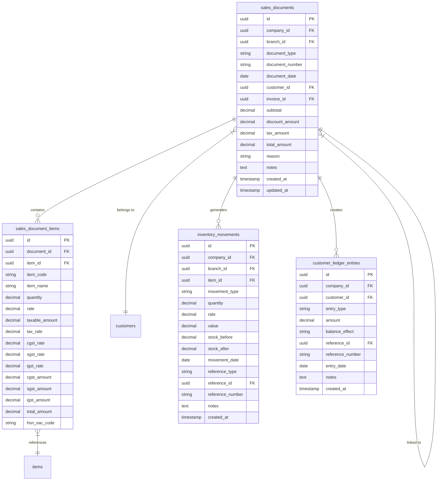
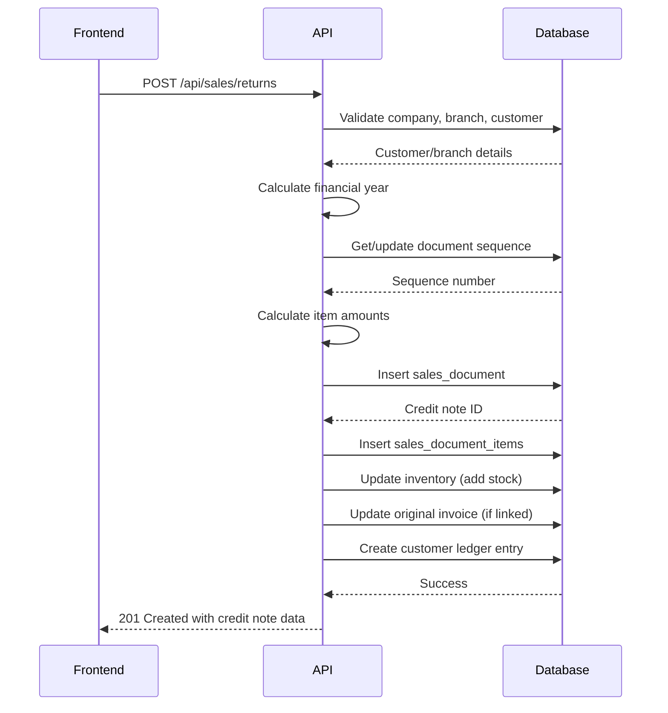
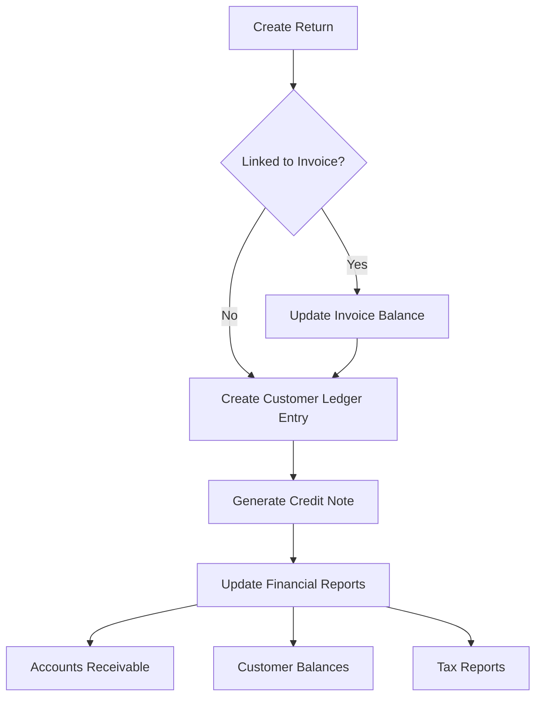

# Sales Returns

<cite>
**Referenced Files in This Document**   
- [SalesReturnForm.js](file://src/components/sales/SalesReturnForm.js)
- [index.js](file://src/pages/api/sales/returns/index.js)
- [accountingService.js](file://src/services/accountingService.js)
- [useInventory.js](file://src/hooks/useInventory.js)
- [SalesReturnList.js](file://src/components/sales/SalesReturnList.js)
- [SalesReturnView.js](file://src/components/sales/SalesReturnView.js)
- [next-number.js](file://src/pages/api/sales/returns/next-number.js)
</cite>

## Table of Contents
1. [Introduction](#introduction)
2. [Return Processing Implementation](#return-processing-implementation)
3. [Data Model and Relationships](#data-model-and-relationships)
4. [Return Form Functionality](#return-form-functionality)
5. [API Integration and Business Logic](#api-integration-and-business-logic)
6. [Inventory Management Integration](#inventory-management-integration)
7. [Accounting Integration](#accounting-integration)
8. [Common Issues and Edge Cases](#common-issues-and-edge-cases)
9. [Best Practices](#best-practices)
10. [Performance Optimization](#performance-optimization)

## Introduction
The Sales Returns feature in ezbillify-v1 enables businesses to process customer returns efficiently through credit notes. This system handles return processing from initiation to completion, including return reasons, item condition tracking, refund processing, and inventory restocking. The implementation integrates seamlessly with inventory management for stock updates and with accounting for credit notes and ledger adjustments. The feature supports partial returns, validates against original invoices, and automatically calculates tax reversals based on the original transaction's tax structure.

## Return Processing Implementation
The return processing workflow begins with the creation of a credit note through the SalesReturnForm interface. When a return is initiated, the system validates the return against several business rules including quantity limits based on the original invoice, proper customer selection, and complete item information. The return processing includes validation of return quantities against original invoice quantities to prevent over-returns. The system also validates customer information to ensure the selected customer belongs to the current company and exists in the records.

The return processing flow includes several key steps: selecting the customer, optionally linking to an original invoice, adding returned items with their quantities and conditions, specifying return reasons, and calculating the refund amount. The system automatically calculates tax amounts based on the original invoice's tax structure, handling both intrastate and interstate transactions appropriately. For intrastate transactions, GST is split into CGST and SGST components, while for interstate transactions, it is handled as IGST.

**Section sources**
- [SalesReturnForm.js](file://src/components/sales/SalesReturnForm.js#L599-L745)
- [index.js](file://src/pages/api/sales/returns/index.js#L128-L133)

## Data Model and Relationships
The sales returns data model is built around the sales_documents table with a document_type of 'credit_note'. Each return record maintains relationships with multiple entities including the original invoice, customer, inventory items, and accounting entries. The primary entity, sales_documents, contains core information about the return including document_number, document_date, customer_id, invoice_id (linking to the original sale), and financial amounts.

The data model includes a one-to-many relationship between returns and returned items through the sales_document_items table, which tracks each item's details including item_id, quantity, rate, tax information, and total amount. Returns are linked to customers through the customer_id field, maintaining customer information such as name, code, and contact details. When a return is linked to an original invoice, the system updates the invoice's balance_amount to reflect the returned amount.

The data model also includes integration with inventory through the inventory_movements table, which records stock changes when returns are processed. Accounting integration is handled through customer_ledger_entries, which creates credit entries for the returned amount. The system uses document_sequences to manage credit note numbering, supporting branch-specific numbering with financial year-based resets.

**Diagram sources**
- [index.js](file://src/pages/api/sales/returns/index.js#L327-L357)
- [SalesReturnForm.js](file://src/components/sales/SalesReturnForm.js#L49-L58)

## Return Form Functionality
The SalesReturnForm provides a comprehensive interface for creating and managing returns with several key functional components. The form includes customer selection with search functionality that filters customers by name, code, or email. When creating a return linked to an original invoice, the form automatically populates customer information and displays a warning indicating which invoice is being returned.

The item selection process includes a search dropdown that filters available items by name or code. When an item is selected, the system automatically applies the appropriate tax rates based on the customer's state relative to the company's state, determining whether the transaction is intrastate or interstate. The form calculates tax amounts automatically, splitting GST into CGST and SGST for intrastate transactions or applying IGST for interstate transactions.

The form includes validation rules that prevent invalid entries such as negative quantities or rates. It also validates that return quantities do not exceed the original invoice quantities when linked to an invoice. The return reason field allows users to specify the reason for the return, which is stored for audit and analysis purposes. The form automatically calculates totals including subtotal, tax amounts, and final total after any document-level discounts.

**Section sources**
- [SalesReturnForm.js](file://src/components/sales/SalesReturnForm.js#L357-L476)
- [SalesReturnForm.js](file://src/components/sales/SalesReturnForm.js#L478-L525)

## API Integration and Business Logic
The sales returns API endpoints handle the creation, retrieval, and updating of credit notes with comprehensive business logic. The POST endpoint at /api/sales/returns processes new return requests, validating required fields including company_id, branch_id, customer_id, document_date, and items. The API fetches branch details to determine the document prefix and constructs the credit note number using the branch prefix, sequence number, and financial year.

When creating a return, the API calculates financial year based on the document date, with financial years running from April to March. It manages document numbering through the document_sequences table, creating new sequences if none exist or resetting sequence numbers at the start of a new financial year. The API processes each returned item, calculating taxable amounts from rates that include tax by reversing the tax calculation.

For returns linked to original invoices, the API updates the invoice's total_amount and balance_amount to reflect the returned amount, ensuring the invoice balance never goes negative. The system creates customer ledger entries with a credit effect to reduce the customer's outstanding balance. The API also handles partial updates of return records, allowing updates to document date, notes, and reason without recalculating financials if items are not modified.

**Diagram sources**
- [index.js](file://src/pages/api/sales/returns/index.js#L114-L498)
- [SalesReturnForm.js](file://src/components/sales/SalesReturnForm.js#L700-L745)

## Inventory Management Integration
The sales returns system integrates with inventory management to automatically update stock levels when returns are processed. When a return is created, the system iterates through each returned item and updates the item's current_stock and available_stock by adding the returned quantity. This restocking process only occurs for items where track_inventory is enabled, allowing businesses to control which items have their inventory tracked.

The integration creates inventory movement records in the inventory_movements table with movement_type set to 'in' to indicate stock being added back to inventory. Each movement record includes details such as item_id, quantity, rate, value, reference to the credit note, stock_before and stock_after values, and movement date. This provides a complete audit trail of inventory changes.

The system handles the inventory update transactionally, ensuring that if the inventory update fails, the entire return process is rolled back. The integration also considers branch-specific inventory, updating stock levels for the specific branch where the return was processed. This branch-aware inventory management allows multi-branch businesses to maintain accurate stock levels across locations.

**Section sources**
- [index.js](file://src/pages/api/sales/returns/index.js#L390-L432)
- [useInventory.js](file://src/hooks/useInventory.js#L32-L97)

## Accounting Integration
The sales returns feature integrates with the accounting system to ensure proper financial recording of return transactions. When a return is processed, the system creates a customer ledger entry with entry_type set to 'credit_note' and balance_effect set to 'credit', which reduces the customer's outstanding balance. This ledger entry is linked to the credit note through reference_id and reference_number fields.

The integration updates the original invoice's financial amounts when a return is linked to an invoice, reducing both the total_amount and balance_amount fields. This ensures that financial reports accurately reflect the current state of customer accounts. The system also handles tax reversal calculations automatically, applying the same tax structure as the original invoice but in reverse.

For accounting purposes, the system maintains complete audit trails through the customer_ledger_entries table, which records the amount, date, and reference information for each credit note. This integration ensures that financial statements such as accounts receivable aging and customer balances are automatically updated to reflect returns, providing accurate financial reporting.

**Diagram sources**
- [index.js](file://src/pages/api/sales/returns/index.js#L457-L473)
- [accountingService.js](file://src/services/accountingService.js#L142-L174)

## Common Issues and Edge Cases
The sales returns system addresses several common issues and edge cases in return processing. One common issue is partial returns, which the system handles by validating that return quantities do not exceed original invoice quantities. The validation occurs both in the frontend form and in the API, providing immediate feedback to users attempting to return more items than were originally purchased.

Another common issue is expired return windows, which the system addresses through business logic that could be extended to check the original invoice date against company return policies. While the current implementation doesn't enforce return windows, the document_date field provides the necessary data to implement such validation.

Tax reversal calculations are handled accurately by preserving the original tax structure from the invoice. For items with compound taxes or cess, the system would need to be extended, but currently handles standard GST calculations correctly. The system also addresses the issue of branch-specific document numbering, ensuring that credit notes are properly numbered according to each branch's sequence.

The system handles the edge case of sequence number updates by using the current_number in the WHERE clause of the update statement, preventing race conditions where multiple returns might receive the same number. If the sequence update fails, it's logged as a warning but doesn't prevent the return from being created, ensuring business continuity.

**Section sources**
- [SalesReturnForm.js](file://src/components/sales/SalesReturnForm.js#L686-L694)
- [index.js](file://src/pages/api/sales/returns/index.js#L474-L489)

## Best Practices
Best practices for return authorization workflows include linking returns to original invoices whenever possible to ensure accurate quantity validation and tax calculations. Businesses should establish clear return policies and train staff to consistently apply them. The return reason field should be used to capture the reason for each return, enabling analysis of return patterns and identification of potential product or service issues.

For multi-branch operations, it's recommended to use branch-specific document numbering to maintain clear audit trails and simplify reconciliation. Businesses should regularly reconcile credit notes with inventory adjustments to ensure stock levels are accurate. The system's integration with customer ledger entries means that returns automatically reduce customer balances, so businesses should ensure their accounts receivable processes account for these automatic adjustments.

Security best practices include validating that the customer belongs to the current company and that the user has appropriate permissions to create returns. The system should be monitored for unusual return patterns that might indicate fraud or errors. Regular audits of return transactions against inventory movements can help identify discrepancies early.

**Section sources**
- [SalesReturnForm.js](file://src/components/sales/SalesReturnForm.js#L604-L656)
- [index.js](file://src/pages/api/sales/returns/index.js#L128-L133)

## Performance Optimization
Performance optimization for return processing focuses on minimizing database queries and ensuring efficient data handling. The system uses batch operations where possible, such as fetching all master data (customers, items, units, tax rates) in parallel during form initialization. The API endpoints use efficient database queries with proper indexing on commonly filtered fields like company_id, document_type, and document_date.

The return creation process is optimized by calculating financials in a single pass through the items array, rather than making multiple iterations. The system uses database transactions for critical operations like inventory updates to ensure data consistency while minimizing lock times. For large datasets, the system implements pagination in the returns list view, limiting the number of records retrieved at once.

Caching strategies could be implemented to further improve performance, such as caching frequently accessed master data. The document numbering system is optimized by using the current_number in the WHERE clause of the update statement, preventing the need for additional locking mechanisms. Frontend performance is enhanced by debouncing search inputs and using virtualized lists for large item selections.

**Section sources**
- [SalesReturnForm.js](file://src/components/sales/SalesReturnForm.js#L97-L102)
- [index.js](file://src/pages/api/sales/returns/index.js#L52-L91)