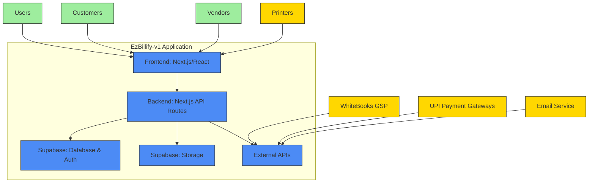
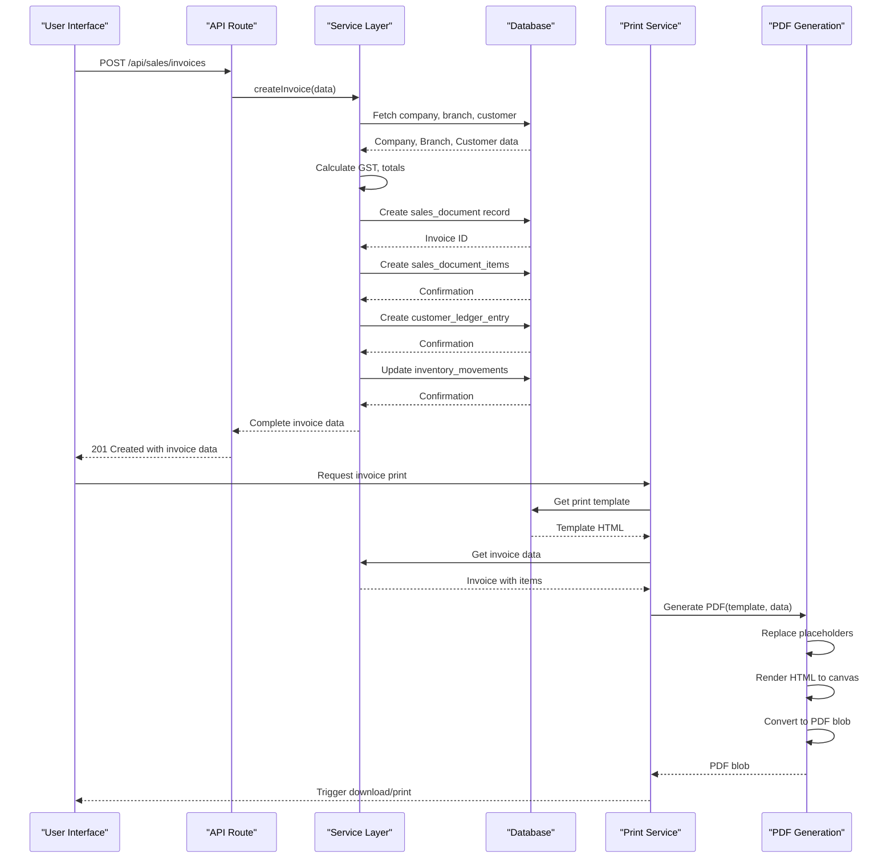

# System Overview

<cite>
**Referenced Files in This Document**   
- [README.md](file://README.md)
- [package.json](file://package.json)
- [src/pages/_app.js](file://src/pages/_app.js)
- [src/lib/db.js](file://src/lib/db.js)
- [src/lib/constants.js](file://src/lib/constants.js)
- [src/services/accountingService.js](file://src/services/accountingService.js)
- [src/services/customerService.js](file://src/services/customerService.js)
- [src/services/itemService.js](file://src/services/itemService.js)
- [src/context/AuthContext.js](file://src/context/AuthContext.js)
- [src/context/CompanyContext.js](file://src/context/CompanyContext.js)
- [src/pages/api/sales/invoices/index.js](file://src/pages/api/sales/invoices/index.js)
- [src/pages/api/purchase/bills/index.js](file://src/pages/api/purchase/bills/index.js)
- [src/services/gstService.js](file://src/services/gstService.js)
- [src/services/printService.js](file://src/services/printService.js)
- [src/services/pdfGenerationService.js](file://src/services/pdfGenerationService.js)
</cite>

## Table of Contents
1. [Introduction](#introduction)
2. [Core Functionality](#core-functionality)
3. [Technical Architecture](#technical-architecture)
4. [Frontend Architecture](#frontend-architecture)
5. [Backend Architecture](#backend-architecture)
6. [Data Management](#data-management)
7. [Key Workflows](#key-workflows)
8. [GST Compliance](#gst-compliance)
9. [Printing and Document Generation](#printing-and-document-generation)
10. [System Context Diagram](#system-context-diagram)
11. [Component Interaction Diagram](#component-interaction-diagram)

## Introduction

EzBillify-v1 is a comprehensive full-stack business management platform designed specifically for businesses in India. The system integrates accounting, sales, purchase, inventory management, and GST compliance functionality into a unified solution that streamlines business operations from quotation to payment and month-end closing. Built with modern web technologies, EzBillify-v1 provides an intuitive interface for business owners and accountants while ensuring compliance with Indian tax regulations.

The platform serves as a complete business management solution, replacing multiple disparate systems with a single integrated application. It addresses the specific needs of Indian businesses by incorporating GST calculations, e-Invoice and e-Way Bill generation, and financial reporting that adheres to local accounting standards. The system supports multiple business types including proprietorships, partnerships, LLPs, and private limited companies, making it suitable for businesses of various sizes and structures.

EzBillify-v1 follows a modular architecture that separates concerns between frontend presentation, business logic, and data persistence. The system is built on the Next.js framework with React for the frontend, Supabase for the backend and database, and Tailwind CSS for styling. This technology stack enables rapid development, real-time data synchronization, and responsive user interfaces across devices.

**Section sources**
- [README.md](file://README.md)
- [package.json](file://package.json)

## Core Functionality

EzBillify-v1 provides a comprehensive suite of business management features organized into several core modules. The system is designed to handle the complete business cycle from customer acquisition to financial reporting, with special emphasis on GST compliance for Indian businesses.

The accounting module offers complete financial management capabilities including journal entries, trial balance, balance sheet, profit and loss statements, and cash flow statements. The system automatically calculates GST based on the location of the company and customer, determining whether a transaction is intrastate (subject to CGST and SGST) or interstate (subject to IGST). Financial ratios such as current ratio, debt-to-equity, and profitability margins are automatically calculated to provide business insights.

The sales module supports the complete sales cycle from quotation to invoice to payment collection. Users can create quotations that can be converted to sales orders and then to invoices. The system automatically generates sequential document numbers with financial year-based numbering (e.g., INV-0001/23-24). Invoices include detailed tax breakdowns and support multiple payment methods including UPI, bank transfer, and cash. The system also tracks customer credit limits and prevents invoice creation when limits are exceeded.

The purchase module manages the procurement process from purchase order to goods receipt to bill entry. Purchase orders can be created and converted to bills upon receipt of goods. The system updates inventory levels automatically when bills are recorded and maintains the latest purchase price for each item. Vendor management includes tracking of vendor balances and payment terms.

Inventory management is tightly integrated with both sales and purchase operations. The system tracks current stock levels, calculates reorder points, and identifies low stock items. Stock movements are recorded for all transactions including purchases, sales, adjustments, and opening balances. The system supports multiple units of measurement and can handle both products and services.

GST compliance features include integration with third-party GSPs (Goods and Services Tax Suvidha Providers) like WhiteBooks for e-Invoice and e-Way Bill generation. The system can generate IRNs (Invoice Reference Numbers) and track e-Invoice status. It also supports GST return preparation with GSTR-1, GSTR-2, and GSTR-3B reports that can be reconciled with filed returns.

**Section sources**
- [src/lib/constants.js](file://src/lib/constants.js)
- [src/services/accountingService.js](file://src/services/accountingService.js)
- [src/services/customerService.js](file://src/services/customerService.js)
- [src/services/itemService.js](file://src/services/itemService.js)

## Technical Architecture

EzBillify-v1 follows a modern full-stack architecture built on Next.js, React, Supabase, and Tailwind CSS. The system employs a server-side rendering approach with API routes for backend functionality, providing both performance benefits and SEO optimization. The architecture is designed to be scalable, maintainable, and developer-friendly, leveraging the strengths of each technology in the stack.

The frontend is built with React components organized in a feature-based structure, with separate directories for accounting, sales, purchase, inventory, and other modules. The application uses React Context for state management, with specialized contexts for authentication, company data, branch information, and theme preferences. This approach avoids the complexity of external state management libraries while providing efficient state propagation throughout the component tree.

The backend leverages Supabase as a Backend-as-a-Service (BaaS) solution, providing authentication, database, storage, and serverless functions. Supabase is built on PostgreSQL, offering a robust relational database with support for advanced features like stored procedures and real-time subscriptions. The system uses Supabase's authentication system with email/password and OTP-based login, and extends it with custom user roles (admin and workforce).

API routes in the pages/api directory handle all server-side operations, following RESTful principles with clear endpoints for each resource. These routes are protected with middleware for authentication and rate limiting. The system uses a service layer pattern, with dedicated service classes for accounting, customer management, item management, and other domains. These services encapsulate business logic and provide a clean interface between the API routes and the database.

The database schema is normalized to reduce redundancy while maintaining performance through appropriate indexing. Key tables include companies, customers, vendors, items, sales_documents, purchase_documents, and journal_entries. The schema supports multi-branch operations with a branch_id field on relevant tables, allowing businesses with multiple locations to manage their operations from a single system.

**Section sources**
- [src/pages/_app.js](file://src/pages/_app.js)
- [package.json](file://package.json)
- [src/lib/db.js](file://src/lib/db.js)
- [src/context/AuthContext.js](file://src/context/AuthContext.js)

## Frontend Architecture

The frontend architecture of EzBillify-v1 is built on Next.js with React components organized in a modular structure. The application follows a component-based design with reusable UI elements and domain-specific components that encapsulate complex functionality. The architecture promotes consistency, maintainability, and developer productivity through well-defined patterns and conventions.

The component hierarchy is organized under the src/components directory with subdirectories for each major module: accounting, auth, dashboard, gst, items, master-data, others, purchase, sales, and shared. The shared directory contains reusable UI components such as buttons, cards, tables, forms, and navigation elements that maintain visual consistency across the application. These components are built with Tailwind CSS for utility-first styling, enabling rapid development and responsive design.

State management is implemented using React Context, with specialized contexts for different domains. The AuthContext manages user authentication, session state, and profile information. The CompanyContext provides access to company settings, tax rates, units of measurement, and chart of accounts. The BranchContext handles branch-specific data and operations. These contexts are provided at the application root in _app.js, making them available to all components through custom hooks.

The application uses a layout-based routing system with different layouts for authenticated and unauthenticated users. The AppLayout provides the main application shell with sidebar navigation, top bar, and content area. The AuthLayout is used for login, registration, and other authentication-related pages. Page-specific layouts are used for modules like sales and purchase to provide specialized navigation and actions.

Form handling follows a consistent pattern across the application, with form components that manage their own state and validation. The system uses controlled components with React hooks for state management, and implements real-time validation with immediate feedback to users. Complex forms are broken down into smaller components and use a wizard pattern when appropriate to guide users through multi-step processes.

Data fetching is implemented using custom hooks that encapsulate API calls and provide loading, error, and success states. These hooks leverage React's useEffect and useState hooks to manage side effects and component state. The system implements caching strategies to reduce redundant API calls and improve performance, particularly for frequently accessed data like tax rates and units of measurement.

**Section sources**
- [src/pages/_app.js](file://src/pages/_app.js)
- [src/context/AuthContext.js](file://src/context/AuthContext.js)
- [src/context/CompanyContext.js](file://src/context/CompanyContext.js)
- [src/components/shared/](file://src/components/shared/)

## Backend Architecture

The backend architecture of EzBillify-v1 is built on Next.js API routes with Supabase as the primary data layer. The system follows a service-oriented architecture with dedicated service classes that encapsulate business logic and provide a clean separation between API endpoints and data operations. This approach promotes code reuse, testability, and maintainability.

API routes are organized in the pages/api directory with subdirectories for each major domain: accounting, auth, barcode, branches, companies, customers, debug, gsp, gst, integrations, items, master-data, purchase, sales, vendors, and webhooks. Each API route file exports a handler function that processes HTTP requests and returns appropriate responses. The routes follow RESTful conventions with clear naming and consistent response formats.

Authentication is implemented using Supabase Auth with email/password and OTP-based login methods. The system extends the basic authentication with custom middleware that verifies user sessions and company associations. The withAuth middleware is applied to API routes that require authentication, ensuring that only authorized users can access protected resources. User roles (admin and workforce) are enforced at both the API and component levels to provide appropriate access control.

The service layer provides a clean abstraction over data operations and business logic. Services like accountingService, customerService, and itemService encapsulate domain-specific functionality and provide methods that can be called from API routes or other services. These services use the db utility to perform CRUD operations on the database, with additional methods for complex operations like financial statement generation and inventory management.

Database operations are centralized in the db utility (src/lib/db.js), which provides a consistent interface for interacting with Supabase. The utility includes methods for create, read, update, delete, batch operations, search, aggregation, and transactions. It also includes helper methods for error formatting, UUID validation, and input sanitization to ensure data integrity and security.

The system implements a comprehensive error handling strategy with consistent error responses across API routes. Errors are categorized and mapped to user-friendly messages, with detailed error information available in development mode for debugging. The system also includes logging capabilities to track important operations and errors for auditing and troubleshooting.

**Section sources**
- [src/pages/api/](file://src/pages/api/)
- [src/services/](file://src/services/)
- [src/lib/db.js](file://src/lib/db.js)
- [src/lib/middleware.js](file://src/lib/middleware.js)

## Data Management

EzBillify-v1 uses Supabase as its primary data management solution, leveraging PostgreSQL as the underlying database engine. The system employs a normalized schema design to ensure data integrity and reduce redundancy, with appropriate relationships and constraints to maintain referential integrity. The data model supports multi-tenancy with a company_id field on relevant tables, allowing multiple businesses to use the same system while keeping their data isolated.

The database schema includes core tables for companies, customers, vendors, items, sales_documents, purchase_documents, journal_entries, and various master data entities. The sales_documents and purchase_documents tables use a polymorphic design with a document_type field to support multiple document types (quotation, sales order, invoice, purchase order, bill, etc.) in a single table. This approach simplifies querying and reporting across document types while maintaining flexibility.

Data relationships are enforced through foreign key constraints, with cascading updates and deletes where appropriate. For example, when a company is deleted, all related records are automatically removed through cascading deletes. The system uses UUIDs as primary keys to ensure global uniqueness and prevent enumeration attacks. Indexes are created on frequently queried fields to optimize performance, particularly for search operations and joins.

The system implements soft deletion for customer and vendor records by setting a status field to 'inactive' rather than permanently removing the record. This preserves historical data for reporting and audit purposes while preventing the entity from being used in new transactions. Hard deletion is used for temporary records like quotations that have not been converted to sales orders.

Data validation is implemented at multiple levels: client-side with form validation, server-side with API route validation, and database-level with constraints and triggers. The system uses a combination of built-in database constraints (NOT NULL, UNIQUE, CHECK) and application-level validation to ensure data quality. For example, GSTIN validation is performed using a regular expression pattern defined in constants.js, and duplicate GSTINs are prevented at the database level with a unique constraint.

The system includes comprehensive audit logging with an audit_logs table that records important operations including record creation, updates, and deletions. Each log entry includes the user ID, company ID, resource type, action performed, and timestamp. This provides a complete audit trail for compliance and troubleshooting purposes.

**Section sources**
- [src/lib/db.js](file://src/lib/db.js)
- [src/lib/constants.js](file://src/lib/constants.js)
- [migrations/](file://migrations/)
- [database/migrations/](file://database/migrations/)

## Key Workflows

EzBillify-v1 supports several key business workflows that represent common operational processes for businesses in India. These workflows are designed to be intuitive and efficient, guiding users through complex processes with minimal effort while ensuring data accuracy and compliance.

The sales process follows a sequential workflow from quotation to invoice to payment. Users start by creating a quotation with items, quantities, and prices. The quotation can be sent to the customer and, when accepted, converted to a sales order. The sales order can then be converted to an invoice, which triggers the creation of accounting entries and updates to inventory levels. The invoice can be paid through various methods, and the system automatically updates the customer's ledger and credit utilization.

The purchase process begins with a purchase order that specifies items to be procured from a vendor. When goods are received, a Goods Receipt Note (GRN) is created to record the actual quantities received. The GRN can then be converted to a bill, which records the purchase transaction, updates inventory levels, and creates accounting entries. The system maintains the latest purchase price for each item, which can be used for cost calculations and pricing decisions.

Month-end closing is automated through the accounting module, which provides a month-end closing process that ensures all transactions are properly recorded and financial statements are accurate. The system performs a trial balance to verify that debits equal credits, generates financial statements (balance sheet, profit and loss, cash flow), and creates closing entries to transfer temporary accounts (revenue and expenses) to permanent accounts (retained earnings). The process includes reconciliation of bank accounts and verification of inventory counts.

The inventory management workflow includes stock adjustments, stock transfers, and cycle counting. Users can record physical inventory counts and create adjustment entries to reconcile differences between physical and system counts. The system supports multiple units of measurement and can handle conversions between primary and secondary units. Stock valuation is performed using the weighted average cost method, with costs updated automatically when new purchases are recorded.

Customer and vendor management workflows include credit limit management, aging analysis, and statement generation. The system tracks outstanding balances and sends reminders for overdue invoices. Credit limits are enforced during invoice creation to prevent over-extension of credit. Aging reports categorize outstanding amounts by age (current, 30 days, 60 days, 90+ days) to help identify collection issues.

**Section sources**
- [src/services/accountingService.js](file://src/services/accountingService.js)
- [src/pages/api/sales/invoices/index.js](file://src/pages/api/sales/invoices/index.js)
- [src/pages/api/purchase/bills/index.js](file://src/pages/api/purchase/bills/index.js)
- [src/services/itemService.js](file://src/services/itemService.js)

## GST Compliance

EzBillify-v1 includes comprehensive GST compliance features designed specifically for businesses in India. The system automates GST calculations, supports e-Invoice and e-Way Bill generation, and provides tools for GST return preparation and reconciliation. These features ensure that businesses remain compliant with GST regulations while reducing the administrative burden of tax compliance.

GST calculations are performed automatically based on the location of the company and customer. The system determines whether a transaction is intrastate (subject to CGST and SGST) or interstate (subject to IGST) by comparing the state codes of the company and customer. The appropriate tax rates are applied based on the item's tax rate configuration, and the tax amounts are calculated and displayed on invoices and other documents. The system supports all standard GST rates (0%, 0.25%, 3%, 5%, 12%, 18%, 28%) as defined in the Indian tax structure.

E-Invoice generation is integrated with third-party GSPs (Goods and Services Tax Suvidha Providers) like WhiteBooks. The system can generate IRNs (Invoice Reference Numbers) by sending invoice data to the GSP API and receiving the IRN, acknowledgment number, and QR code in response. E-Invoices are stored with their IRN and status, and the system can regenerate e-Invoices if needed. The e-Invoice QR code is included on printed invoices to allow verification by tax authorities and customers.

E-Way Bill generation is also supported through integration with GSPs. The system can generate e-Way Bills for shipments above the threshold value, including the necessary details like transporter information, vehicle number, and distance. E-Way Bills are linked to the corresponding invoice and can be tracked within the system. The system validates e-Way Bill requirements based on item value and distance to ensure compliance.

GST return preparation is facilitated through specialized reports that extract data in the format required for GSTR-1, GSTR-2, and GSTR-3B filings. The system can generate summary and detailed reports for outward supplies, inward supplies, and input tax credit. These reports can be exported to Excel or CSV format for submission to tax authorities. The system also includes a GST reconciliation feature that compares filed returns with system data to identify discrepancies.

The system maintains a complete audit trail of all GST-related transactions, including e-Invoice generation attempts, e-Way Bill creation, and GST return submissions. This audit trail can be used for internal review and during tax audits. The system also includes validation rules to prevent common GST compliance errors, such as issuing invoices without a valid GSTIN or applying incorrect tax rates.

**Section sources**
- [src/lib/constants.js](file://src/lib/constants.js)
- [src/services/gstService.js](file://src/services/gstService.js)
- [src/pages/api/gst/](file://src/pages/api/gst/)
- [src/components/gst/](file://src/components/gst/)

## Printing and Document Generation

EzBillify-v1 includes a sophisticated printing and document generation system that supports multiple paper sizes, custom templates, and various output formats. The system is designed to meet the diverse printing needs of businesses, from standard A4 invoices to thermal receipt printing for retail environments.

The printing system is built around a template-based architecture that allows users to customize the appearance of documents without requiring technical expertise. Templates are stored in the database and can be created or modified through the user interface. The system supports multiple template types for different document categories (invoices, bills, purchase orders, etc.) and paper sizes (A4, A5, A3, 80mm, 58mm). Each template is defined as HTML with placeholders for dynamic data, which are replaced with actual values during document generation.

Document generation is handled by the pdfGenerationService, which uses jsPDF and html2canvas to convert HTML templates into PDF files. The service first processes the template by replacing placeholders with actual data using Handlebars templating. It then renders the processed HTML in a hidden iframe, captures it as an image using html2canvas, and converts it to a PDF using jsPDF. This approach preserves the exact styling and layout of the template, including fonts, colors, and positioning.

The printService orchestrates the document generation process and provides methods for printing, downloading, and previewing documents. It handles the preparation of template data by formatting dates, amounts, and addresses according to user preferences. The service also generates additional content such as QR codes for UPI payments and e-Invoice verification. For thermal receipts, the service optimizes the layout for narrow paper widths and includes condensed information to fit the limited space.

The system supports both client-side and server-side printing options. Client-side printing uses the browser's print dialog, allowing users to select their printer and print settings. Server-side printing could be implemented for network printers or print servers, though the current implementation focuses on client-side printing. The system also supports downloading documents as PDF files for email or archival purposes.

Template customization is a key feature, allowing businesses to brand their documents with logos, colors, and custom layouts. The system includes a template editor that provides a visual interface for designing templates, though the current implementation stores templates as HTML in the database. Users can create different templates for different branches or document types, enabling customized branding for various business units.

**Section sources**
- [src/services/printService.js](file://src/services/printService.js)
- [src/services/pdfGenerationService.js](file://src/services/pdfGenerationService.js)
- [public/templates/](file://public/templates/)
- [src/components/print/](file://src/components/print/)

## System Context Diagram

The system context diagram illustrates the high-level components of EzBillify-v1 and their interactions. The diagram shows the main application boundary with external systems and users, highlighting the key interfaces and data flows.

**Diagram sources**
- [src/pages/_app.js](file://src/pages/_app.js)
- [src/pages/api/](file://src/pages/api/)
- [src/services/](file://src/services/)

## Component Interaction Diagram

The component interaction diagram illustrates how key components in EzBillify-v1 interact during a typical sales process. The diagram shows the sequence of operations from invoice creation to document generation, highlighting the flow of data and control between components.

**Diagram sources**
- [src/pages/api/sales/invoices/index.js](file://src/pages/api/sales/invoices/index.js)
- [src/services/customerService.js](file://src/services/customerService.js)
- [src/services/itemService.js](file://src/services/itemService.js)
- [src/services/printService.js](file://src/services/printService.js)
- [src/services/pdfGenerationService.js](file://src/services/pdfGenerationService.js)