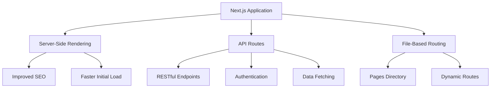
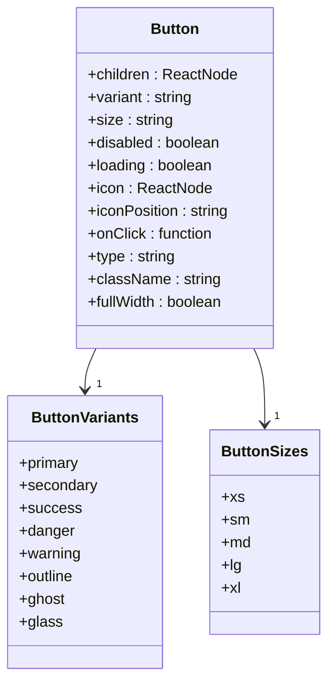
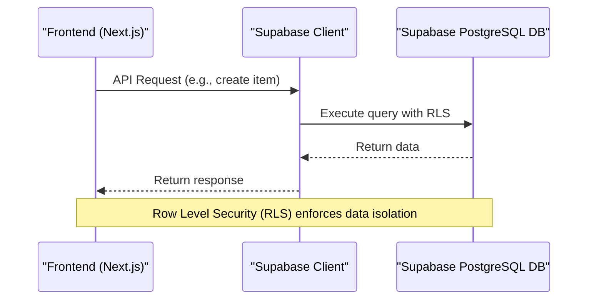
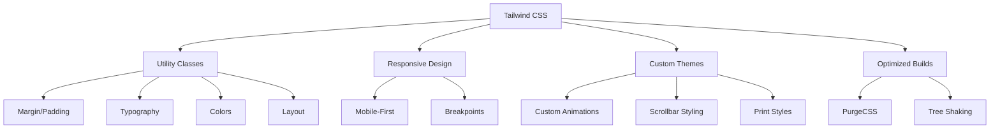
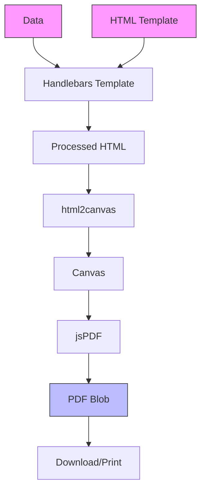
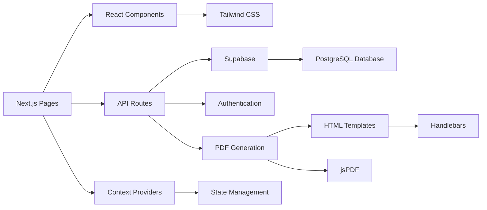

# Technology Stack

<cite>
**Referenced Files in This Document**   
- [package.json](file://package.json)
- [tailwind.config.js](file://tailwind.config.js)
- [jsconfig.json](file://jsconfig.json)
- [_app.js](file://src/pages/_app.js)
- [db.js](file://src/lib/db.js)
- [supabase.js](file://src/services/utils/supabase.js)
- [Button.js](file://src/components/shared/ui/Button.js)
- [index.js](file://src/pages/api/items/index.js)
- [pdfGenerationService.js](file://src/services/pdfGenerationService.js)
- [AuthContext.js](file://src/context/AuthContext.js)
- [A4-Default.html](file://public/templates/A4-Default.html)
- [globals.css](file://src/styles/globals.css)
- [_document.js](file://src/pages/_document.js)
</cite>

## Table of Contents
1. [Introduction](#introduction)
2. [Next.js for Server-Side Rendering and API Routes](#nextjs-for-server-side-rendering-and-api-routes)
3. [React for Component-Based UI Development](#react-for-component-based-ui-development)
4. [Supabase for Database and Authentication](#supabase-for-database-and-authentication)
5. [Tailwind CSS for Utility-First Styling](#tailwind-css-for-utility-first-styling)
6. [@react-pdf/renderer for Document Generation](#react-pdfrenderer-for-document-generation)
7. [Technology Integration Patterns](#technology-integration-patterns)
8. [Common Setup Issues and Solutions](#common-setup-issues-and-solutions)
9. [Performance Optimization Tips](#performance-optimization-tips)
10. [Conclusion](#conclusion)

## Introduction
The ezbillify-v1 application leverages a modern technology stack designed for rapid development, scalability, and maintainability. This document provides a comprehensive analysis of the core technologies used in the application: Next.js for server-side rendering and API routes, React for component-based UI development, Supabase for database and authentication, Tailwind CSS for utility-first styling, and @react-pdf/renderer for document generation. The integration of these technologies enables the creation of a robust, feature-rich billing and accounting platform with GST compliance for the Indian market.

**Section sources**
- [package.json](file://package.json)
- [_document.js](file://src/pages/_document.js)

## Next.js for Server-Side Rendering and API Routes

Next.js serves as the foundation of the ezbillify-v1 application, providing server-side rendering capabilities, file-based routing, and API routes. The application uses Next.js 14.0.3, which enables improved performance and developer experience.

The application leverages Next.js for server-side rendering to improve SEO and initial load performance. The `_app.js` file wraps the application with necessary context providers, including AuthContext, ToastContext, and BranchContext, ensuring that authentication and state management are available throughout the application.

**Diagram sources**
- [_app.js](file://src/pages/_app.js)
- [package.json](file://package.json)

API routes are implemented in the `src/pages/api` directory, following Next.js conventions. For example, the items API endpoint at `src/pages/api/items/index.js` demonstrates the use of server-side functions to handle CRUD operations for inventory items. The API routes integrate with Supabase for database operations and include middleware for authentication.

**Section sources**
- [_app.js](file://src/pages/_app.js)
- [index.js](file://src/pages/api/items/index.js)

## React for Component-Based UI Development

React is used as the core UI library for building reusable components in the ezbillify-v1 application. The application follows a component-based architecture with a clear directory structure organized by feature domains such as accounting, auth, dashboard, items, master-data, purchase, sales, and shared components.

The component architecture promotes reusability and maintainability. For example, the Button component in `src/components/shared/ui/Button.js` demonstrates a well-designed, configurable UI element with multiple variants, sizes, and states. The component uses Tailwind CSS for styling and supports loading states, icons, and accessibility features.

**Diagram sources**
- [Button.js](file://src/components/shared/ui/Button.js)

The application also implements context-based state management using React Context API. The AuthContext in `src/context/AuthContext.js` provides authentication state and user information across the application, while other contexts like ToastContext and BranchContext manage toast notifications and branch selection state.

**Section sources**
- [Button.js](file://src/components/shared/ui/Button.js)
- [AuthContext.js](file://src/context/AuthContext.js)

## Supabase for Database and Authentication

Supabase is the primary backend service for ezbillify-v1, providing PostgreSQL database hosting, authentication, real-time subscriptions, and storage. The application uses @supabase/supabase-js (version 2.57.4) as the client library to interact with Supabase services.

The database architecture is implemented through a comprehensive set of tables for accounting, inventory, customers, vendors, and company management. The `src/lib/db.js` file provides a wrapper around Supabase client operations, offering simplified CRUD operations, batch operations, search functionality, and aggregation methods.

**Diagram sources**
- [db.js](file://src/lib/db.js)
- [supabase.js](file://src/services/utils/supabase.js)

Authentication is implemented using Supabase Auth with email/password and OTP-based login flows. The AuthContext manages the authentication state and provides helper functions for sign in, sign up, password reset, and session management. The application also implements role-based access control with admin and workforce roles.

Database operations leverage Supabase's Row Level Security (RLS) policies to ensure data isolation between companies and users. The application uses both the regular Supabase client (with RLS) and an admin client (bypassing RLS) for different types of operations.

**Section sources**
- [db.js](file://src/lib/db.js)
- [supabase.js](file://src/services/utils/supabase.js)
- [AuthContext.js](file://src/context/AuthContext.js)

## Tailwind CSS for Utility-First Styling

Tailwind CSS (version 3.4.17) is used as the utility-first CSS framework for styling the ezbillify-v1 application. The configuration in `tailwind.config.js` specifies the content sources to scan for Tailwind classes, ensuring that only used classes are included in the production build.

The application leverages Tailwind's utility classes for responsive design, theming, and component styling. The `src/styles/globals.css` file includes Tailwind's base, components, and utilities layers, along with custom CSS for animations, scrollbar styling, and print media queries.

**Diagram sources**
- [tailwind.config.js](file://tailwind.config.js)
- [globals.css](file://src/styles/globals.css)

The application also defines custom utilities in the globals.css file, such as animation classes, glass morphism effects, gradient text, and focus styles. These custom utilities extend Tailwind's capabilities while maintaining consistency across the application.

**Section sources**
- [tailwind.config.js](file://tailwind.config.js)
- [globals.css](file://src/styles/globals.css)

## @react-pdf/renderer for Document Generation

The ezbillify-v1 application implements document generation using a combination of HTML templates and PDF conversion libraries. While @react-pdf/renderer is listed in the package.json dependencies, the actual implementation uses jspdf, jspdf-autotable, and html2canvas for PDF generation.

The PDF generation service in `src/services/pdfGenerationService.js` uses a template-based approach where HTML templates from the public/templates directory are populated with data using Handlebars and then converted to PDF. This approach allows for flexible template design while maintaining consistent styling.

**Diagram sources**
- [pdfGenerationService.js](file://src/services/pdfGenerationService.js)
- [A4-Default.html](file://public/templates/A4-Default.html)

The application supports various template formats for different paper sizes (A3, A4, A5, 80mm, 58mm) and use cases (basic, detailed, GST-compatible, modern). The templates use placeholder syntax (e.g., {{COMPANY_NAME}}) that is replaced with actual data during the generation process.

**Section sources**
- [pdfGenerationService.js](file://src/services/pdfGenerationService.js)
- [A4-Default.html](file://public/templates/A4-Default.html)

## Technology Integration Patterns

The ezbillify-v1 application demonstrates effective integration patterns between the various technologies in its stack. The most significant integration is between Next.js API routes and Supabase, which enables serverless backend functionality without requiring a separate backend service.

The application uses environment variables to configure Supabase connections, with NEXT_PUBLIC_SUPABASE_URL and NEXT_PUBLIC_SUPABASE_ANON_KEY for client-side operations and SUPABASE_SERVICE_ROLE_KEY for server-side operations that bypass Row Level Security.

**Diagram sources**
- [package.json](file://package.json)
- [_app.js](file://src/pages/_app.js)
- [supabase.js](file://src/services/utils/supabase.js)
- [pdfGenerationService.js](file://src/services/pdfGenerationService.js)

The component architecture follows a clear separation of concerns, with shared UI components in the shared directory, feature-specific components in their respective directories, and pages that compose these components. The use of Next.js's file-based routing system makes it easy to navigate and understand the application structure.

**Section sources**
- [package.json](file://package.json)
- [_app.js](file://src/pages/_app.js)
- [supabase.js](file://src/services/utils/supabase.js)
- [pdfGenerationService.js](file://src/services/pdfGenerationService.js)

## Common Setup Issues and Solutions

When setting up the ezbillify-v1 application, several common issues may arise related to environment configuration, dependency installation, and service integration.

### Supabase Configuration Issues
The most common setup issue is missing or incorrect Supabase environment variables. The application requires three key environment variables:
- NEXT_PUBLIC_SUPABASE_URL: The URL of the Supabase project
- NEXT_PUBLIC_SUPABASE_ANON_KEY: The anonymous key for client-side operations
- SUPABASE_SERVICE_ROLE_KEY: The service role key for server-side operations that bypass RLS

Without these variables, the application will not be able to connect to the database. The supabase.js file includes error handling that logs helpful messages during development when these variables are missing.

### Dependency Installation Issues
Due to the number of dependencies in the package.json file, npm or yarn installation may fail due to network issues or version conflicts. Using a package manager with lock file support (like npm with package-lock.json) helps ensure consistent installations across environments.

### Template Path Issues
The PDF generation service relies on HTML templates in the public/templates directory. If this directory is missing or the templates are not properly formatted, document generation will fail. The templates must use the correct placeholder syntax (e.g., {{COMPANY_NAME}}) that matches the data structure expected by the Handlebars compiler.

**Section sources**
- [supabase.js](file://src/services/utils/supabase.js)
- [package.json](file://package.json)
- [pdfGenerationService.js](file://src/services/pdfGenerationService.js)

## Performance Optimization Tips

The ezbillify-v1 application includes several performance optimizations that can be further enhanced:

### Bundle Size Optimization
The application can reduce bundle size by:
- Implementing dynamic imports for heavy libraries like jspdf and html2canvas
- Using Next.js's built-in image optimization for logo and document assets
- Removing unused dependencies from package.json

### Database Query Optimization
To improve database performance:
- Ensure proper indexing on frequently queried columns
- Use Supabase's query optimization features like select() with specific columns
- Implement caching for frequently accessed data using React Query or SWR
- Use Supabase's real-time subscriptions to minimize polling

### Rendering Performance
For improved UI performance:
- Implement virtualized lists for large data sets (e.g., item lists, customer lists)
- Use React.memo for expensive components that don't change frequently
- Implement pagination and infinite scrolling for large datasets
- Optimize images and assets used in templates

### PDF Generation Optimization
To improve document generation performance:
- Cache compiled Handlebars templates
- Implement worker threads for PDF generation to avoid blocking the main thread
- Pre-generate frequently used documents during off-peak hours
- Optimize HTML templates for faster rendering

**Section sources**
- [pdfGenerationService.js](file://src/services/pdfGenerationService.js)
- [db.js](file://src/lib/db.js)
- [Button.js](file://src/components/shared/ui/Button.js)

## Conclusion
The ezbillify-v1 application effectively combines Next.js, React, Supabase, Tailwind CSS, and PDF generation libraries to create a comprehensive billing and accounting solution. The technology stack provides a solid foundation for a scalable, maintainable application with strong performance characteristics. By following the integration patterns and optimization tips outlined in this document, developers can effectively work with and extend the application to meet evolving business requirements.